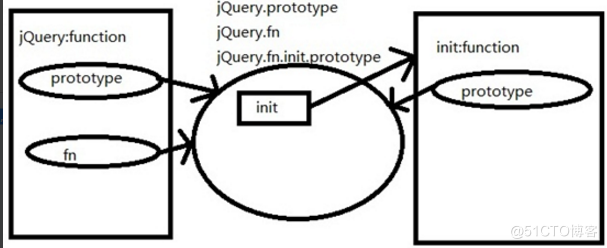

## 知识点

### 构造函数、原型

创建对象的三种方法

```javascript
// 对象字面量
var obj = {}
// new Object
var obj = new Object();
// 构造函数
function Obj() {
    this.name = 'obj';
    this.str() = function() { return name;}
}
var obj = new Obj();
```

new 在执行时会做四件事情：

1. 在内存中创建一个新的空对象。

2. 让 this 指向这个新的对象。

3. 执行构造函数里面的代码，给这个新对象添加属性和方法。

4. 返回新对象

每一个构造函数都有一个 `prototype` 属性，指向另一个对象。

由构造函数生成的对象都会有一个属性 `__proto__` 指向构造函数的 prototype 原型对象，对象可以使用构造函数 `prototype` 原型对象的属性和方法

对象原型（ `__proto__` ）和构造函数（ `prototype` ）原型对象里面都有一个属性 `constructor` 属性指回构造函数本身。

Ref: [JS中的构造函数、原型、原型链](https://segmentfault.com/a/1190000022776150)

### 匿名函数

匿名函数可以省略函数名，只需要把函数的代码放在圆括号里面即可。

```javascript
// 自调用匿名函数
(function () {
    // code
})();

// 写法二（推荐)
(function(){
    // code
}());
```

匿名函数内部的变量和函数都是局部的，只能在匿名函数内部使用。

```javascript
(function(){
    var a = 1;
    console.log(a);
}());
console.log(a); // error
```

JQuery 将接口函数和变量挂载到 `windows` 对象。

```javascript
(function( window, undefined ) {
    jQuery = function( selector, context ) {
        return new jQuery.fn.init( selector, context );
    };
    //其他代码
    window.jQuery = window.$ = jQuery;
})( window );
```

传入 `window` 的原因：
* 不必向上查找，直接挂载到 `window` 对象上，访问更快了。
* 利于代码压缩。(将 `windows` 压缩成 `w`，压缩后的代码大小更小)

传入 `undefined` 的原因:

`undefined` 并不是JS中的关键字，在IE8及以下中是可以修改的。

## 代码解析

```javascript
core_strundefined = typeof undefined,
```
>
Ref: [js关于undefined的判断？](https://www.zhihu.com/question/270181759)


```javascript
// Map over jQuery in case of overwrite
_jQuery = window.jQuery,

// Map over the $ in case of overwrite
_$ = window.$,
```

防冲突。TODO

JQuery 结构

```javascript
function JQuery() {
    return new JQuery.fn.init();
}
JQuery.fn = JQuery.prototype = {
    constructor: JQuery,
    init: function() {
        // Constructor
    }
}
JQuery.fn.init.prototype = JQuery.fn;
```

