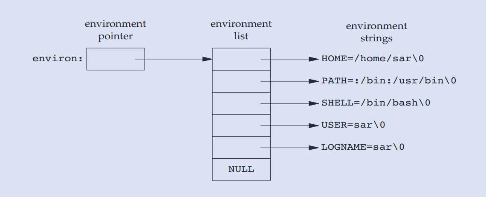
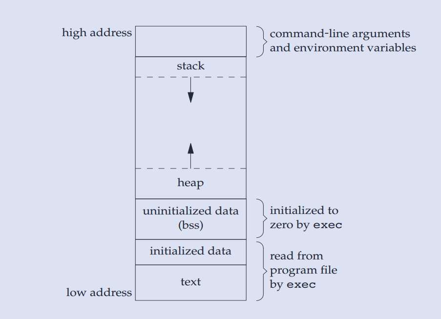
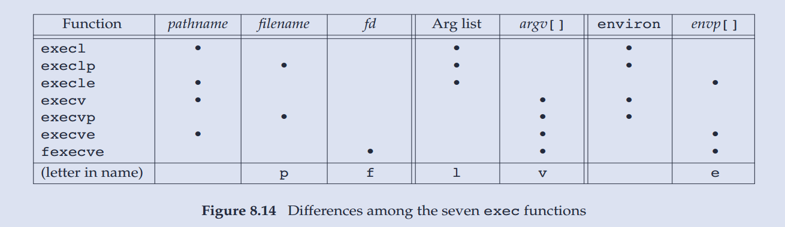
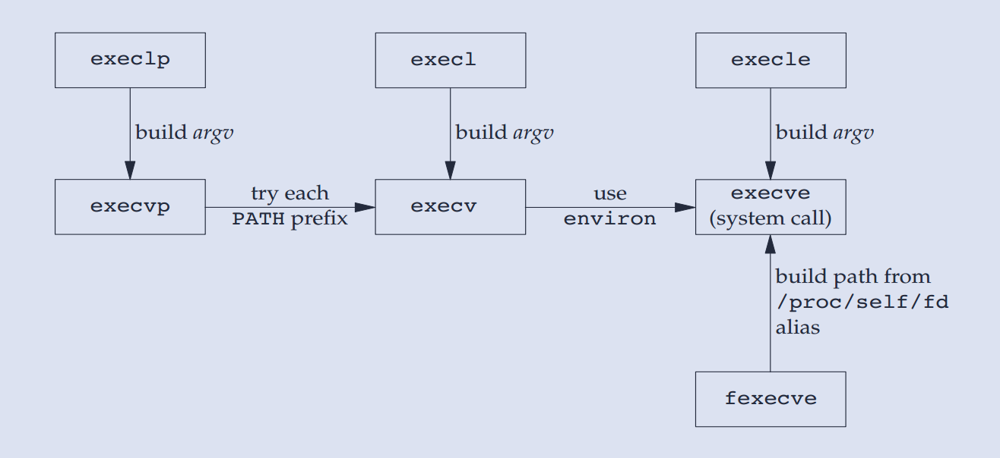
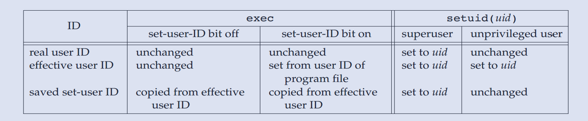
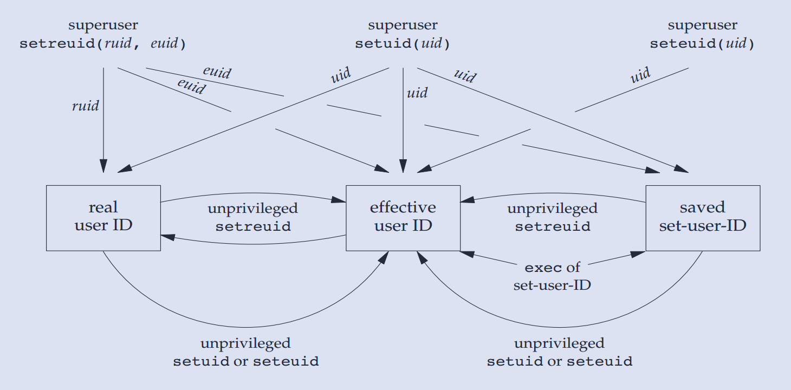

# Linux 进程


## 进程环境

### main 函数

C 程序总是从 main 函数开始执行，mian 函数的原型是
```c
int main(int argc, char *argv[]);
```

当内核执行 C 程序时，在调用 main 前先调用一个特殊的**启动例程**，让启动例程来调用 main 函数。
当 main 函数结束时，其返回值被启动例程当做参数传给 exit 函数。故例程调用 main 函数的 C 语言形式如下：
```c
exit(main(argc, argv));
```
exit 做完清理工作后，调用 _exit 系统调用来终止进程，main 函数的返回状态最终传给 _exit，成为进程的退出状态。

### 进程终止方式

进程终止分为正常终止和异常终止,其中五种为正常终止：

1. 从 main 返回；
2. 调用 exit；
3. 调用 _exit 和 _Exit ；
4. 最后一个线程从其启动例程返回；
5. 从最后一个线程调用 pthread_exit；

三种异常终止：

6. 调用 abort；
7. 接到一个信号；
8. 最后一个线程对取消请求做出响应。

### 退出函数

```c
#include <stdlib.h>
void exit(int status);
void _Exit(int status);
#include <unistd.h>
void _exit(int status);
```

三个函数都是正常终止一个程序：`_exit` 和 `_Exit` 立即进入内核，`exit` 先做一些清理工作，再进入内核。

按照 ISO C 和 POSIX.1，exit 先调用登记的终止处理函数，然后再关闭打开流（调用 fclose），最后调用 `_exit` 和 `_Exit`。


### 终止处理函数

按照 ISO C，一个进程最多登记 32 个终止处理函数，也称钩子函数，使用 atexit 来登记。

```c
#include <stdlib.h>
int atexit(void (*func)(void));
```

注意：

1. 不能向终止处理函数传递任何参数，也不期望其返回值。
2. 登记的顺序和被调用的顺序是相反的。
3. 可重复登记，如果一个函数被登记多次，也会被调用多次。

一个程序只能通过调用 exec 来执行。进程可以主动终止（显式或隐式的调用_exit或_Exit），也可被动终止（被信号终止）。

### 命令行解析

```c
#include <unistd.h>
int getopt(int argc, char * const argv[], const char *optstring);
```

编程练习：使用命令行参数，输出当前时间。 [参考](../src/chap3-process/mydate.c)

### 环境变量

环境变量即存储在系统的变量，每个程序都接收一张存储环境变量的环境表。环境表是一个字符指针数组，每个指针包含一个以 null 结尾的字符串地址。
全局变量 environ 则包含该指针数组的地址：

```c
extern char **environ;
```



ISO C 定义一个函数 getenv，用于取环境变量的值，程序并不直接访问 environ。

```c
#include <stdlib.h>
char *getenv(const char *name);
int setenv(const char *name, const char *value, int overwrite);
int unsetenv(const char *name);
```

### C 程序布局

* 正文段 只读，可共享。
* 初始化数据段，存储程序需要明确赋值的变量。
* 未初始化数据段，bbs段。
* 栈 自动变量及函数调用需要保存的信息。
* 堆，动态分配的位置。



### 库

**库文件**一般就是编译好的二进制文件，用于在链接阶段同目标代码一起生成可执行文件，或者运行可执行文件的时候被加载，以便调用库文件中的某段代码。

* 静态库 链接时装载
* 动态库 第一次执行时装载
* 手工装载库 运行时手动装载

>使用 `pmap(1)` 分析程序的存储布局。

### 函数 setjum 和 longjum

goto 语句是不能跨函数，执行这种操作的是函数 setjum 和 longjum，用于处理发生在深层嵌套函数调用中出错。

编程练习：使用 setjum 和 longjum 实现函数间跳转。[参考](../src/chap3-process/jump.c)

### 资源获取和设置

```c
#include <sys/time.h>
#include <sys/resource.h>
 struct rlimit {
               rlim_t rlim_cur;  /* Soft limit */
               rlim_t rlim_max;  /* Hard limit (ceiling for rlim_cur) 普通用户只能降低，root用户能升高也能降低*/
 };
int getrlimit(int resource, struct rlimit *rlim);
int setrlimit(int resource, const struct rlimit *rlim);
```

资源限制影响到调用进程并其由子进程继承。

## 进程基础知识

### 进程的标识符 pid

每一个进程都有一个非负整数表示其进程 ID。进程 ID 是唯一的，用以区别其他进程，进程号是顺次向下使用。

进程号虽然是唯一的，但是是可复用的：当进程结束后，其进程 ID 成为复用的候选者；大多数 UNIX 系统实现了延迟复用，防止误认。

使用`ps`[查看进程信息](#ps_c)

专用进程：

* ID 为 0 的是调度进程，被称为**交换进程**，是系统进程。
* ID 为 1 的是 init 进程，是所有进程的祖先进程，在自举结束后，由内核调用。
* ID 为 2 的页守护进程，负责支持虚拟存储器系统的分页操作。

### 获取进程号

```c
#include<unistd.h>
// 返回当前 pid
pid_t getpid(void);
// 返回父进程 pid
pid_t getppid(void);
```

### 函数 fork

`fork` 通过复制当前进程产生新进程（子进程）。

```c
#include <unistd.h>
pid_t fork(void);
```

`fork()`函数被调用一次，返回两次，分别从父进程和子进程返回。两次返回的区别是子进程返回0，父进程返回子进程的 pid, 以区分父子进程。

>子进程返回0的理由是，进程 ID 不可能是0，且可以通过 `gettpid()` 返回父进程的 PID。
>父进程返回子进程 PID 的理由是，父进程不能通过函数调用获取任一子进程。

子进程获得父进程的副本，包括**PC（程序计数器）、数据空间、堆和栈**，同时共享正文区（代码段）。但现在很多实现并不真的复制，而是**写时复制**。

但是 `fork()` 产生的子进程和父进程并不完全相同，区别有：

* pid 不同
* ppid 不同
* 未决信号和文件锁不继承
* 资源利用量清 0

**注意**：

* 父子进程从相同地方返回（即 fork() 返回），但**谁先执行不确定**
* 子进程也复制 IO 缓冲，  所以涉及到 IO 操作时最好 `fork()` 之前 `fflush(NULL)`

使用 `time` [命令](#time_c) 打印进程运行时间

三种异常情况：

1. 当一个子进程还在运行时，父进程就终止，就会被完成 `init` 进程收养，当子进程终止时，完成善后工作
2. 当子进程终止时，父进程(父进程还在，否则子进程自动变成孤儿进程)没有来得及善后(使用 wait/ waitpid),就会等待善后，成为僵尸进程
3. 当子进程终止时，父进程未处理(wait/waitpid)然后父进程终止,则子进程会由[僵尸进程](#zombie_p)变成孤儿进程，被 `init` 处理

`fork()` 与 `vfork()`的区别

* fork 是 创建一个子进程，并把父进程的内存数据copy到子进程中。
* vfork是 创建一个子进程，并和父进程的内存数据share一起用。

`vfork` 是这样的工作的，

1. 保证子进程先执行。
2. 当子进程调用exit()或exec()后，父进程往下执行。

详细内容参考[知乎问题 C语言里，main 函数中 return x和 exit(x) 到底有什么区别 ?](https://www.zhihu.com/question/26591968)

### wait & waitpid

当进程正常或异常终止时，内核就向其父进程发送 `SIGCHLD` 信号。

```c
#include  <sys/types.h>
#include  <sys/wait.h>
// 若成功，返回进程 pid，若出错，返回 0
pid_t wait(int *status);
pid_t waitpid(pid_t pid, int *status, int options);
```

* 当所有子进程都还在运行，则阻塞。
* 当有一个进程已终止，正等待父进程获取终止状态，则获得终止状态立即返回。
* 当无子进程，则出错返回。

如果因为收到 `SIGCHLD` 信号而调用 `wait`，则期望立即返回；如果随机时间点调用 `wait`，则可能阻塞。

两个函数的区别：

1. 在一个子进程终止前，wait 使其调用者阻塞，而 waitpid 有一选项，可使调用者不阻塞。
2. waitpid 可以设置 pid 参数，指定要等待的子进程。

参数 statloc 是一个整型指针，如果非空，则把终止状态存放在指向的单元，如果空，则不保存终止状态。

waitpid 中 pid 参数的作用及解释：

* pid==-1，等待任一子进程，等同于 wait
* pid>0，等待进程 ID 与 pid 相等的子进程
* pid==0，等待组进程的任一子进程
* pid<-1，等待组 ID 等于 pid 绝对值的任一子进程

optons 参数进一步控制 waitpid 的行为，其值或为 0，或是预定义常量的按位或运算。

waitpid 提供 wait 没有的三个功能：

* 等待一个特定进程。
* 提供一个非阻塞版本。
* 支持作业控制。

### 函数 exec

在 fork 后，子进程往往调用 exec 函数，以执行另一个程序。当进程调用 exec 后，进程执行的程序的完成替换成新的程序，新程序从 main 开始。

exec 用磁盘上的新程序替换了当前进程的正文段、数据段、堆段和栈段。

```c
#include <unistd.h>
extern char **environ;
int execl(const char *path, const char *arg, ... /* (char  *) NULL */);
int execlp(const char *file, const char *arg, ... /* (char  *) NULL */);
int execle(const char *path, const char *arg, ... /*, (char *) NULL, char * const envp[] */);
int execv(const char *path, char *const argv[]);
int execvp(const char *file, char *const argv[]);
int execvpe(const char *file, char *const argv[], char *const envp[]);
```

这些函数的区别：

1. path 参数表示使用路径名，file 参数表示使用文件名，从 PATH 环境变量搜索。
2. 参数表的传递，l 表示 list，v 表示 矢量 vector。前者每个命令行参数作为单独的参数，空指针结尾，后者构造一个指向各参数的指针数组，把该数组地址作为参数。
3. 环境表相关，可以主动传递一个指向环境字符串指针数组的指针，或者使用调用进程中的 environ 变量作为环境。

注意：第一个参数 `argv[0]` 可以设置为任意字符串，惯例是文件名或路径名。




### 用户权限和组权限

在 UNIX 系统，特权（如能改变当前日期的表示法）以及访问控制，是基于用户 ID 和组 ID 的。
当程序需要增加特权或访问当前不被允许的资源时，需要更换 用户 ID 和组 ID，当用户减少特权或阻止对某些资源的访问时，也需要更换 用户 ID 和组 ID。

为了降低恶意程序的风险，我们总是试图使用 **最小特权** 模式，给程序能完成任务所需的最小特权。

用户 ID 分为实际用户 ID、有限用户 ID 和 保存的设置用户 ID（并不是所有系统都有），关于用户 ID 的一切适用于组 ID。

可以使用 setuid 设置实际用户 ID 和有效用户 ID

```c
#include <unistd.h>
int setuid(uid_t uid);
int setgid(gid_t gid);
```

说明：

1. 当进程具有超级用户权限，可以将 实际用户 ID, 有效用户 ID和 保存的设置用户 ID三个设置为 uid
2. 当进程不具有超级用户权限，且 uid 等于 实际用户 ID 或 保存的设置用户 ID时，则函数只将有效用户 ID 设置为 uid
3. 其他情况则报错，errno 为 **EPERM**

#### 设置用户 ID 位

在 st_mode 里，还有一位，称之为设置用户 ID 位，即 u+s. 仅当程序文件设置了设置用户 ID 位，exec 才设置有效用户 ID 位。

保存的设置用户 ID 是由 exec 复制有效用户 ID 而得到的。



函数 setreuid 和 setregid 交换实际用户(组) ID 和有效用户(组) ID.



用户登录过程：init 进程通过 fork 和 exec 产生 getty 进程，后者等待用户输入用户名，之后直接 exec 为 login 进程，等待用户输入用户口令。
login 通过读取 shadow 文件进行校验用户口令，若成功则 fork 和 exec 产生 shell 进程，同时通过 setuid 将权限降低为普通用户。

当普通用户运行 root 权限的程序文件时，如果该文件设置了设置用户 ID 位，则运行该程序时，有效用户 ID 等于 root，同时保存的设置用户 ID 等于 有效用户 ID，
也等于root。为了降低风险，程序一开始会设置有效用户 ID 为实际用户 ID，直到需要 root 权限时：调用 setuid 把有效用户 ID 设置为保存的设置用户 ID.
等到不再需要 root 特权时，再把有效用户 ID 改回实际用户 ID.

### 进程时间

常用可度量的时间有：墙上时钟时间，用户 CPU 时间和系统 CPU 时间。

任一进程可调用 times 函数获得 times 获得它自己及子进程的上述值。

```c
#include <sys/times.h>
clock_t times(struct tms *buf);
//若成功，返回流逝的墙上时钟值
struct tms {
               clock_t tms_utime;  /* user time */
               clock_t tms_stime;  /* system time */
               clock_t tms_cutime; /* user time of children */
               clock_t tms_cstime; /* system time of children */
           };
```

注意：

1. 此结构体没有包含墙上时钟，而是作为函数返回值。
2. 对于墙上时钟，应使用相对值而非绝对值，即在测量前后调用并用新值减去旧值。
3. 所有由此函数返回的 clock_t 都用 `_SC_CLK_TCK` 转换成秒数。

### 函数 system

通过函数 system 执行一个命令字符串

```c
#include<stdlib.h>
int system(const char *cmdstring);
```

注意：

1. 若参数为空，则为测试函数是否可用，可用时返回非零值。
2. system 在其实现中调用了 fork、exec 和 waitpid。

### 进程会计

大多数 UNIX 系统提供一个选项以进行进程会计处理，当进程结束时，内核就写一个会计记录，一般包括文件名、所使用的 CPU 总量、用户 ID、组 ID、启动时间等。

任一标准都没有对进程会计进行说明，所以不同系统的实现可能都有差别。

### 系统日志

syslogd 可以简单地被称为记录系统活动的一个daemons

```c
#include <syslog.h>

void openlog(const char *ident, int option, int facility);
void syslog(int priority, const char *format, ...);
void closelog(void);
```

## 进程关系

### 进程组

每个进程除了进程 ID 外，属于一个进程组，进程组是一个或多个进程的集合。

同一个进程组中的各个进程接收来自同一个终端的各自信号，进程组有唯一的进程组 ID，其类型与进程 ID 相同，实际上，进程组 ID 等于组长进程的进程 ID。

进程组组长可以创建一个进程组、创建该组的进程、然后终止。进程组的生命周期取决于该组最后一个进程离开的时间。

进程调用 setpgid 可以加入一个现有的进程组或创建新的进程组

```c
#include<unistd.h>
int setpgid(pid_t pid, pid_t pgid);
```

函数将 pid 进程的进程组 ID 设置为 pgid，如果两个参数相等，则 pid 进程变成进程组组长。

注意：

1. 如果 pid 或 pgid 为 0，则使用调用者的 pid。
2. 只能为它自己或子进程设置进程组 ID，当子进程调用 exec 后，也不能再更改其进程组 ID。

### 会话

会话（session）是一个或多个进程组的集合。shell的管道将几个进程编成一组。

```c
#include <unistd.h>
建立一个新会话
pid_t setsid(void);
```

如果该进程不是一个进程组的组长，则创建一个新会话，具体地：

1. 该进程变成新会话的会话手进程。此时，该进程是新会话的唯一进程。
2. 该进程成为一个进程组的组长进程。
3. 该进程没有控制终端。

如果该进程为进程组组长，则出错。为了不出现这种情况，先 fork，使父进程终止，子进程继续。

### 守护进程

守护进程（daemon)是生存周期长的一种进程，在系统引导装入时启动，在系统关闭时终止，没有控制终端，在后台运行。

#### 系统守护进程

父进程为 0 的各进程通常为内核进程，作为系统引导装入过程的一部分而启动。（init 进程是内核在引导装入时启动的用户层次的命令）

内核进程是特殊的，通常存在于系统的整个生命周期，具有超级用户权限，无控制终端，无命令行。

> 在 ps 的输出中，内核守护进程的名字被方括号包含，其父进程是 kthreadd.

对于需要在进程上下文执行工作但不被用户层进程上下文调用的每一个内核组件，通常都有相应的内核守护进程，例如：

* kswapd 守护进程也称内存换页守护进程，其功能是将脏页面慢慢写回磁盘
* flush 守护进程在内存达到设置的最小阈值时将脏页面冲洗至磁盘
* sync_super 守护进程将文件系统元数据冲洗至磁盘
* jdb 守护进程帮助实现 ext4 文件系统中的日志功能

#### 编写规则

编写守护进程有一些基本规则：

1. 调用 umask 将文件模式创建创建屏蔽字设置为一个已知值。
2. 调用 fork，再使父进程终止，以保证子进程不是一个进程组的组长。
3. 调用 setsid 创建新会话。
4. 将当前目录更改为根目录。
5. 关闭不再需要的文件描述符。
6. 某些守护进程打开 /dev/null 来重定向标准输入、标准输出、标准错误。

有时不管标准输入、标准输出是否重定向，程序都要与终端交互，方法是 open 文件 `/dev/tty`.

## 参考内容

### PS <span id = "ps_c">命令</span>

查看进程信息，需熟悉各种不同参数的用法。

常用的有以下几个：

* a 显示所有用户的所有进程(包括其它用户)
* x 显示无控制终端的进程
* f 用树形格式来显示进程
* l 长格式输出
* u 按用户名和启动时间的顺序来显示进程
* m 查看详细信息
* j 显示与作业相关的信息，如会话 ID，进程组 ID、控制终端和终端进程组 ID。

ps 输出解释

* PID 进程的ID
* TTY 终端ID
* STAT 进程状态
* TIME 进程消耗CPU的时间

STAT 进程状态

* D 无法中断的休眠状态(通常 IO 的进程)
* R 正在运行可中或可运行(在队列中)
* S 处于休眠状态
* T 停止或被追踪
* X 死掉的进程(从来没见过)
* Z 僵尸进程

### time  <span id="time_c">命令</span>

以秒为单位将一条命令执行期间所用的时间、系统时间和 time 命令的执行时间打印在标准错误中。

用法： `time  [ -p  ] Command  [ Argument  ... ]`

example:  

```shell script
#列举home文件夹这一命令花费的时间
time ls /home
```

time 命令结果有三行组成：real 、user 和 sys

* real 值表示从程序开始到程序执行结束时所消耗的时间
* user 值表示程序运行在用户态的cpu时间
* sys 值表示程序运行在内核态的cpu时间

三者之间无等式关系

### <span id="zombie_p">孤儿进程和僵尸进程</span>

* 孤儿进程：一个父进程退出，而它的一个或多个子进程还在运行，那么那些子进程将成为孤儿进程。孤儿进程将被init进程(进程号为1)所收养，并由init进程对它们完成状态收集工作。

* 僵尸进程：一个进程使用fork创建子进程，如果子进程退出，而父进程并没有调用wait或waitpid获取子进程的状态信息，那么子进程的进程描述符仍然保存在系统中。这种进程称之为僵死进程。

在每个进程退出的时候,内核释放该进程所有的资源,包括打开的文件,占用的内存等。

但是仍然为其保留一定的信息(包括 PID,退出状态,运行时间)。直到父进程通过 wait/waitpid 来取时才释放

### 面试题1

```c
// a.c
#include <stdio.h>
int main(int argc, char **argv)
{
    printf("hello");
}
```
将上述程序保存并编译链接成可执行文件 a.out，在终端输入
```shell script
./a.out
echo $?
```

请问最后一条命令输出是多少？

> $? 表示最后运行的命令的结束代码（返回值）即执行上一个指令的返回值
> 而 a.out 的父进程就是 shell，进程的返回值是 printf 的返回值 

扩展：仅把程序改成如下形式：
```c
// a.c
#include <stdio.h>
int main(int argc, char **argv)
{
    exit(-1);
}
```
请问 echo 的输出是多少？

> 退出状态只是 8 位，并被 shell 解释为无符号数。


### 面试题2
```c
#inluce<unistd.h>
int main(int argc, char** argv)
{
    printf("hello");
    fork();
}
```

请问如何输出？
>输出 hellohello

解释：printf输出到标准输出，但是由于是行缓冲模式，hello 存储在缓冲区里没有输出到终端，在 fork 时被子进程复制，所以才会输出两遍。
