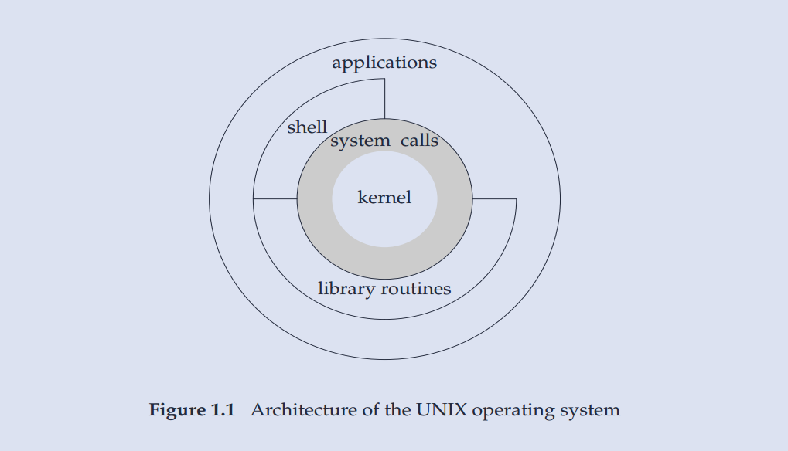
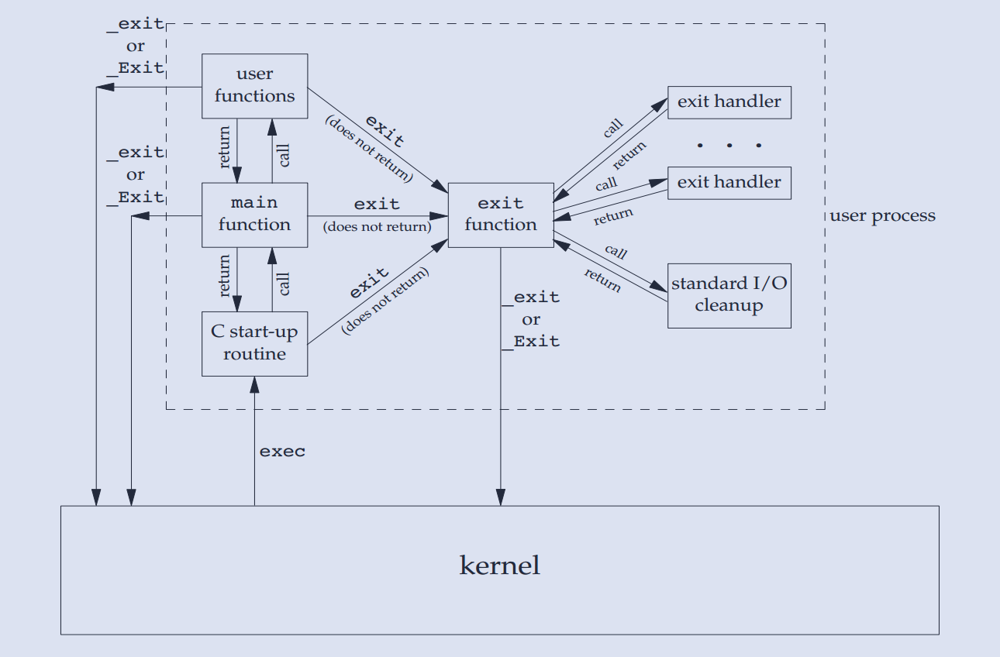
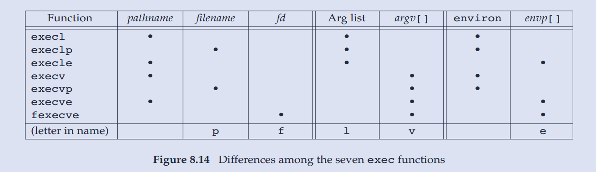
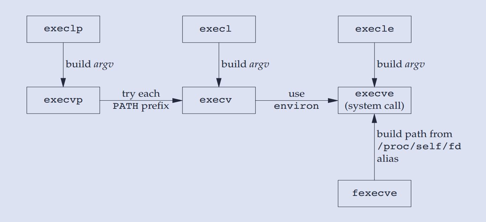
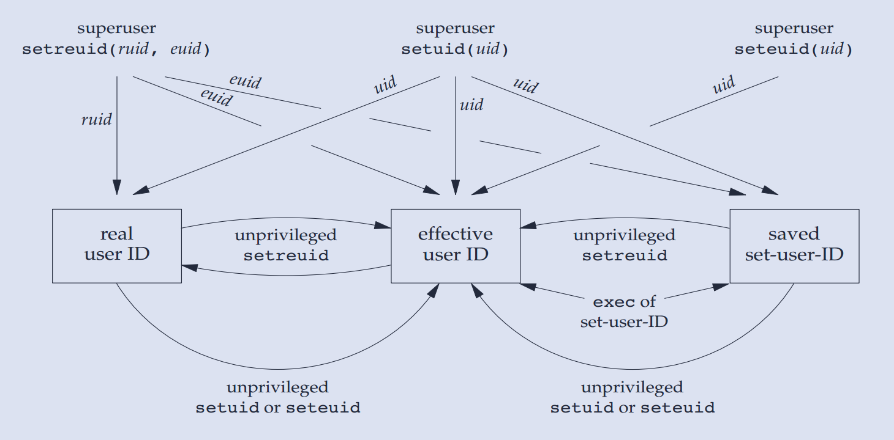

# APUE 笔记

## 1. Unix 基础

操作系统为运行的程序提供服务的，典型服务：执行新程序，IO 操作，分配空间，获取系统信息。

可以将操作系统视为一种软件，其控制计算机硬件资源，提供程序运行环境。也将该种软件称为**内核（kernel）**，因为其相对较小，且位于环境核心。

内核的接口称为**系统调用（system call）**，公用函数库构建在系统调用之上，应用程序既可以直接使用系统调用，也可以使用函数库。`shell` 是一个特殊的应用程序。

准确来讲，Linux 是 GNU 操作系统的内核。



### 1.1 系统调用概述

系统调用是访问内核的入口，通过系统调用，进程可以请求内核去执行某些动作。

* 系统调用将处理器从用户态切换到核心态

* 系统调用都由一个唯一的数字来标识，而程序则是通过名称调用。

* 系统调用可携带参数。

系统调用的过程经历多个步骤。

1. 调用 C 语言函数库中的外壳（`wrapper`）函数，来发起系统调用。

2. 保存系统调用的参数到寄存器。

3. 将系统调用编号复制到 `%eax`寄存器。

4. 执行一条中断机器指令(`int 0x80`)，切换到核心态，并执行中断矢量所指向的代码。

5. 响应中断 0x80，内核会调用 `system_call()` 例程。

6. 若系统调用服务例程的返回值表明调用有误，外壳函数会使用该值来设置全局变量 `errno`.

7. 外壳函数会返回到调用程序，并同时返回一个整型值，以表明系统调用是否成功。

即便对于一个简单的系统调用，仍要完成相当多的工作，因此系统调用的开销虽小，却也不容忽视。

### 1.2. 登录

用户通过键入**登录名**和**口令**执行登录操作。系统查看口令文件（通常是 `/etc/passwd` ）中的登录名。

```txt
root:x:0:0:root:/root:/bin/bash
daemon:x:1:1:daemon:/usr/sbin:/usr/sbin/nologin
bin:x:2:2:bin:/bin:/usr/sbin/nologin
sys:x:3:3:sys:/dev:/usr/sbin/nologin
nobody:x:65534:65534:nobody:/nonexistent:/usr/sbin/nologin
wch:x:1000:1000:wch,,,:/home/wch:/bin/zsh
```

口令文件中登录项，由7个冒号分割的字段组成：登录名，加密口令，数字用户 ID（UID），数字组 ID（GID），注释字段，起始目录和 shell 程序。

目前，加密口令已经转移到其他文件中。

加密口令不同于口令，前者是后者的加密字符，Unix 不存储后者，验证口令的方式是：加密后对比加密口令是否一致。

用户登录时，工作目录设置为起始目录（home directory），其值也是从口令文件中获取的。

系统通过口令文件最后一个字段来确定为用户执行哪一个 shell。

常见的 shell：

* Bourne shell 是古老和广泛的 shell

* Bourne-again shell 是 GNU shell，遵循 POSIX 标准，兼容 Bourne shell

* C shell

* TENEX C shell 是 C shell 的加强版

OSX 和 大部分 Linux 系统的 shell 都是 Bourne-again shell。

### 1.3. 文件组织

目录（directory）是一个包含目录项的文件。逻辑上，每个目录项都包含文件名和相关属性信息，如文件类型、文件大小、所有者、权限及最后修改时间。

文件名不能包含斜线（/）和空字符，因为前者来分割路径中的各个文件名，后者终止一个路径名。POSIX 推荐文件名使用数字、字母、句点（.）、短横线（-）和下划线（_）。

创建新目录时，会自动创建两个文件名，.（指向当前目录）和 ..（指向父目录），根目录的父目录是本身。

由斜线分割的，一个或多个的文件名组成的 **序列** 称为路径名（pathname），斜线开头的是路径名为 **绝对路径**，否则为 **相对路径**。

每个进程都有一个工作目录（working directory），也称 **当前工作目录**，相对路径名都是从工作目录开始解析的。

>UNIX 系统手册是分成若干部分的，`ls(1)` 表示 UNIX 手册第一部分的 ls 项。一个特定项可能在不同部分的含义不同。
> 比如，使用 `man 1 ls` 来获取 `ls(1)` 相关信息。

### 1.4. UNIX 标准

UNIX 标准主要有3个，都是各自独立的组织所制定的标准：

* ISO C

* IEEE POSIX

* Single UNIX Specification

#### ISO C

ISO C 标准意图提供 C 程序的可移植性，使之适应不同的操作系统，而不仅仅适合 UNIX 系统。此标准定义了 C 的语法与语义，还定义了标准库。
现今的 UNIX 系统都提供了 C 标准库。

#### POSIX

POSIX 指的是可移植操作系统接口，目的是提升应用程序在各种 UNIX 系统环境之间的可移植，定义了符合 POSIX 的操作系统必须提供的各种服务。

#### Single UNIX Specification

Single UNIX Specification （SUS，单一UNIX规范）是 POSIX.1 标准的一个超集，定义了一些附加接口，扩展了 POSIX.1 规范提供的功能。

整体而言，这些标准之间配合不错，ISO C 和 POSIX.1 可能有冲突，如果冲突，POSIX.1 服从 ISO C。

## 2. IO 操作

I/O是一切实现的基础，分两类

* 系统调用 I/O (文件 I/O)
* 标准 I/O

不同系统的文件 I/O 可能不同，不能跨平台。

标准 I/O 是对系统调用 I/O 的一套跨平台封装，优先使用，因为 1）跨平台，移植性好，2）能合并系统调用，为读写加速

> 比如，标准 IO 函数 `fopoen`，在 Unix 下依赖 `open` 函数，而在 Windows 下依赖 `openfile`

### 2.1 标准 I/O

不同与文件 I/O，标准 I/O 都是围绕 **流（stream）** 进行的，当使用标准 I/O 打开或创建一个文件时，会关联一个流。

标准 I/O 提供三种类型的缓冲：

* 全缓冲区： 满了刷新（eg：非终端设备默认）。
* 行缓冲区： 换行/满了 刷新 (eg: 标准输出)。
* 无缓冲区： 立即输出（eg：标准错误）。

刷新是指将缓冲区的内容写到对应文件上去。

ISO C 仅有以下要求：

1. 当标准输入和标准输出不指向交互设备时，它们才是全缓冲的。
2. 标准错误绝非全缓冲。

而很多系统默认实现：

1. 标准错误是无缓冲。
2. 若是指向终端，则是行缓冲，否则是全缓冲。

注意：

1. 可以修改流的缓冲模式，`setvbuf()`，但不建议这么做。
2. 使用 `fflush(FILE *fp)` 强制冲洗一个流，若 fp 为 NULL，冲洗所有输出流。  

#### 文件打开

```c
// 成功返回 `FILE` 指针，否则返回 `NULL`, 并设置 `errno`.
FILE *fopen(const char *pathname, const char *mode);
// 若已打开，则先关闭；若已经定向，则取消定向
FILE *freopen(const char *pathname, const char *mode, FILE *stream);

// ISO C 不涉及文件描述符，此函数是 POSIX 所属部分
FILE *fdopen(int fd, const char *mode);
```

注意：

1. 函数参数都是 const 指针，保证文件路径和读写权限不会被修改。
2. path 可使用相对路径或绝对路径。
3. `mode` 决定文件如何读写, 只使用`mode`前几个有效字符，后面忽略，即 "w" 和 "write" 等效，"w+" 与 "w+abc" 等效。
4. `mode` 在 Windows 有额外参数 `b`，表示使用二进制模式，默认是文本模式，这个参数对 Linux 无效.
5. 线程中使用 `fopen()` 打开文件个数有上限（除去默认打开的流 `stdin`,`stdout` 和 `stderr`)，具体在 `ulimit -a`中查看。
6. 创建的文件权限由 `0666&~umask` 决定。

#### 文件关闭

```c
// 关闭一个打开的流。
int fclose(FILE *fp);
```

注意：

1. 关闭之前，会冲洗缓冲区的输出数据。
2. 当一个进程正常终止时，则所有未带写缓冲区的标准 I/O 都被冲洗，并关闭 I/O 流。

#### 文件读写

有三种不同类型的非格式 I/O 进行流的读写：

1. 每次一个字符的 I/O，一次读或写一个字符。如果流是带缓冲的，则标准 I/O 处理所有缓冲。
2. 每次一行的 I/O。使用 `fgets` 和 `fputs`，行以换行符终止。
3. 直接 I/O。每次读写某种数量的对象，而每个对象具有指定的长度。

##### 读写单个字符

```c
// 读单个字符
int fgetc(FILE *stream);
int getc(FILE *stream);

// 等价于 getc(stdin)
int getchar(void);

// 写单个字符
int fputc(int c, FILE *stream);
int putc(int c, FILE *stream);

// 等价于 putc(stdout)
int putchar(int c);
```

注意:

* `fgetc` 从 stream 中读取字符，并转换为 int, 或者 `EOF` 到文件结尾。`fgetc` 一般情况下等价于 `getc`, 而前者是函数，后者是宏。
* `fputc` 向流中写一个字符，字符被转换成 uint，`fputc`、`putc` 和 `putchar`之间关系类似上面情况。

> 宏比函数的运行速度快，编译速度慢。Linux 内核都是使用宏来实现。

##### 读写多个字符

```c
// 最多读取 n 个字符
// 成功返回字符串地址（即 s ），失败或文件尾返回 NULL
char *fgets(char *s, int size, FILE *stream);

// 不要使用这个函数，不检查溢出
char *gets(char *s);
```

`fgets`从流读取字符存到 `s` 中，碰到换行、文件尾或者读到了 `n-1` 个字符就停止读取，
并在存储的字符串末尾加上null字符作为字符串的结尾（读n-1个字符，加上null字符正好n个）。

注意：

* `fgets` 如果读到换行符，会停止读取，还会会将其存入str中。

##### 按行读取文件

```c
ssize_t getline(char **lineptr, ssize_t *n, FILE *stream);
```

如果 `lineptr` 为 NULL，n 为 0， 则会 malloc 内存, 所以要么主动给 lineptr 分配空间，要么让函数分配空间，后者需要相关参数赋空值。

##### 读写整块字符

```c
size_t fread(void *ptr, size_t size, size_t nmemb, FILE *stream);
size_t fwrite(const void *ptr, size_t size, size_t nmemb, FILE *stream);
```

读写成块的数据，如若干数目的结构体，返回成功读写的结构体的数目。

#### 格式化输入输出

使用 `fprintf()` 、`fscanf()`. 不要把所有的输出放到 `stdout` ，应把错误输出放到 `stderr`。

#### 文件指针

```c
int fseek(FILE *stream, long offset, int whence);
long ftell(FILE *stream);
void rewind(FILE *stream);
```

`offset` 可以是负数，表示反向移动。

`whence` 可以是以下值：

* `SEEK_SET` 文件头
* `SEEK_END` 文件尾
* `SEEK_CUR` 当前位置

* 使用 `fseek` 把文件指针移到 **文件头/文件尾/当前位置** 的附近(使用 offset)。
* 使用 `ftell`， 获取当前文件指针的偏移(由于 `ftell` 返回一个 正 long 值，故文件长受限于 long 的正数部分)。
* 使用 `rewind` 把指针头移回文件首，相当于 `fseek`的封装。

#### 临时文件

```c
// 返回一个可使用的临时文件名，多线程不安全
char *tmpnam(char *s);
// 返回一个可使用的临时文件，返回 `FILE`
FILE *tmpfile(void);
```

#### 缺陷

效率不高，需要多次复制。比如，当使用 fgets 和 fputs 时，需要复制两次数据，一次是内核和标准 I/O 缓冲区之间，第二次是标准 I/O 缓冲区和用户程序中的行缓存区之间。

### 2.2 文件 IO

对于内核而言，打开的文件是通过文件描述符引用：当打开或创建文件时，内核向进程返回一个文件描述符，并将文件描述符作为参数，传递给 `read` 或 `write`。

文件描述符 0，1，2 与进程的 **标准输入、标准输出与标准错误** 关联。

注意：

1. 文件描述符是个非负整数。
2. 一个进程会维护一个文件打开描述符表，每个表项都包含一个文件表项的指针。

#### 文件打开

```c
#include <sys/types.h>
#include <sys/stat.h>
#include <fcntl.h>

int open(const char *pathname, int flags);
int open(const char *pathname, int flags, mode_t mode);
int creat(const char *pathname, mode_t mode);
int openat(int dirfd, const char *pathname, int flags);
int openat(int dirfd, const char *pathname, int flags, mode_t mode);
```

参数：

* path 参数是要打开或创建文件的名字。
* oflag 参数说明此函数的多个选项，用一个或多个常量进行或运算表示。
* mode 参数仅当创建文件时可用，说明文件的权限，用一个或多个常量进行或运算表示。

返回： 文件描述符，一般都是当前可用最小的。

文件打开方式对应的oflag：

| mode | oflags | 含义 |
| :----: | :----:| :----: |
| r | O_RDONLY | 只读，定位到文件头 |
| r+ | O_RDWR | 读写，定位到文件头 |
| w | O_WRONLY &#124; O_TRUNC &#124; O_CREAT | 只写，清空，定位到文件头 |
| w+ | O_RDWR &#124; O_CREAT &#124; O_TRUNC | 读写, 清空，定位到文件头 |
| a | O_WRONLY &#124; O_CREAT &#124; O_APPEND  | 只写，每次写到文件尾 |
| a+ | O_RDWR &#124; O_CREAT &#124; O_APPEND| 读写，每次都写到文件尾 |

#### 文件关闭

```c
#include <unistd.h>
int close(int fd);
```

关闭一个文件，并释放进程加在上面的记录锁。

进程终止时，内核自动关闭它所有的打开文件，可以利用这一点而不显示地用 `close` 关闭打开的文件。

#### 设置偏移量

```c
#include <unistd.h>
off_t lseek(int fd, off_t offset, int whence);
```

为一个打开文件设置偏移量。

返回：新的文件偏移量（若成功执行）

注意：

1. 某些设备可允许该函数返回负的偏移量，测试时应判断不等于-1，而不是小于0。
2. 文件偏移量可大于文件长度，这种情况下进行写，则形成文件空洞
3. 文件空洞不占用磁盘存储区

#### 函数 read

```c
#include <unistd.h>
ssize_t read(int fd, void* buf, size_t nbytes);
```

参数：

* fd 文件描述符
* buf 读取的字符串存储地址
* nbytes 打算读取的字节数目

返回：读到的字节数，若到文件尾，则为 0 ，出错则为 -1

有很多情况导致实际读取小于预计值：

1. 读到文件尾
2. 终端读取一行
3. 某一信号造成中断，只读取到部分数据就返回，读取固定长度的数据有时需要多次读取

#### 函数 write

```c
#include <unistd.h>
ssize_t write(int fd, const void* buf, size_t nbytes);
```

返回写的字节数，通常与参数 nbytes 相同，否则表示出错。出错的常见原因磁盘满，或者文件长度限制。

如果设置了 `O_APPEND` 参数，总是写到文件尾，不管文件指针位置。

#### I/O 数据结构

内核使用3种数据结构表示打开文件：

1. 每个进程都有一个打开文件描述符表，文件描述符关联一个指向文件表项的指针。
2. **内核** 为所有打开文件维护一张表，文件表项都包含文件状态信息、文件偏移量和指向该文件 v 节点表项的指针。
3. 每个打开文件都一个 v 节点，v 节点包括了文件类型和该文件的 inode。


当进程打开一个文件时，内核就会创建一个新的file对象。多个进程同时打开同一个文件，则会创建多个file对象。

file 对象是全局级别，可以与其他进程共享。

#### 函数 dup 和 dup2

复制现有的文件描述符

```c
#include <unistd.h>
int dup(int fd);
int dup2(int fd, int fd2);
```

dup 使用的是当前最小可用的 fd。

dup2 可指定新描述符的值，如果新描述符已经打开，则先关闭，除非 fd 等于 fd2。

#### 函数 fcntl

fcntl 函数可用改变已经打开文件的属性。

```c
#include <unistd.h>
int fcntl(int fd,int cmd,...);
```

该函数有5种功能：

* 复制一个已有的描述符
* 获取/设置文件描述符标志
* 获取/设置文件状态标志
* 获取/设置异步 I/O 所有权
* 获取/设置 记录锁

#### 函数 ioctl

ioctl 是 I/O 操作的杂物箱，不能用本章其他函数表示的 I/O 操作都能用 ioctl 来表示。

每个设备驱动程序可以定义它自己专用的一组 ioctl 命令，系统为不同种类的设备提供通用的 ioctl 命令。

#### `/dev/fd`

该目录为虚目录，显示的当前进程的文件描述符信息。

打开 `/dev/fd/n` 等效于复制描述符 n。

### 2.3 其他

#### errno

`errno` 是记录系统的最后一次错误代码

* 可以把 `errno` 看做全局变量，则需尽快保存或使用，以防被其他程序使用更改。
* errno 把每一种错误对应到一个 int，具体地，可以查看 `/usr/include/asm-generic/errno-base.h`。
* 简单的说，errno在标准C中是一个整型变量，在 `errno.h` 中声明，C标准库中实现。
* 建议使用 `perrno()` 来打印错误。
* 多线程技术中，为了使errno线程安全，使用宏`#define errno (*__errno_location ())`替代了简单的 `extern int errno` 声明。

#### 文本方式和二进制方式

1. 使用二进制方式进行读文件时，会原封不动的读出全部的内容，写文件的时候，会把内存缓冲区的内容原封不动的写到文件中。

2. 使用文本方式进行读文件时，会将回车换行符号 `CRLF(0x0D 0x0A)` 全部转换成单个的换行符号 `LF(0x0A)`，
写文件的时候，会将换行符号 LF 全部转换成回车换行符号 CRLF.

因此，在 Windows 平台下开发中，以二进制模式创建并写入的文件，在读取时，为了防止读文件出错，建议以二进制模式进行读取；
同样的道理，以文本模式创建并写入的文件，在读取该文件时，建议以文本模式进行读取。

#### 面试题1

```c
char *ptr = "abc";
ptr[0] = 'x'; //能否执行?
```

显然，"abc"是常量字符串，一般来说不能被修改，但也不尽然，要看系统环境，这取决于编译器存放常量字符串的位置。

#### 面试题2

```c
#define SIZE 5
char buf[SIZE];
fgets(buf,SIZE, stream);

// 情况1，如果读一个文件，内容为ab,则读取字符串的内容为 'a' 'b' '\0'
// 情况2，如果文件内容为abcdef,则读取字符串内容为 'a' 'b' 'c' 'd' '\0'
// 问，如果文件内容为abcd,则需要几次可以读完？ ( POSIX 风格的文件)
// 2次，第一次的内容为，'a','b','c','d','\0'
// 第二次内容为 '\n','\0'
```

POSIX 定义 **行**：

> A sequence of zero or more non-characters plus a terminating character.

所以 Unix 文件每一行结尾都有一个 `\n`, 包括最后一行。

而 Windows 没有这个概念，它用 `\r\n` 来换行，最后一行没有额外的换行符。

现在主流的编辑器可以自由设置 Line Separator(Windows 的 CRLF 和 Unix & MacOS 的 LF)
，其中，CR 指 Carriage Return, LF 指 Line Feed.

主流编辑器如 VSCode 和 JetBrain 系列，都默认文件末尾不加换行符，可以设置 Line Separator 设置风格.

#### man 手册分类

| 序号 | 英文 | 中文 |
| :----: | :----: | :----: |
| 1 | Executable programs or shell commands | 可执行程序或shell命令 |
| 2 | System calls (functions provided by the kernel) | 系统调用 |
| 3 | Library calls (functions within program libraries) | 库调用 |
| 4 | Special files (usually found in /dev) | 特殊文件 |
| 5 | File formats and conventions eg /etc/passwd | 文件格式和约定 |
| 6 | Games | 游戏 |
| 7 | Miscellaneous (including macro packages and conventions), e.g. man(7), groff(7) | 杂项（包括宏和惯例） |
| 8 | System administration commands (usually only for root) | 系统管理命令（通常仅适用于root用户） |
| 9 | Kernel routines [Non standard] | 内核例程（非标准） |

## 3. 文件系统

### 3.1. 文件信息

获取文件信息相关函数

```c
#include <sys/types.h>
#include <sys/stat.h>
#include <unistd.h>

int stat(const char *path, struct stat *buf);
int fstat(int fd, struct stat *buf);
int lstat(const char *path, struct stat *buf);
```

注意：

* 第一个传递的是文件路径
* 第二个传递的是与文件相关联的 fd
* 第三个与第一个大体相同，不同之处在于对链接文件的处理

```c
 struct stat {
               dev_t     st_dev;         /* ID of device containing file; 包含当前文件的设备 ID 号*/
               ino_t     st_ino;         /* Inode number; 与 ls -i 中的 inode 号相对应*/
               mode_t    st_mode;        /* File type and mode; 权限信息 */
               nlink_t   st_nlink;       /* Number of hard links; 硬链接数 */
               uid_t     st_uid;         /* User ID of owner; uid */
               gid_t     st_gid;         /* Group ID of owner; gid */
               dev_t     st_rdev;        /* Device ID (if special file); 设备 ID 号，如果该文件是设备的话 */
               off_t     st_size;        /* Total size, in bytes; */
               blksize_t st_blksize;     /* Block size for filesystem I/O; 一个Block 的大小 */
               blkcnt_t  st_blocks;      /* Number of 512B blocks allocated; 当前文件分配了多少个512B大小的块 */
               time_t    st_atim;        /* Time of last access ; 最后一次读的时间 */
               time_t    st_mtim;        /* Time of last modification; 最后一次写的时间 也是 ls 命令显示的时间*/
               time_t    st_ctim;        /* Time of last status change; 最后一个亚数据修改的时间 */
           };
```

`st_size`、`st_blksize` 和 `st_blocks` 无乘积关系。

#### 文件空洞

当调用 `lseek()` 改变文件偏移量，使之越过文件结尾，再执行 I/O 操作，将导致原来**文件结尾到新写入数据之间**形成一个空洞，称之为**文件空洞**。

文件空洞不占用磁盘空间，只有往空洞写入内容才会分配磁盘块。这也意味着，一个文件名义上的大小可能远大于其实际在磁盘上占用的空间。有时候文件下载会使用文件空洞。

#### st_mode 文件权限信息

st_mode 是一个整型变量，使用低16位表示其文件信息


使用 `S_ISXXX(st_mode)` 宏判断文件类型，如 `S_ISREG` 判断文件是否一个常规文件

#### umask

```c
#include <sys/types.h>
#include <sys/stat.h>
mode_t umask(mode_t mask);
```

如前所述，IO 操作创建的文件权限默认是通过 `0666 & umask` 确定的。

umask 的作用：防止权限过松。

`umask` 也是一条 shell 命令，后面接需要设置的 `umask` 值；如果不带参数，则是打印当前 `umask` 的值

### 3.2 文件权限

```c
#include <sys/stat.h>
int chmod(const char *path, mode_t mode);
int fchmod(int fd, mode_t mode);
```

`chmod` 也是一条 shell 命令，用以设置文件权限 [参考](https://www.runoob.com/linux/linux-comm-chmod.html)

#### 粘住位 t位

如果一个可执行文件的这一位被设置了，那么在该程序第一次执行结束时，其程序的正文部分（机器指令部分）的一个副本仍被保存在交换区，下次执行该程序时能较快的装入内存。

现今的unix系统大多 虚拟存储系统以及 快速文件系统，所以不再需要这种技术，所以改变粘住位的含义：

如果对一个目录设置了粘住位，只有对该目录具有 写权限的用户在满足下列条件之一的情况下，才能删除或更名该目录下的文件：

* 拥有此文件
* 拥有此目录
* 是超级用户

#### 文件系统 FAT UFS

文件系统的功能：存储和管理文件或数据

FAT16/32 实质是静态存储的单链表 具体[参考](http://www.360doc.com/content/19/1029/09/1367418_869696583.shtml)

UFS(Linux早期开源文件系统) 参考 APUE 4.14 节， 由 i 位图 、块位图，inode 和 数据块 组成

#### 硬链接和符号链接

```c
#include<unistd.h>
//创建一个硬链接文件
int link(const char *oldpath, const char *newpath);
//删除一个硬链接，可能同时删除对应文件
int unlink(const char *pathname);

#include<sys/types.h>
#include<utime.h>
//修改文件的最后访问时间和修改时间
int utime(const char *filename, const struct utimbuf *times);
```

硬链接（ `ln old_file new_file` ）是 多个文件名关联同一个文件(inode 相同），删除一个文件名，仍可以通过另一个访问文件。

符号链接（`ln -s old_file new_file`） 是一个单独文件（inode 不同），类似于快捷方式，基本不占存储空间，通过原文件名访问文件内容。如果删除原文件名，则文件被删除，符号链接失效。

使用 `remove()`（ISO C) 删除一个文件，`rename()` 更改文件名或文件路径。

**注意**: 硬链接和目录项是同义词，且建立硬链接有限制，不能在分区建立，不能给目录建立，符号链接不受这两点限制。

### 3.3. 目录操作

```c
#include <sys/stat.h>
#include <sys/types.h>

int mkdir(const char *pathname, mode_t mode);

#include <unistd.h>
//删除一个目录，必须是空目录
int rmdir(const char *pathname);

//修改当前工作路径
int chdir(const char *path);
int fchdir(int fd);

//获取当前工作路径
char *getcwd(char *buf, size_t size);
//
```

>chroot命令用来在指定的根目录下运行指令。chroot，即 change root directory （更改 root 目录）。
>在 linux 系统中，系统默认的目录结构都是以/，即是以根 (root) 开始的。而在使用 chroot 之后，系统的目录结构将以指定的位置作为/位置。

#### glob 函数

```c
#include <glob.h>
typedef struct {
    size_t   gl_pathc;    /* Count of paths matched so far  */
    char   **gl_pathv;    /* List of matched pathnames.  */
    size_t   gl_offs;     /* Slots to reserve in gl_pathv.  */
} glob_t;

//通过通配符获取文件名 
int glob(const char *pattern, int flags, int (*errfunc) (const char *epath, int eerrno), glob_t *pglob);
void globfree(glob_t *pglob);
```

可以通过通配符匹配(有选择地）获取目录下的所有文件

---

也可以通过以下函数获取目录中的文件信息

```c
#include <sys/types.h>
#include <dirent.h>

DIR *opendir(const char *name);
DIR *fdopendir(int fd);
int closedir(DIR *dirp);
struct dirent *readdir(DIR *dirp);
void rewinddir(DIR *dirp);
void seekdir(DIR *dirp, long loc);
long telldir(DIR *dirp);
```

### 3.4. 系统文件

口令文件 `/etc/passwd` 和组文件 `/etc/group` 是两个重要的与系统相关的数据文件，也经常被使用。

虽然这些文件都是文本文件，可以使用标准 IO 读取，但比较耗费时间。我们需要以非 ASCII 文本格式存放，并提供相关接口。

#### 口令文件

```c
#include <pwd.h>
// passwd 结构体是函数体内部的静态变量，调用下面函数的任一个，都会重写。
struct passwd {
               char   *pw_name;       /* username */
               char   *pw_passwd;     /* user password */
               uid_t   pw_uid;        /* user ID */
               gid_t   pw_gid;        /* group ID */
               char   *pw_gecos;      /* user information */
               char   *pw_dir;        /* home directory */
               char   *pw_shell;      /* shell program */
           };

struct passwd *getpwuid(uid_t uid);
struct passwd *getpwnam(char *name);
```

POSIX.1 定义了两个访问口令文件的函数，可以通过用户登录名或 UID 访问到口令文件中相对应的数据行(不能获取用户口令）。

**注意**：

* 通常都会有一个 root 用户, UID 为 0。
* 加密口令字段为占位符 x, 故无法访问通过上述函数访问到用户口令。

#### 组文件

### 3.5 其他

#### 在 shell 中 `-` 开头的非选项参数

显然，以 `-` 和 `--` 开头的非选项参数会被当做选项参数，此时需要加一个 `--` 表示选项参数已经结束，剩下的都是非选项参数

```bash
# 如果想要查看 -a 文件的信息，下面这种做法是达不到要求的
ls -a 
# 你需要加上 --, 将后面的内容解析为非选项参数
ls -- -a
```

#### ls命令参数

* -a  --all 显示隐藏文件(.开头的文件)
* -i  --inode 显示文件的 index number
* -n  --numeric-uid-gid 与 -l 类似，但是显示的是 uid 和 gid
* -l  使用长格式

#### stat 命令

显示文件的详细信息

#### 硬盘的结构

硬盘由很多盘片(platter)组成，每个盘片的每个面都有一个读写磁头。如果有N个盘片，就有2N个面，对应2N个磁头(Heads)，从0、1、2开始编号。
每个盘片被划分成若干个同心圆磁道(逻辑上的，是不可见的。)
每个盘片的划分规则通常是一样的。这样每个盘片的半径均为固定值R的同心圆在逻辑上形成了一个以电机主轴为轴的柱面(Cylinders)，从外至里编号为0、1、2......每个盘片上的每个磁道又被划分为几十个扇区(Sector)，
通常的容量是512byte，并按照一定规则编号为1、2、3......形成Cylinders×Heads×Sector个扇区。这三个参数即是硬盘的物理参数。

#### du 命令

显示指定的目录或文件所占用的磁盘空间

```bash
# 以 K 为单位，显示当前目录所占磁盘空间
du 
# 显示当前文件所占用磁盘空间
du file
```

## 4. 进程

### 4.1 进程环境

#### main 函数

C 程序总是从 main 函数开始执行

```c
int main(int argc, char *argv[]);
```

当内核执行 C 程序时，在调用 main 前先调用一个特殊的**启动例程**，让启动例程来调用 main 函数。
当 main 函数结束时，其返回值被启动例程当做参数传给 exit 函数。故例程调用 main 函数的 C 语言形式如下：

```c
exit(main(argc, argv));
```

`exit` 做完清理工作后，调用 `_exit` 系统调用来终止进程，`main` 函数的返回状态最终传给 `_exit`，成为进程的退出状态。

#### 进程终止方式

进程终止分为正常终止和异常终止,其中五种为正常终止：

1. 从 `main` 返回；
2. 调用 `exit`；
3. 调用 `_exit` 和 `_Exit` ；
4. 最后一个线程从其启动例程返回；
5. 从最后一个线程调用 `pthread_exit`；

三种异常终止：

1. 调用 `abort`；
2. 接到信号；
3. 最后一个线程对取消请求做出响应。

#### 退出函数

```c
#include <stdlib.h>
void exit(int status);
void _Exit(int status);
#include <unistd.h>
void _exit(int status);
```

三个函数都是正常终止一个程序：`_exit` 和 `_Exit` 立即进入内核，`exit` 先做一些清理工作，再进入内核。

按照 ISO C 和 POSIX.1，exit 先调用登记的终止处理函数，然后再关闭打开流（调用 fclose），最后调用 `_exit` 和 `_Exit`。



#### 终止处理函数

按照 ISO C，一个进程最多登记 32 个终止处理函数，也称钩子函数，使用 atexit 来登记。

```c
#include <stdlib.h>
int atexit(void (*func)(void));
```

注意：

1. 不能向终止处理函数传递任何参数，也不期望其返回值。
2. 登记的顺序和被调用的顺序是相反的。
3. 可重复登记，如果一个函数被登记多次，也会被调用多次。

一个程序只能通过调用 exec 来执行。进程可以主动终止（显式或隐式的调用_exit或_Exit），也可被动终止（被信号终止）。

#### 命令行解析

```c
#include <unistd.h>
int getopt(int argc, char * const argv[], const char *optstring);
```

编程练习：使用命令行参数，输出当前时间。 [参考](../src/chap3-process/mydate.c)

#### 环境变量

环境变量即存储在系统的变量，每个程序都接收一张存储环境变量的环境表。环境表是一个字符指针数组，每个指针包含一个以 null 结尾的字符串地址。
全局变量 environ 则包含该指针数组的地址：

```c
extern char **environ;
```


ISO C 定义一个函数 getenv，用于取环境变量的值，程序并不直接访问 environ。

```c
#include <stdlib.h>
char *getenv(const char *name);
int setenv(const char *name, const char *value, int overwrite);
int unsetenv(const char *name);
```

#### C 程序布局

* 正文段 只读，可共享。
* 初始化数据段，存储程序需要明确赋值的变量。
* 未初始化数据段，bbs段。
* 栈 自动变量及函数调用需要保存的信息。
* 堆，动态分配的位置。


>使用 `pmap(1)` 分析程序的存储布局。

#### 函数 setjum 和 longjum

goto 语句是不能跨函数，执行这种操作的是函数 setjum 和 longjum，用于处理发生在深层嵌套函数调用中出错。

编程练习：使用 setjum 和 longjum 实现函数间跳转。[参考](../src/chap3-process/jump.c)

#### 资源获取和设置

```c
#include <sys/time.h>
#include <sys/resource.h>
 struct rlimit {
               rlim_t rlim_cur;  /* Soft limit */
               rlim_t rlim_max;  /* Hard limit (ceiling for rlim_cur) 普通用户只能降低，root用户能升高也能降低*/
 };
int getrlimit(int resource, struct rlimit *rlim);
int setrlimit(int resource, const struct rlimit *rlim);
```

资源限制影响到调用进程并其由子进程继承。

### 4.2 进程基础知识

#### 进程的标识符 pid

每一个进程都有一个非负整数表示其进程 ID。进程 ID 是唯一的，用以区别其他进程，进程号是顺次向下使用。

进程号虽然是唯一的，但是是可复用的：当进程结束后，其进程 ID 成为复用的候选者；大多数 UNIX 系统实现了延迟复用，防止误认。

使用`ps`[查看进程信息]

专用进程：

* ID 为 0 的是调度进程，被称为**交换进程**，是系统进程。
* ID 为 1 的是 init 进程，是所有进程的祖先进程，在自举结束后，由内核调用。
* ID 为 2 的页守护进程，负责支持虚拟存储器系统的分页操作。

#### 获取进程号

```c
#include<unistd.h>
// 返回当前 pid
pid_t getpid(void);
// 返回父进程 pid
pid_t getppid(void);
```

#### 函数 fork

`fork` 通过复制当前进程产生新进程（子进程）。

```c
#include <unistd.h>
pid_t fork(void);
```

`fork()`函数被调用一次，返回两次，分别从父进程和子进程返回。两次返回的区别是子进程返回0，父进程返回子进程的 pid, 以区分父子进程。

>子进程返回0的理由是，进程 ID 不可能是0，且可以通过 `gettpid()` 返回父进程的 PID。
>父进程返回子进程 PID 的理由是，父进程不能通过函数调用获取任一子进程。

子进程获得父进程的副本，包括**PC（程序计数器）、数据空间、堆和栈**，同时共享正文区（代码段）。但现在很多实现并不真的复制，而是**写时复制**。

但是 `fork()` 产生的子进程和父进程并不完全相同，区别有：

* pid 不同
* ppid 不同
* 未决信号和文件锁不继承
* 资源利用量清 0

**注意**：

* 父子进程从相同地方返回（即 fork() 返回），但**谁先执行不确定**
* 子进程也复制 IO 缓冲，  所以涉及到 IO 操作时最好 `fork()` 之前 `fflush(NULL)`

使用 `time` [命令](#time_c) 打印进程运行时间

三种异常情况：

1. 当一个子进程还在运行时，父进程就终止，就会被完成 `init` 进程收养，当子进程终止时，完成善后工作
2. 当子进程终止时，父进程(父进程还在，否则子进程自动变成孤儿进程)没有来得及善后(使用 wait/ waitpid),就会等待善后，成为僵尸进程
3. 当子进程终止时，父进程未处理(wait/waitpid)然后父进程终止,则子进程会由[僵尸进程](#zombie_p)变成孤儿进程，被 `init` 处理

`fork()` 与 `vfork()`的区别

* fork 是 创建一个子进程，并把父进程的内存数据copy到子进程中。
* vfork是 创建一个子进程，并和父进程的内存数据share一起用。

`vfork` 是这样的工作的，

1. 保证子进程先执行。
2. 当子进程调用exit()或exec()后，父进程往下执行。

详细内容参考[知乎问题 C语言里，main 函数中 return x和 exit(x) 到底有什么区别 ?](https://www.zhihu.com/question/26591968)

#### wait & waitpid

当进程正常或异常终止时，内核就向其父进程发送 `SIGCHLD` 信号。

```c
#include  <sys/types.h>
#include  <sys/wait.h>
// 若成功，返回进程 pid，若出错，返回 0
pid_t wait(int *status);
pid_t waitpid(pid_t pid, int *status, int options);
```

* 当所有子进程都还在运行，则阻塞。
* 当有一个进程已终止，正等待父进程获取终止状态，则获得终止状态立即返回。
* 当无子进程，则出错返回。

如果因为收到 `SIGCHLD` 信号而调用 `wait`，则期望立即返回；如果随机时间点调用 `wait`，则可能阻塞。

两个函数的区别：

1. 在一个子进程终止前，wait 使其调用者阻塞，而 waitpid 有一选项，可使调用者不阻塞。
2. waitpid 可以设置 pid 参数，指定要等待的子进程。

参数 statloc 是一个整型指针，如果非空，则把终止状态存放在指向的单元，如果空，则不保存终止状态。

waitpid 中 pid 参数的作用及解释：

* pid==-1，等待任一子进程，等同于 wait
* pid>0，等待进程 ID 与 pid 相等的子进程
* pid==0，等待组进程的任一子进程
* pid<-1，等待组 ID 等于 pid 绝对值的任一子进程

optons 参数进一步控制 waitpid 的行为，其值或为 0，或是预定义常量的按位或运算。

waitpid 提供 wait 没有的三个功能：

* 等待一个特定进程。
* 提供一个非阻塞版本。
* 支持作业控制。

#### 函数 exec

在 fork 后，子进程往往调用 exec 函数，以执行另一个程序。当进程调用 exec 后，进程执行的程序的完成替换成新的程序，新程序从 main 开始。

exec 用磁盘上的新程序替换了当前进程的正文段、数据段、堆段和栈段。

```c
#include <unistd.h>
extern char **environ;
int execl(const char *path, const char *arg, ... /* (char  *) NULL */);
int execlp(const char *file, const char *arg, ... /* (char  *) NULL */);
int execle(const char *path, const char *arg, ... /*, (char *) NULL, char * const envp[] */);
int execv(const char *path, char *const argv[]);
int execvp(const char *file, char *const argv[]);
int execvpe(const char *file, char *const argv[], char *const envp[]);
```

这些函数的区别：

1. path 参数表示使用路径名，file 参数表示使用文件名，从 PATH 环境变量搜索。
2. 参数表的传递，l 表示 list，v 表示 矢量 vector。前者每个命令行参数作为单独的参数，空指针结尾，后者构造一个指向各参数的指针数组，把该数组地址作为参数。
3. 环境表相关，可以主动传递一个指向环境字符串指针数组的指针，或者使用调用进程中的 environ 变量作为环境。

注意：第一个参数 `argv[0]` 可以设置为任意字符串，惯例是文件名或路径名。




#### 用户权限和组权限

在 UNIX 系统，特权（如能改变当前日期的表示法）以及访问控制，是基于用户 ID 和组 ID 的。
当程序需要增加特权或访问当前不被允许的资源时，需要更换 用户 ID 和组 ID，当用户减少特权或阻止对某些资源的访问时，也需要更换 用户 ID 和组 ID。

为了降低恶意程序的风险，我们总是试图使用 **最小特权** 模式，给程序能完成任务所需的最小特权。

用户 ID 分为实际用户 ID、有限用户 ID 和 保存的设置用户 ID（并不是所有系统都有），关于用户 ID 的一切适用于组 ID。

可以使用 setuid 设置实际用户 ID 和有效用户 ID

```c
#include <unistd.h>
int setuid(uid_t uid);
int setgid(gid_t gid);
```

说明：

1. 当进程具有超级用户权限，可以将 实际用户 ID, 有效用户 ID和 保存的设置用户 ID三个设置为 uid
2. 当进程不具有超级用户权限，且 uid 等于 实际用户 ID 或 保存的设置用户 ID时，则函数只将有效用户 ID 设置为 uid
3. 其他情况则报错，errno 为 **EPERM**

#### 设置用户 ID 位

在 st_mode 里，还有一位，称之为设置用户 ID 位，即 u+s. 仅当程序文件设置了设置用户 ID 位，exec 才设置有效用户 ID 位。

保存的设置用户 ID 是由 exec 复制有效用户 ID 而得到的。


函数 setreuid 和 setregid 交换实际用户(组) ID 和有效用户(组) ID.



用户登录过程：init 进程通过 fork 和 exec 产生 getty 进程，后者等待用户输入用户名，之后直接 exec 为 login 进程，等待用户输入用户口令。
login 通过读取 shadow 文件进行校验用户口令，若成功则 fork 和 exec 产生 shell 进程，同时通过 setuid 将权限降低为普通用户。

当普通用户运行 root 权限的程序文件时，如果该文件设置了设置用户 ID 位，则运行该程序时，有效用户 ID 等于 root，同时保存的设置用户 ID 等于 有效用户 ID，
也等于root。为了降低风险，程序一开始会设置有效用户 ID 为实际用户 ID，直到需要 root 权限时：调用 setuid 把有效用户 ID 设置为保存的设置用户 ID.
等到不再需要 root 特权时，再把有效用户 ID 改回实际用户 ID.

#### 进程时间

常用可度量的时间有：

* 墙上时钟时间

* 用户 CPU 时间

* 系统 CPU 时间

任一进程可调用 times 函数获得 times 获得它自己及子进程的上述值。

```c
#include <sys/times.h>
clock_t times(struct tms *buf);
//若成功，返回流逝的墙上时钟值
struct tms {
               clock_t tms_utime;  /* user time */
               clock_t tms_stime;  /* system time */
               clock_t tms_cutime; /* user time of children */
               clock_t tms_cstime; /* system time of children */
           };
```

注意：

1. 此结构体没有包含墙上时钟，而是作为函数返回值。
2. 对于墙上时钟，应使用相对值而非绝对值，即在测量前后调用并用新值减去旧值。
3. 所有由此函数返回的 clock_t 都用 `_SC_CLK_TCK` 转换成秒数。

#### 函数 system

通过函数 system 执行一个命令

```c
#include<stdlib.h>
int system(const char *cmdstring);
```

注意：

1. 若参数为空，则为测试函数是否可用，可用时返回非零值。
2. system 在其实现中调用了 fork、exec 和 waitpid。

#### 进程会计

大多数 UNIX 系统提供一个选项以进行进程会计处理，当进程结束时，内核就写一个会计记录，一般包括文件名、所使用的 CPU 总量、用户 ID、组 ID、启动时间等。

任一标准都没有对进程会计进行说明，所以不同系统的实现可能都有差别。

#### 系统日志

syslogd 可以简单地被称为记录系统活动的一个daemons

```c
#include <syslog.h>

void openlog(const char *ident, int option, int facility);
void syslog(int priority, const char *format, ...);
void closelog(void);
```

### 4.3. 进程关系

#### 进程组

每个进程除了进程 ID 外，属于一个进程组，进程组是一个或多个进程的集合。

同一个进程组中的各个进程接收来自同一个终端的各自信号，进程组有唯一的进程组 ID，其类型与进程 ID 相同，实际上，进程组 ID 等于组长进程的进程 ID。

进程组组长可以创建一个进程组、创建该组的进程、然后终止。进程组的生命周期取决于该组最后一个进程离开的时间。

进程调用 setpgid 可以加入一个现有的进程组或创建新的进程组

```c
#include<unistd.h>
int setpgid(pid_t pid, pid_t pgid);
```

函数将 pid 进程的进程组 ID 设置为 pgid，如果两个参数相等，则 pid 进程变成进程组组长。

注意：

1. 如果 pid 或 pgid 为 0，则使用调用者的 pid。
2. 只能为它自己或子进程设置进程组 ID，当子进程调用 exec 后，也不能再更改其进程组 ID。

#### 会话

会话（session）是一个或多个进程组的集合。shell的管道将几个进程编成一组。

```c
#include <unistd.h>
建立一个新会话
pid_t setsid(void);
```

如果该进程不是一个进程组的组长，则创建一个新会话，具体地：

1. 该进程变成新会话的会话手进程。此时，该进程是新会话的唯一进程。
2. 该进程成为一个进程组的组长进程。
3. 该进程没有控制终端。

如果该进程为进程组组长，则出错。为了不出现这种情况，先 fork，使父进程终止，子进程继续。

#### 守护进程

守护进程（daemon)是生存周期长的一种进程，在系统引导装入时启动，在系统关闭时终止，没有控制终端，在后台运行。

##### 系统守护进程

父进程为 0 的各进程通常为内核进程，作为系统引导装入过程的一部分而启动。（init 进程是内核在引导装入时启动的用户层次的命令）

内核进程是特殊的，通常存在于系统的整个生命周期，具有超级用户权限，无控制终端，无命令行。

> 在 ps 的输出中，内核守护进程的名字被方括号包含，其父进程是 kthreadd.

对于需要在进程上下文执行工作但不被用户层进程上下文调用的每一个内核组件，通常都有相应的内核守护进程，例如：

* kswapd 守护进程也称内存换页守护进程，其功能是将脏页面慢慢写回磁盘
* flush 守护进程在内存达到设置的最小阈值时将脏页面冲洗至磁盘
* sync_super 守护进程将文件系统元数据冲洗至磁盘
* jdb 守护进程帮助实现 ext4 文件系统中的日志功能

##### 编写规则

编写守护进程有一些基本规则：

1. 调用 umask 将文件模式创建创建屏蔽字设置为一个已知值。
2. 调用 fork，再使父进程终止，以保证子进程不是一个进程组的组长。
3. 调用 setsid 创建新会话。
4. 将当前目录更改为根目录。
5. 关闭不再需要的文件描述符。
6. 某些守护进程打开 /dev/null 来重定向标准输入、标准输出、标准错误。

有时不管标准输入、标准输出是否重定向，程序都要与终端交互，方法是 open 文件 `/dev/tty`.

### 4.3 其他

#### PS

查看进程信息，需熟悉各种不同参数的用法。

常用的有以下几个：

* a 显示所有用户的所有进程(包括其它用户)
* x 显示无控制终端的进程
* f 用树形格式来显示进程
* l 长格式输出
* u 按用户名和启动时间的顺序来显示进程
* m 查看详细信息
* j 显示与作业相关的信息，如会话 ID，进程组 ID、控制终端和终端进程组 ID。

ps 输出解释

* PID 进程的ID
* TTY 终端ID
* STAT 进程状态
* TIME 进程消耗CPU的时间

STAT 进程状态

* D 无法中断的休眠状态(通常 IO 的进程)
* R 正在运行可中或可运行(在队列中)
* S 处于休眠状态
* T 停止或被追踪
* X 死掉的进程(从来没见过)
* Z 僵尸进程

#### time

以秒为单位将一条命令执行期间所用的时间、系统时间和 time 命令的执行时间打印在标准错误中。

用法： `time  [ -p  ] Command  [ Argument  ... ]`

example:  

```bash
#列举home文件夹这一命令花费的时间
time ls /home
```

time 命令结果有三行组成：real 、user 和 sys

* real 值表示从程序开始到程序执行结束时所消耗的时间
* user 值表示程序运行在用户态的cpu时间
* sys 值表示程序运行在内核态的cpu时间

三者之间无等式关系

#### 孤儿进程和僵尸进程

* 孤儿进程：一个父进程退出，而它的一个或多个子进程还在运行，那么那些子进程将成为孤儿进程。孤儿进程将被init进程(进程号为1)所收养，并由init进程对它们完成状态收集工作。

* 僵尸进程：一个进程使用fork创建子进程，如果子进程退出，而父进程并没有调用wait或waitpid获取子进程的状态信息，那么子进程的进程描述符仍然保存在系统中。这种进程称之为僵死进程。

在每个进程退出的时候,内核释放该进程所有的资源,包括打开的文件,占用的内存等。

但是仍然为其保留一定的信息(包括 PID,退出状态,运行时间)。直到父进程通过 wait/waitpid 来取时才释放

#### 面试题1

```c
// a.c
#include <stdio.h>
int main(int argc, char **argv)
{
    printf("hello");
}
```

将上述程序保存并编译链接成可执行文件 a.out，在终端输入

```bash
./a.out
echo $?
```

请问最后一条命令输出是多少？

> $? 表示最后运行的命令的结束代码（返回值）即执行上一个指令的返回值
> 而 a.out 的父进程就是 shell，进程的返回值是 printf 的返回值

扩展：仅把程序改成如下形式：

```c
// a.c
#include <stdio.h>
int main(int argc, char **argv)
{
    exit(-1);
}
```

请问 echo 的输出是多少？

> 退出状态只是 8 位，并被 shell 解释为无符号数。

#### 面试题2

```c
#inluce<unistd.h>
int main(int argc, char** argv)
{
    printf("hello");
    fork();
}
```

请问如何输出？
>输出 hellohello

解释：printf输出到标准输出，但是由于是行缓冲模式，hello 存储在缓冲区里没有输出到终端，在 fork 时被子进程复制，所以才会输出两遍。
