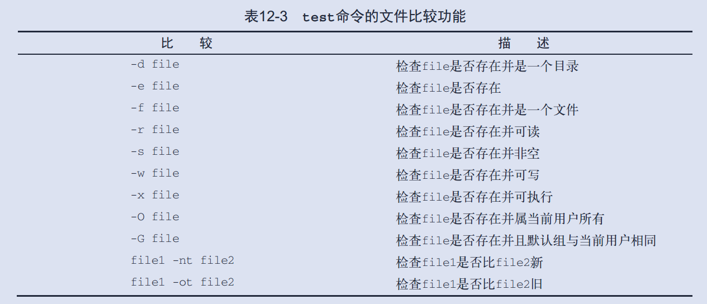

# Shell 笔记

## 1. 什么是 shell

**shell** 是一个程序，它接受键盘输入的命令，把命令传递给操作系统去执行。

**bash** 是 "Bourne Again SHell" 的首字母缩写，最初由 Unix 上 Steve Bourne 写的 `sh` 的增强版。

### 1.1 终端仿真器

使用 *图形用户界面* 时，我们需要一个和 `shell` 交互的叫做 **终端仿真器(terminal)** 的程序，KDE 用的是 `konsole`, 而 GNOME 则使用 `gnome-terminal`.

shell提示符是 `#` 而不是 `$`，则表示终端会话就有超级用户权限。

X 窗口系统（使 GUI 工作的底层引擎）内建了一种机制，支持 __快速拷贝__ 和 __粘贴技巧__ :

>按下鼠标左键，沿着文本拖动鼠标（或者双击一个单词）高亮了一些文本，那么这些高亮的文本就被拷贝到了一个由 X 管理的缓冲区里面。然后按下鼠标中键，这些文本就被粘贴到光标所在的位置。

不要在一个终端窗口里使用 `Ctrl-c` 和 `Ctrl-v` 快捷键来执行拷贝和粘贴操作，这两个控制代码有着不同的含义。

使用 `Ctrl-Shift-c` 和 `Ctrl-Shift-v` 来进行复制粘贴。

### 1.2 简单命令

* `data`: 显示系统当前时间和日期
* `cal`: 默认显示当前月份的日历
* `df`: 查看磁盘剩余空间的数量
* `free`: 显示空闲内存的数量
* `exit`: 终止一个终端会话
* `pwd`: 打印出当前工作目录名
* `cd`: 更改目录
* `ls`: 列出目录内容
* `file`: 确定文件类型
* `less`: 浏览文件内容
* `rm`: 删除文件和目录
* `ln`: 创建硬链接和符号链接
* `cp`: 复制文件和目录
* `mv`: 移动/重命名文件和目录
* `mkdir`: 创建目录
* `wc`: 对数据中的文本进行计数，打印行数、字数和字节数

大多数命令看起来像这样

```shell
command -options arguments
```

其中选项是由一个 **中划线** 加上 **一个字符** 组成，例如 `-l`。许多命令支持长选项，长选项由 **两个中划线** 加上 **一个字(word)** 组成。许多命令也允许把多个短选项串在一起使用。

### 1.3 `less` 命令

`less` 命令是一个用来 **浏览文本文件** 的程序。如果文件内容多于一页，可以上下滚动文件。按下 `q` 键，退出程序。

| 命令 | 行为 |
| ---- | ---- |
| Page UP or b | 向上翻滚一页 |
| Page Down or space | 向下翻滚一页 |
| UP Arrow | 向上翻滚一行 |
| Down Arrow | 向下翻滚一行 |
| G |移动到最后一行|
| 1G or g |移动到开头一行|
| /charaters |向前查找指定的字符串|

### 1.4 符号链接与硬链接

硬链接为一个文件创建新的文件名，可通过任一文件名访问该文件。

符号链接指向一个文件名，通过被指向的文件名访问文件。

```shell script
# 创建硬链接
ln file link
# 创建软链接
ln -s item link
```

### 1.5 通配符

shell 提供了特殊字符来帮助你快速指定一组文件名。这些特殊字符叫做通配符

|通配符|意义|
|----|----|
|*|匹配任意多个字符（包括零个或一个）|
|?|匹配任意一个字符（不包括零个）|
|[characters]| 匹配任意一个属于字符集中的字符|
|[!characters]| 匹配任意一个不是字符集中的字符|
|\[\[:class:]]| 匹配任意一个属于指定字符类中的字符|

解释:匹配是在`[]`中进行，`[:class:]`代表一类字符，故最后一个需要两个方括号

|字符类|意义|
|----|----|
|[:alnum:]| 匹配任意一个字母或数字|
|[:alpha:]| 匹配任意一个字母|
|[:digit:]| 匹配任意一个数字|
|[:lower:]| 匹配任意一个小写字母|
|[:upper:]| 匹配任意一个大写字母|

### 1.6 `alias`

`alias` 可以创建命令。

```shell script
# 创建 alias
alias name='string'
# 删除 alias
unalias foo
```

## 2. 键盘操作

移动光标的快捷键：

| 按键 | 行动 |
| ----|----|
|Ctrl-a | 移动光标到行首 |
|Ctrl-e | 移动光标到行尾 |
|Ctrl-f | 光标前移一个字符 |
|Ctrl-b |光标后移一个字符 |
|Alt-f  |光标前移一个字 |
|Alt-b  |光标后移一个字 |
|Ctrl-l |清空屏幕，移动光标到左上角|

编辑字符的快捷键：

|按键 | 行动|
| ---- |----|
| Ctrl-d| 删除光标位置的字符 |
| Ctrl-t| 光标位置的字符和光标前面的字符互换位置 |
| Alt-t| 光标位置的字和其前面的字互换位置 |
| Alt-l| 把从光标位置到字尾的字符转换成小写字母 |
| Alt-u| 把从光标位置到字尾的字符转换成大写字母 |

### 2.1 历史命令 

已经执行过的命令的历史列表存放在 `.bash_history` 文件里。

许多 Linux 发行版默认保存最后输入的 **500** 个命令。

|按键 | 行动|
| ---- |----|
|!!| 重复最后一次执行的命令。|
|!number | 重复历史列表中第 number 行的命令。|
|!string | 重复最近历史列表中，以这个字符串开头的命令。|
|!?string | 重复最近历史列表中，包含这个字符串的命令。|

## 3. Linux 基础

### 3.1 掩码

创建文件或文件夹时，`umask` 命令控制着默认权限。

若没有文件掩码时，文件的默认权限为 `0666`,文件夹的默认权限为 `0777`。

* 创建文件一般是用来读写，所以默认情况下所有用户都具有读写权限，但是没有可执行权限，所以文件创建的默认权限为 `0666`
* 而文件夹的 `x权限` 表示的是打开权限，所以这个权限必须要有，所以文件夹的默认权限为 `0777`

用户掩码的作用是用户在创建文件时从文件的默认权限中除去掩码中的权限。所以文件创建之后的权限实际为:

```
＃文件创建权限
默认权限(文件0666,文件夹0777) - umask
```

### 3.2 进程相关

#### 3.2.1 `ps` 命令

查看进程。`ps` 命令有许多选项，

- `x`: 展示所有进程，不管它们有没有终端

一个常见的选项组合是 `aux`

```shell script
$ ps aux
USER   PID  %CPU  %MEM     VSZ    RSS  TTY   STAT   START   TIME  COMMAND
...
```

#### 3.2.2 `top` 命令

`top` 以进程活动顺序显示连续更新的系统进程列表。(默认情况下，每三秒钟更新一次)


#### 3.2.3 进程控制

1. 中断进程。终端窗口，按下 `Ctrl-c`
2. 放到后台。程序命令之后加上 `&` 字符。
3. 放到前台。`fg` 命令跟随着一个百分号和任务序号。
4. 停止前台进程。输入 `Ctrl-z`。

### 3.3 网络相关

#### 3.3.1 检查和监测网络

1. `ping` 命令会持续在特定的时间间隔内(默认是一秒)发送数据包，直到它被中断
2. `traceroute` 程序会显示从本地到指定主机要经过的所有“跳数”的网络流量列表
3. `netstat` 程序被用来检查各种各样的网络设置和统计数据。

#### 3.3.2 网络中传输文件

1. `ftp` 被广泛地用来从因特网上下载文件。
2. `wget` 可以下载文件。

### 3.4 压缩与备份

#### 3.4.1 `gzip` 命令

`gzip` 程序被用来压缩一个或多个文件。

#### 3.4.2 `tar` 命令

```shell script
$ tar mode[options] pathname...
```
`mode` 是指以下操作模式：

|模式 | 说明 |
|:----:|:----:|
|c| 为文件和/或目录列表创建归档文件。|
|x| 抽取归档文件。|
|r| 追加具体的路径到归档文件的末尾。|
|t| 列出归档文件的内容。|

TODO

## 4 查找文件

### 4.1 `locate` 命令 - 全局简单查找

`locate` 程序会执行一次快速的路径名数据库搜索，并输出所有与给定字符串相匹配的路径名。

```shell script
# 输出任一个包含字符串“bin/zip”的路径名
$ locate bin/zip
```

### 4.2 `find` 命令 - 根据属性筛选

`locate` 程序只能依据文件名来查找文件，而 `find` 程序能基于各种属性递归搜索给定目录来查找文件。

#### 4.2.1 条件筛选

1. 测试文件类型

```shell script
$ find ~ -type f | wc -l
```

常见文件类型测试条件:
| 文件类型 | 描述 |
| ---- |----|
|b| 块特殊设备文件|
|c| 字符特殊设备文件|
|d| 目录|
|f| 普通文件|
|l| 符号链接|

2. 测试文件大小和文件大小

```shell script
$ find ~ -type f -name "*.JPG" -size +1M | wc -l
```

`-size +1M` 表示文件大于 `1M`。

`-name "*.JPG"` 表示要搜索的文件名模式。

#### 4.2.2 查找后的操作

`find` 命令允许基于搜索结果来执行操作。

几个预定义的操作： 

|操作| 描述|
| :----: | :----:|
| -delete | 删除当前匹配的文件 |
|-ls | 对匹配的文件执行等同的 `ls -dils` 命令，并将结果发送到标准输出 |
|-print| 把匹配文件的全路径名输送到标准输出，如果没有指定其它操作，这是默认操作 |
|-quit| 找到一个匹配退出 |

也可以自定义查找后的操作。

```shell script
-exec rm '{}' ';'
# or
-exec rm {} \;
```
参考：

* [Why does find -exec mv {} ./target/ + not work?](https://stackoverflow.com/questions/5607542/why-does-find-exec-mv-target-not-work)

## 5. 文本处理

### 5.1 `cat` 命令

`cat` 命令读取一个或多个文件，然后复制它们到标准输出

```shell script
$ cat [file]
```

`cat` 接受多个文件作为参数，然后拼接这些文件。常用于连接被分散的文件。

```shell script
$ cat part1 part2 > fullfile
```

如果没有文件名参数，`cat` 将复制标准输入到标准输出。

### 5.2 `sort` 命令

`sort` 对一个或多个文件进行 __行排序__，打印结果到标准输出。

部分选项:
| 选项 | 长选项 | 描述 |
| :----: | :----:| :----:|
|-b| --ignore-leading-blanks|默认情况下，对整行进行排序，即从第一个非空白字符开始排序。|
|-f| --ignore-case|排序不区分大小写。|
|-n| --numeric-sort|基于字符串的数值来排序。|
|-r| --reverse|按相反顺序排序。|
|-k| --key=`field1[,field2]`|对从 field1 到 field2 之间的字符排序。|
|-m| --merge|把每个参数看作是一个预先排好序的文件。|
|-t| --field-separator=char | 定义域分隔字符。默认情况下，域由空格或制表符分隔。|


`sort` 最重要之一是排序条件。

```shell script
$ sort -k 3.7nbr -k 3.1nbr -k 3.4nbr distros.txt
Fedora    10  11/25/2008
Ubuntu  8.10  10/30/2008
SUSE    11.0  06/19/2008
...
```

`key` 选项允许在字段中指定偏移量，上述命令按照年、月、日的方式排序。`nr` 表示按照字符串的数值逆序排列，`b` 用来删除日期字段中开头的空格。

### 5.3 `cut` 命令

`cut` 程序被用来从文本行中抽取文本，并把其输出到标准输出。

使用以下选项:

|选项| 说明|
|:----: | :----:|
|-c char_list |从文本行中抽取由 char_list 定义的文本。这个列表可能由 一个或多个逗号分隔开的数值区间组成。|
|-f field_list | 抽取整个文本行，除了那些由 -c 和 / 或 -f 选项指定的文本。|
|-d delim_char | 当指定 -f 选项之后，使用 delim_char 做为字段分隔符。默 认情况下，字段之间必须由单个 tab 字符分隔开。|
|--complement | 从文本行中抽取一个或多个由 field_list 定义的字段。这个 列表可能包括一个或多个字段，或由逗号分隔开的字段区间。|

### 5.4 sed 编辑器

`sed` 编辑器被称作流编辑器。流编辑器则会在编辑器处理数据之前基于预先提供的一组规则来编辑数据流。

`sed` 编辑器可以根据命令来处理数据流中的数据，这些命令要么从命令行中输入，要么存储在一个命令文本文件中。 `sed` 编辑器会执行下列操作：

1. 一次从输入中读取 **一行** 数据

2. 根据所提供的编辑器命令匹配数据

3. 按照命令修改流中的数据

4. 将新的数据输出到 `STDOUT`

`sed` 命令的格式如下

```shell script
sed options script file
# 选项
# -e script 在处理输入时，将 script 中指定的命令添加到已有的命令中
# -f file   在处理输入时，将 file 中指定的命令添加到已有的命令中
# -n        不产生命令输出，使用 print 命令来完成输出
```


#### 5.4.1 s 命令

`s 命令`会用斜线间指定的第二个文本字符串来替换第一个文本字符串模式

```shell script
echo "This is a test" | sed 's/test/big test/'
# 输出
# This is a big test
```

替换命令在替换多行中的文本时能正常工作，但默认情况下它只替换每行中出现的第一处。
要让替换命令能够替换一行中不同地方出现的文本必须使用 **替换标记（substitution flag）**。
替换标记会在替换命令字符串之后设置。

```shell script
s/pattern/replacement/flags
```
有4种可用的替换标记：

- 数字，表明新文本将替换第几处模式匹配的地方；
- g，表明新文本将会替换所有匹配的文本；
- p，表明原先行的内容要打印出来，常与 n 选项一起用
- w  file，将替换的结果写到文件中。

sed 编辑器允许选择字符来作为替换命令中的字符串分隔符：
```shell script
# 使用 ! 作为字符串分隔符
sed 's!/bin/bash!/bin/csh!' /etc/passwd
```

如果只想将命令作用于特定行或某些行，则必须用 **行寻址**，两种形式：

- 以数字形式表示行区间

```shell script
# 只作用第二行
$ sed '2s/dog/cat/' data1.txt
# 只作用第二三行
$ sed '2,3s/dog/cat/' data1.txt
# 从第二行开始作用
$ sed '2,s/dog/cat/' data1.txt
```

- 用文本模式来过滤出行

sed 编辑器允许指定文本模式来过滤出命令要作用的行。格式如下：
```shell script
# sed 编辑器只会将该命令作用到包含指定文本模式的行
$ /pattern/command
# 举例，修改用户 x 的默认 shell
$ sed '/x/s/bash/csh/' /etc/passwd
```

sed 编辑器允许在文本模式中采用正则表达式。

#### 5.4.2 删除行

如果需要删除文本流中的特定行，可以用 `d` 删除命令。它会删除匹配指定寻址模式的所有行。

```shell script
# 方式1，数字形式
# 删除特定行
$ sed '3d' data.txt # 删除第三行
# 删除特定区间
$ sed '2,3d' data.txt # 删除二三行
# 从某行删除到文件尾
$ sed '2,$d' data.txt # 从第2行到文件尾
# 方式2，文本匹配模式
# 删除匹配 number 1的行
$ sed '/number 1/d' data.txt # 在第一行匹配模式
# 使用两个文本模式来删除(闭)区间内的行
# 第一个模式会“打开”行删除功能，第二个模式会“关闭”行删除功能
$ sed '/1/,/3/d' data.txt # 遇到文本中有 1 则开启删除，遇到 3 则关闭
```

#### 5.4.3 插入和附加

- 插入命令（`i`）会在指定行前增加一个新行
- 添加命令（`a`）会在指定行后增加一个新行

```shell script
sed '[address]command\new line'

# 举例
echo "Test Line 2" | sed 'i\Test Line 1'
# Test Line 1
# Test Line 2
```

#### 5.4.4 修改行

修改（ change）命令允许修改数据流中 **整行文本** 的内容。
它跟插入和附加命令的工作机制一样，你必须在 sed 命令中单独指定新行。

```shell script
$ sed '3c\
> This is a changed line of text.' data6.txt 
This is line number 1.
This is line number 2.
This is a changed line of text.
This is line number 4.
```

也可使用文本匹配模式。

#### 5.4.5 转换命令

转换命令（`y`）是唯一可以处理单个字符的 sed 编辑器命令。转换命令格式
如下：
```shell script
sed '[address]y/inchars/outchars/'
```
转换命令会对 `inchars` 和 `outchars` 值进行一对一的映射。

#### 5.4.6 打印 

另外有3个命令也能用来打印数据流中的信息：

- `p 命令` 用来打印文本行


```shell script
$ echo "this is a test" | sed 'p' 
this is a test
this is a test
# n 选项禁止其他行输出
$ sed -n '/number 3/p' data6.txt 
This is line number 3
```

- 等号（`=`）命令用来打印行号

```shell script
$ cat data1.txt
The quick brown fox jumps over the lazy dog. 
The quick brown fox jumps over the lazy dog. 
The quick brown fox jumps over the lazy dog. 
The quick brown fox jumps over the lazy dog.
$ sed '=' data1.txt
1
The quick brown fox jumps over the lazy dog. 
2
The quick brown fox jumps over the lazy dog. 
3
The quick brown fox jumps over the lazy dog. 
4
The quick brown fox jumps over the lazy dog.
```

- `l` 命令用来列出行
可以打印数据流中的文本和不可见的ASCII字符。任何不可见的字符要么在其八进制前加一个反斜线，要么使用C语言的命名法，如制表符变成 `\t`。

### 5.5 awk 编辑器

`awk` 操作：

1. 按行扫描文件
2. 把行分割成数据段(field)
3. 模式匹配
4. 对匹配执行动作

awk 语法：

```shell script
awk options program file
```

| 选项 | 描述 |
| :----: | :----:|
| `-F fs` | 指定分隔符 |
| `-f file` | 指定程序文件名 |
| `-v var=value` | 定义变量及默认值 |

**从命令行读取程序脚本:**

`awk` 程序脚本用一对花括号来定义，由于 `awk` 命令行假定脚本是单个文本字符串，你还必须将脚本放到单引号中。`awk` 编程语言允许多条命令，命令之间放个分号即可。

```shell script
# 打印输入流的第一个字段
$ gawk '{print $1}'
# 先替换第四个字段，再打印整行
$ echo "My name is Rich" | gawk '{$4="Dave"; print $0}'
My name is Dave
```

**处理数据前后操作:**

```shell script
$ gawk 'BEGIN {print "Hello World!"} {print $0} END {print "byebye"}' data1
Hello World!
This is a test
This is a test
This is another test.
This is another test.
byebye
```

`gawk` 程序会执行 `BEGIN` 中的代码，然后处理输入流中的数据，最后执行 `END` 中的代码。


`awk` 的内置变量：

- NR 当前流编号
- FNR 当前文档的流编号，在多个输入文档的时候有用
- NF 块号
- FS 数据段分隔符
- RS 行分隔符
- OFS 输出数据段分隔符
- ORS 输出行分隔符
- FIELDWIDTHS 依据字段长度分割数据
- $0 当前文本行
- $1 当前行的第 1 个数据段
- $n 当前行的第 n 个数据段


## 6 shell 脚本

创建 shell 脚本文件时，必须在文件的第一行指定要使用的 shell。其格式为：

```shell script
#!/bin/bash
```

要让 shell 找到脚本，可以采用下面两种方法中的一种：

- 将 shell 脚本文件所处的目录添加到 `PATH` 环境变量中
- 在提示符中用绝对或相对文件路径来引用 shell 脚本文件

另外，由于新建文件通常没有执行权限，需要 `chmod u+x file`

### 6.1 字符串

字符串可以不加引号，也可加单引号或双引号。三者效果不同。

* 单引号模式不做任何改变
* 双引号模式会解析变量，glob 模式展开
* 不加引号的模式会把第字符串按照空格、制表符、换行符等符号来分割开。然后把这些分割后的每一项再按 glob 模式展开，最后把这些值，再用一个空格重新连接起来，并打印出来。

```shell script
$ name=cat
$ echo this is a       $name
this is a cat
$ echo 'this is a       $name'
this is a       $name
$ echo "this is a       $name"
this is a       cat
```

传递到 `echo` 命令的任一个参数都会打印到标准输出，`-n` 选项表示不换行。

### 6.2 变量

shell 维护着一组环境变量，用来记录系统信息。shell 允许自定义变量。

使用等号将值赋给用户变量，在变量、等号和值之间 **不能出现空格**。

与系统变量类似，用户变量可通过美元符引用。

```shell script
$ name='bob'
$ echo $name
bob
```

#### 6.2.1 命令替换

命令替换允许我们把一个 **命令的输出** 作为字符串来使用，有两种引用方式。

- `` `variable` ``
- `$(variable)`

```shell script
#!/bin/bash
# copy the /usr/bin directory listing to a log file
today=$(date +%y%m%d)
# or
today=`date +%y%m%d`
ls /usr/bin -al > log.$today
```

#### 6.2.2 数学表达式展开

shell 脚本中有两种途径来进行数学运算：

- expr 命令( `expr oepration`)
- 美元符和方括号(`$[ operation ]`)

#### 6.2.3 花括号展开

可以从一个包含花括号的模式中创建多个文本字符串。

```shell script
$ echo Front-{A,B,C}-Back
Front-A-Back Front-B-Back Front-C-Back
```
花括号展开模式可能包含 一个开头部分叫做报头，一个结尾部分叫做附言。

花括号表达式 本身可能包含一个由逗号分开的字符串列表，或者一个整数区间，或者单个的字符的区间。

### 6.3 重定向

**输出重定向** 将命令的输出发送到一个文件中。`>` 会覆盖已有文件， `>>` 不会覆盖而是追加数据。

```shell script
# 技巧：清空一个文件/新建一个文件
$ > a.txt
```

**输入重定向** 将文件的内容重定向到命令，输入重定向符号是 `<`。内联输入重定向无需使用文件进行重定向，只需要在命令行中指定用于输入重定向的数据。

**标准错误重定向** 没有专用的重定向操作符。

使用文件描述符技巧来重定向标准错误。

```shell script
$ ls -l /bin/usr 2> ls-error.txt
```

**重定向标准输出和错误到同一个文件**

```shell script
# 方法一
# 先重定向标准输出到文件，然后重定向 标准错误 到 标准输出
$ ls -l /bin/usr > ls-output.txt 2>&1

# 方法二
# 使用 &> 表示法 
$ ls -l /bin/usr &> ls-output.txt
```

**处理不需要的输出**

重定向到 `/dev/null`.

### 6.4 管道

管道可以将一个命令的输出作为另一个命令的输入。管道串起的命令会 **同时运行**。


### 6.5 `tee` 命令

`tee` 从 **标准输入** 读取数据，并同时输出到 **标准输出** 和 **文件**。

```shell script
$ ls /usr/bin | tee ls.txt | grep zip
```

### 6.6 退出码

shell 中运行的每个命令都状态码（exit status） 表示其执行状态。
退出状态码是一个 0 ～ 255 的整数值，在命令结束运行时由命令传给 shell，保存在 `$?`。

shell 脚本会以最后一个命令的退出状态码退出，`exit` 命令允许在脚本结束时指定一个状态码。


## 7. shell 编程

### 7.1 条件语句

if-then语句有如下格式：

```shell script
if  command
then
    commands
fi
```

先执行 if 后面的那个命令，如果该命令的退出状态码是 0（该命令成功运行），位于 then 部分的命令才会被执行。

if-then-else 语句在语句中提供了另外一组命令：

```shell script
if  command
then
    commands
else
    commands
fi
```

if 语句可以嵌套，此处不再赘述。

### 7.2 test 命令

`test` 命令提供了在 if 语句中测试不同条件的途径，如果 test 命令中列出的条件成立，test 命令就会退出并返回退出状态码 0

```shell script
test condition
```

bash shell 提供了另一种条件测试方法，无需在 if 语句中声明 test 命令。

```shell script
# 第一个方括号之后和第二个方括号之前必须加上一个空格，
# 否则就会报错。
if  [condition]
then 
    commnands
fi
```

#### 7.2.1 数值比较

最常见的情形是对两个数值进行比较，形式为

```shell script
n1 -options n2
# -eq 相等
# -ge 大于等于
# -gt 大于
# -le 小于等于
# -lt 小于
# -ne 不等于
```

注意，`test` 不能用于浮点数。

#### 7.2.2 字符串比较

条件测试还允许比较字符串值。

```shell script
# 1. 字符串相等性
#    检查str1是否和str2相同
str1 = str2
#    检查str1是否和str2不同
str1 != str2

# 2. 字符串顺序
#    检查str1是否比str2小
str1 < str2
#    检查str1是否比str2大
str1 > str2

# 3. 字符串大小
#    检查str1的长度是否非0
-n str1 
#    检查str1的长度是否为0
-z str1 
```

注意：

- 大于号和小于号必须转义，否则shell会把它们当作重定向符号，把字符串值当作文件名
- 大于和小于顺序和 `sort` 命令所采用的不同

>在比较测试中，大写字母被认为是小于小写字母的，但sort命令恰好相反。
>比较测试中使用的是标准的ASCII顺序。
>`sort命令使用的是系统的本地化语言设置中定义的排序顺序。对于英语，本地化设置指定了在排序顺
序中小写字母出现在大写字母前。

#### 7.2.3 文件比较

shell 允许你测试 Linux 文件系统上文件和目录的状态



### 7.3 复合条件测试

if 语句允许你使用布尔逻辑来组合测试。有两种布尔运算符可用：

```shell script
# 同时满足
[ condition1 ] && [ condition2 ]
# 满足一个即可
[ condition1 ] || [ condition2 ]
```

### 7.4 if 语句的高级特性

* 使用双括号，允许在比较过程中使用高级数学表达式
* 使用双方括号，提供了针对字符串比较的高级特性，如模式匹配

### 7.5 case 命令

```shell script
case variable in
pattern1 | pattern2) commands1;;
pattern3) commands2;;
*) default commands;;
esac
```

如果变量和模式是匹配的，那么 shell 会执行为该模式指定的命令。

### 7.6 for 命令

```shell script
# var, not $var
for var in list
do
    commands
done
```
`list` 的几种情况：
1. 字符数组，可以不用引号，如

```shell script
for test in Alabama Alaska Arizona Arkansas California Colorado
do
    echo The next state is $test
done
```

对于列表中的引号，会认为是一个单独的数据，如

```shell script
for test in I don't know if this'll work
do
    echo "word:$test"
done
# 输出
# word:I
# word:dont know if thisll
# word:work
```

有两种办法可解决这个问题：
- 使用转义字符（反斜线）来将单引号转义；
- 使用双引号来定义用到单引号的值

2. 变量

```shell script
list="Alabama Alaska Arizona Arkansas Colorado"
list=$list" Connecticut"
for state in $list
do
    echo "Have you ever visited $state?"
done
```

3. 命令的输出

```shell script
for state in $(cat "filename")
do
    echo "Visit beautiful $state"
done
```

### 7.7 内部字段分隔符

内部字段分隔符( `IFS` )环境变量定义了 bash shell 用作字段分隔符的一系列字符，以下是默认的字段分隔符：

- 空格
- 制表符
- 换行符

可以在 shell 脚本中临时更改 `IFS` 环境变量的值来限制被 bash shell 当作字段分隔符的字符。

### 7.8 C 语言风格的 for 命令

```shell script
for (( variable assignment ; condition ; iteration process ))
```

注意，些部分并没有遵循 bash shell 标准的 for 命令：

- 变量赋值可以有空格；
- 条件中的变量不以美元符开头；
- 迭代过程的算式未用expr命令格式

### 7.9 while 命令

while 命令某种意义上是 if-then 语句和 for 循环的混杂体。

```shell script
while test command
do
    other commands
done
```

### 3.10 until 命令

until命令和while命令工作的方式完全相反，只有测试命令的退出状态码不为0， bash shell才会执行循环中列出的命令。

```shell script
until test commands
do
    other commands
done
```

### 7.11 控制循环

有两个
命令能帮我们控制循环内部的情况：
- break命令
- continue命令

`break n` 可以跳出多层循环，n 为循环层级。与 `break` 类似，`continue` 也可以跳出多层循环。

### 7.12. 处理循环的输出

可以通过在 `done` 命令之后添加一个处理命令来对循环的输出使用管道或进行重定向。例如：

```shell script
for file in /home/x/*
do
    if [ -d "$file" ]
    then
        echo "$file is a directory"
    elif
        echo "$file is a file"
    fi
done > output.txt
```

## 8 用户输入

bash shell 提供了一些不同的方法来从用户处获得数据，包括命令行参数（添加在命令后的数据）、命令行选项（可修改命令行为的单个字母）以及直接从键盘读取输入的能力。

### 8.1 命令行参数

命令行参数允许在运行脚本时向命令行添加数据，如

```shell script
# 向 shell_file 脚本传递两个命令行参数（arg1 和 arg2）
$ ./shell_file arg1 arg2
```

bash shell 将一些称为位置参数（ positional parameter）的特殊变量分配给输入到命令行中的所有参数，如 `$0` 是程序名，`$1` 是第一个参数，`$2` 是第二个参数，依次类推。

在第 9 个变量之后，你必须在变量数字周围加上花括号，比如 `${10}`。

还有一些特殊的变量：

- `$#` 脚本运行时携带的命令行参数的个数
- `$*` 会将命令行上提供的所有参数当作一个单词保存
- `$@` 会将命令行上提供的所有参数当作同一字符串中的多个独立的单词

> 不能在花括号内使用美元符，必须将美元符换成感叹号。

bash shell 的 `shift` 命令能够用来操作命令行参数。
使用 `shift` 命令时，默认情况下它会将每个参数变量向左移动一个位置，变量 `$2` 的值会移到 `$1`中，而变量 `$1` 的值则会被删除，变量 `$0` 的值不会改变。

### 8.2 处理选项

`getopt` 与 `getopts`

TODO

### 8.3 将选项标准化


### 8.4 获得用户输入

`read` 命令从标准输入（键盘）或另一个文件描述符中接受输入，并存储在指定的变量中。
如果不指定变量，则存储在特殊环境变量 `REPLY`。

```shell script
echo -n "Enter your name: "
read name
echo "Hello $name, welcome to my program. "
```

选项：

- `-t` 选项指定了超时时间。超时后，返回一个非零退出状态码
- `-s` 选项隐藏输入

```shell script
# 从文件中读取
count=1
cat test | while read line
do
    echo "Line $count: $line"
    count=$[ $count + 1]
done
echo "Finished processing the file"
```

## 9 呈现数据

### 9.1. 重定向 I/O

1. 只重定向错误，将该文件描述符值放在重定向符号前 `2>`

2. 重定向错误和数据，分开保存 `2> file1 1> file2`

3. 重定向错误和数据，保存到同个文件 `&>`

### 9.2. 在脚本中重定向输出

#### 9.2.1 临时重定向

使用输出重定向符来将输出信息重定向到 `STDERR` 文件描述符只对单行起作用。
默认情况下， Linux 会将 `STDERR` 导向 `STDOUT`

#### 9.2.2. 永久重定向

`exec` 命令会使重定向在整个脚本生效。

```shell
exec 1> filename
```

## 10 控制脚本

默认情况下， bash shell 会忽略收到的任何 `SIGQUIT(3)` 和 `SIGTERM (5)` 信号，
但会处理收到的 `SIGHUP (1)` 和 `SIGINT (2)` 信号

### 10.1. 生成信号

- `Ctrl+C` 组合键会生成 `SIGINT` 信号

- `Ctrl+Z` 组合键会生成一个 `SIGTSTP` 信号，停止 `shell` 中运行的任何进程

如果 `shell` 会话中有一个已停止的作业，在退出 `shell` 时， bash 会提醒你。

```shell script
$ exit
# 输出：
# exit
# There are stopped jobs.
```

### 10.2. 捕获信号

`trap` 命令允许你来指定 shell 脚本要监看并从 shell 中拦截的信号，如果脚本收到了 `trap` 命令中列出的信号，该信号不再由 shell 处理，而是交由本地处理。

```shell script
# trap 命令格式
trap commands signals
# 举例
trap "echo ' Sorry! I have trapped Ctrl-C'" SIGINT
```

除了在 shell 脚本中捕获信号，也可以在 shell 脚本退出时进行捕获，只要在 `trap` 命令后加上 `EXIT` 信号就行。

```shell script
trap "echo Goodbye..." EXIT
# 
count=1
while [ $count -le 5 ]
do
    echo "Loop #$count"
    sleep 1
    count=$[ $count + 1 ]
done
```

当正常退出或异常退出时，捕获就被触发了，就会打印 `Goodbye...`

再次使用 `trap` 命令可以修改或移除捕获。如果希望删除已设置好的捕获，只需要在 `trap` 命令与希望恢复默认行为的信号列表之间加上两个破折号就行了。

### 10.3. 后台运行脚本

后台模式运行 shell 脚本非常简单，只要在命令后加个 `&` 就行了。

注意：

1. 当开始运行和结束运行时，都会在终端显示消息

2. 当后台进程运行时，它仍然会使用终端显示器来显示 `STDOUT` 和 `STDERR` 消息

### 10.4. 在非控制台下运行脚本

若希望在终端会话中启动 shell 脚本，然后让脚本一直以后台模式运行到结束，即使你退出了终端会话，可以使用 `nohup` 命令来实现。

`nohup` 命令阻断所有发送给该进程的 `SIGHUP` 信号，这会在退出终端会话时阻止进程退出。

```shell script
# 命令格式
nohup shell_script &
```

由于 `nohup` 命令会解除终端与进程的关联，进程也就不再同 `STDOUT` 和 `STDERR` 联系在一起，而是重定向到一个名为 `nohup.out` 的文件中。

### 10.5. 作业控制

`jobs` 命令允许查看 shell 当前正在处理的作业。

`kill` 命令向一个进程发送 `SIGINT` 信号，终止该进程。

要重启停止的进程需要向其发送一个 `SIGCONT` 信号

### 10.6. 调整谦让度

在Linux系统中，由 shell 启动的所有进程的调度优先级默认都是相同的，调度优先级是个整数值，从 20（最高优先级）到+19（最低优先级）。默认情况下， bash shell 以优先级 0 来启动所有进程。

`nice` 命令允许你设置命令启动时的调度优先级。

`renice` 命令允许指定运行进程的PID来改变优先级。

### 10.7. 定时运行作业

`at` 命令允许指定 Linux 系统何时运行脚本。

```shell script
at [-f filename] time
```

`atq` 命令可以查看系统中有哪些作业在等待，`atrm` 命令来删除等待中的作业。

`cron` 程序可以安排要定期执行的作业。

### 10.8. 使用新 shell 启动脚本

每次启动一个新 shell 时， bash shell 都会运行 `.bashrc` 文件。

## 11 shell 函数

有两种格式可以创建函数，第一种格式采用关键字 `function`

```shell script
function name {
    commands
}
```

bash shell 会把函数当作一个小型脚本，运行结束时会返回一个退出状态码。函数生成状态码有三种情况：

- 默认是函数中最后一条命令返回的退出状态码
- `return` 命令来退出函数并返回特定的退出状态码
- 变量

函数使用标准的参数环境变量来表示命令行上传给函数的参数，函数名会在 `$0` 变量中定义，函数命令行上的任何参数都会通过`$1`、`$2`等定义。由于函数使用特殊参数环境变量作为自己的参数值，因此它无法直接获取脚本在命令行中的参数值，必须在调用函数时手动将它们传过去。

### 11.1. 在函数中处理变量

函数使用两种类型的变量：
- 全局变量
- 局部变量

全局变量是在 shell 脚本中任何地方都有效的变量，也可以在函数内读取它的值。默认情况下，你在脚本中定义的任何变量都是全局变量。

局部变量是被 `local` 关键字声明的变量。局部变量能够覆盖全局变量。

### 11.2. 在函数中使用数组变量

不能将数组变量作为参数作为函数参数，函数只会取其中的第一个值。必须将该数组变量的值分解成单个的值，然后将这些值作为函数参数使用，然后在函数内部，可以将所有的参数重新组合成一个新的变量。例如

```shell script
function testit {
local newarray
newarray=(;'echo "$@"')
    echo "The new array value is: ${newarray[*]}"
}
myarray=(1 2 3 4 5)
echo "The original array is ${myarray[*]}"
testit ${myarray[*]}
```

从函数里向 shell 脚本传回数组变量也用类似的方法。

### 11.3. 函数递归

shell 函数可以递归。例如，计算阶乘

```shell script
function factorial {
if [ $1 -eq 1 ]
    then
        echo 1
    else
        local temp=$[ $1 - 1 ]
        local result='factorial $temp'
        echo $[ $result * $1 ]
fi
}
```

### 11.4. 创建库

bash shell 允许创建函数库文件，然后在多个脚本中引用该库文件。使用函数库需要先引入，可以使用 `source` 命令。`source` 命令有一个快捷的别名，称作点操作符。

```shell script
# 在shell脚本中运行 myfuncs 库文件
. ./myfuncs
```

在 `.bashrc` 文件中定义的函数可以在 shell 中使用。

**参考书籍**：

* [The Linux Command Line](https://book.douban.com/subject/6806862/)

* [Linux命令行与shell脚本编程大全](https://book.douban.com/subject/26854226/)
