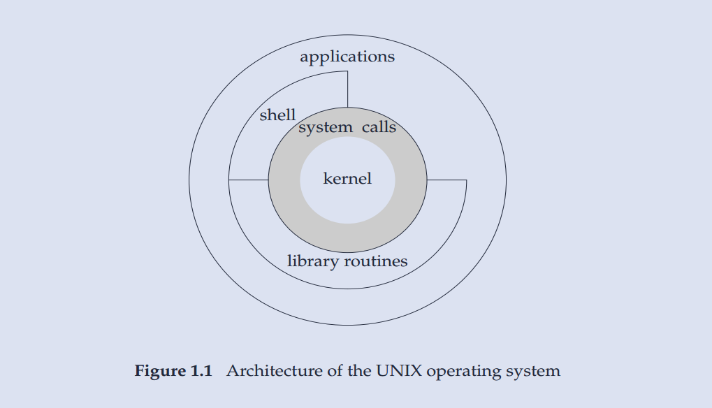

# Unix 基础

操作系统为运行的程序提供服务的，典型服务：执行新程序，IO 操作，分配空间，获取系统信息。

## Unix 体系结构

可以将操作系统视为一种软件，其控制计算机硬件资源，提供程序运行环境。也将该种软件称为**内核（kernel）**，因为其相对较小，且位于环境核心。

内核的接口称为**系统调用（system call）**，公用函数库构建在系统调用之上，应用程序既可以直接使用系统调用，也可以使用函数库。`shell` 是一个特殊的应用程序。

准确来讲，Linux 是 GNU 操作系统的内核。

### 系统调用

系统调用是访问内核的入口，通过系统调用，进程可以请求内核去执行某些动作。

* 系统调用将处理器从用户态切换到核心态

* 系统调用都由一个唯一的数字来标识，而程序则是通过名称调用。

* 系统调用可携带参数。

系统调用的过程经历多个步骤。

1. 调用 C 语言函数库中的外壳（`wrapper`）函数，来发起系统调用。

2. 保存系统调用的参数到寄存器。

3. 将系统调用编号复制到 `%eax`寄存器。

4. 执行一条中断机器指令(`int 0x80`)，切换到核心态，并执行中断矢量所指向的代码。

5. 响应中断 0x80，内核会调用 `system_call()` 例程。 

6. 若系统调用服务例程的返回值表明调用有误，外壳函数会使用该值来设置全局变量 `errno`.

7. 外壳函数会返回到调用程序，并同时返回一个整型值，以表明系统调用是否成功。

即便对于一个简单的系统调用，仍要完成相当多的工作，因此系统调用的开销虽小，却也不容忽视。

## 登录

### 登录名

用户通过键入**登录名**和**口令**执行登录操作。系统查看口令文件（通常是 /etc/passwd ）中的登录名。

口令文件中登录项，由7个冒号分割的字段组成：登录名，加密口令，数字用户 ID（UID），数字组 ID（GID），注释字段，起始目录和 shell 程序。

目前，加密口令已经转移到其他文件中。

加密口令不同于口令，前者是后者的加密字符，Unix 不存储后者，验证口令的方式是：加密后对比加密口令是否一致。

### shell

shell 是一个命令行解释器，与用户进行交互，系统通过口令文件中相应登录项最后一个字段来确定为用户执行哪一个 shell。

常见的 shell：

* Bourne shell 是古老和广泛的 shell

* C shell 

* Korn shell 是 Bourne shell 的后继者

* Bourne-again shell 是 GNU shell，遵循 POSIX 标准，兼容 Bourne shell

* TENEX C shell 是 C shell 的加强版

不同的 Linux 使用不同的默认 shell。MacOS 和 一些Linux使用 Bourne-again shell，一些使用 dash（ Bourne shell 的替代品）。

## 文件和目录

目录（directory）是一个包含目录项的文件。逻辑上，每个目录项都包含文件名和相关属性信息，如文件类型、文件大小、所有者、权限及最后修改时间。

目录中的各个名字称为文件名，文件名不能包含斜线（/）和空字符，因为前者来分割路径中的各个文件名，后者终止一个路径名。

POSIX 推荐文件名使用数字、字母、句点（.）、短横线（-）和下划线（_）。

创建新目录时，会自动创建两个文件名，.（指向当前目录）和 ..（指向父目录），根目录的父目录是本身。

由斜线分割的，一个或多个的文件名组成的**序列**称为路径名（pathname），斜线开头的是路径名为 绝对路径，否则为 相对路径。

>UNIX 系统手册是分成若干部分的，`ls(1)` 表示 UNIX 手册第一部分的 ls 项。一个特定项可能在不同部分的含义不同。
> 比如，使用 `man 1 ls` 来获取 `ls(1)` 相关信息。

每个进程都有一个工作目录（working directory），也称当前工作目录，相对路径名都是从工作目录开始解析的。

用户登录时，工作目录设置为起始目录（home directory），其值也是从口令文件中获取的。

## IO

文件描述符（file descriptor）是一个小的非负整数，内核用以标识一个进程正在读写的文件：内核创建或打开一个文件，会返回一个文件描述符，读写文件使用该描述符。

按惯例，当运行一个新程序，shell 都会打开三个链接到终端的文件描述符，标准输入、标准输出、标准错误，当然，这些都可以重定向到文件。

函数 open、read、write、lseek 和 close 提供不带缓冲（每次都是直接使用系统调用）的 IO，这些都使用文件描述符。

标准 IO 对上面这些不带缓冲的 IO 函数提供一个带缓冲的接口。

## UNIX 标准

UNIX 标准主要有3个，都是各自独立的组织所制定的标准：

* ISO C

* IEEE POSIX

* Single UNIX Specification

### ISO C

ISO C 标准意图提供 C 程序的可移植性，使之适应不同的操作系统，而不仅仅适合 UNIX 系统。此标准定义了 C 的语法与语义，还定义了标准库。
现今的 UNIX 系统都提供了 C 标准库。

### POSIX

POSIX 指的是可移植操作系统接口，目的是提升应用程序在各种 UNIX 系统环境之间的可移植，定义了符合 POSIX 的操作系统必须提供的各种服务。

### Single UNIX Specification

Single UNIX Specification （SUS，单一UNIX规范）是 POSIX.1 标准的一个超集，定义了一些附加接口，扩展了 POSIX.1 规范提供的功能。

整体而言，这些标准之间配合不错，ISO C 和 POSIX.1 可能有冲突，如果冲突，POSIX.1 服从 ISO C。
