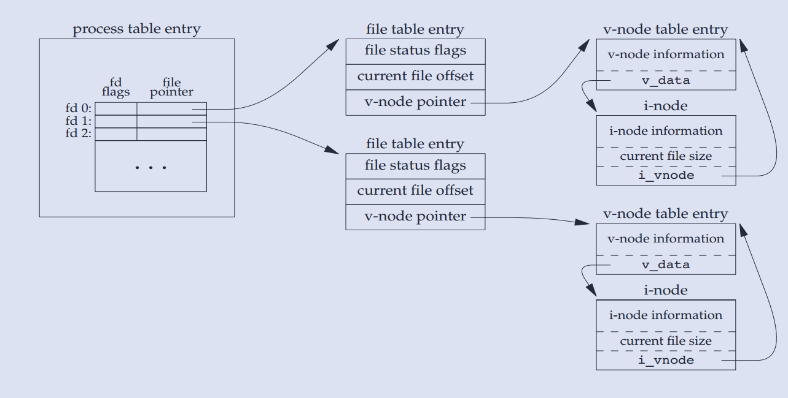

# Input & Output

I/O是一切实现的基础，分两类

* 系统调用 I/O (文件 I/O)
* 标准 I/O

不同系统的文件 I/O 可能不同，不能跨平台。

标准 I/O 是对系统调用 I/O 的一套跨平台封装，优先使用，因为 1）跨平台，移植性好，2）能合并系统调用，为读写加速

> 比如，标准 IO 函数 `fopoen`，在 Unix 下依赖 `open` 函数，而在 Windows 下依赖 `openfile`

## 标准 I/O

不同与文件 I/O，标准 I/O 都是围绕 **流（stream）** 进行的，当使用标准 I/O 打开或创建一个文件时，会关联一个流。

标准 I/O 提供三种类型的缓冲：

* 全缓冲区： 满了刷新（eg：非终端设备默认）。
* 行缓冲区： 换行/满了 刷新 (eg: 标准输出)。
* 无缓冲区： 立即输出（eg：标准错误）。

注：刷新是指将缓冲区的内容写到对应文件上去。

ISO C 仅有以下要求：
1. 当标准输入和标准输出不指向交互设备时，它们才是全缓冲的。
2. 标准错误绝非全缓冲。

而很多系统默认实现：
1. 标准错误是无缓冲。
2. 若是指向终端，则是行缓冲，否则是全缓冲。

注意：
1. 可以修改流的缓冲模式，`setvbuf()`，但不建议这么做。
2. 使用 `fflush(FILE *fp)` 强制冲洗一个流，若 fp 为 NULL，冲洗所有输出流。  

### 文件打开

```c
#include <stdio.h>
FILE *fopen(const char *pathname, const char *mode);
// ISO C 不涉及文件描述符，此函数是 POSIX 所属部分
FILE *fdopen(int fd, const char *mode);
// 若已打开，则先关闭；若已经定向，则取消定向
FILE *freopen(const char *pathname, const char *mode, FILE *stream);
```

若成功，则返回 `FILE` 指针，否则返回 `NULL`, 且设置 `errno` 以指示具体错误，[参考](#errno)。

注意：
1. 函数参数都是 const 指针，保证文件路径和读写权限不会被修改。
2. path 可使用相对路径或绝对路径。
3. `mode` 决定文件如何读写, 只使用`mode`前几个有效字符，后面忽略，即 "w" 和 "write" 等效，"w+" 与 "w+abc" 等效。
4. `mode` 在 Windows 有额外参数 `b`，表示使用二进制模式，默认是文本模式，这个参数对 Linux 无效，[参考](#mode_b)
5. 线程中使用 `fopen()` 打开文件个数有上限（除去默认打开的流 `stdin`,`stdout` 和 `stderr`)，具体在 `ulimit -a`中查看。
6. 上述方式创建的文件权限由 `0666&~umask` 决定。

### 文件关闭

```c
#include <stdio.h>
int fclose(FILE *fp);
```

`fclose` 关闭一个打开的流。

注意：
1. 关闭之前，会冲洗缓冲区的输出数据。
2. 当一个进程正常终止时，则所有未带写缓冲区的标准 I/O 都被冲洗，并关闭 I/O 流。

### 标准 I/O 读写

有三种不同类型的非格式 I/O 进行流的读写：

1. 每次一个字符的 I/O，一次读或写一个字符。如果流是带缓冲的，则标准 I/O 处理所有缓冲。
2. 每次一行的 I/O。使用 `fgets` 和 `fputs`，每行以一个换行符终止。
3. 直接 I/O。每次读写某种数量的对象，而每个对象具有指定的长度。

#### 读写单个字符 

```c
#include <stdio.h>
// 读单个字符
int fgetc(FILE *stream);
int getc(FILE *stream);
// 等价于 getc(stdin)
int getchar(void);
// 写单个字符
int fputc(int c, FILE *stream);
int putc(int c, FILE *stream);
// 等价于 putc(stdout)
int putchar(int c);
```

* `fgetc` 从 stream 中读取字符，并转换为 int, 或者 `EOF` 到文件结尾。`fgetc` 一般情况下等价于 `getc`, 而前者是函数，后者是宏。

* `fputc` 向流中写一个字符，字符被转换成 uint，`fputc`、`putc` 和 `putchar`之间关系类似上面情况。

> 宏比函数的运行速度快，编译速度慢。一般内核都是使用宏来实现。

#### 读写字符串

```c
#include <stdio.h>
char *fgets(char *s, int size, FILE *stream);
// 不要使用这个函数
char *gets(char *s);
```

`fgets`从流的当前位置读取字符存到str中，碰到行尾、文件尾或者读到了n-1个字符就停止读取，
并在存储的字符串末尾加上null字符作为字符串的结尾（读n-1个字符，加上null字符正好n个）。
如果读到了换行符，也会将其存入str中。

两种情况下，函数返回：

* 读到 size-1 个有效字节
* 读到 `\n`

注意：

* `fgets()` 会吸收空白字符，例如，从标准缓存区读取数据，会吸收最后的换行符。

* `gets()` 不推荐使用，因为它不检查溢出，极其危险。使用 `fgets()` 代替。

#### 按行读取文件

```c
ssize_t getline(char **lineptr, ssize_t *n, FILE *stream);
```

如果 `lineptr` 为 NULL，n 为 0， 则会 malloc 内存, 所以要么主动给 lineptr 分配空间，要么让函数分配空间，后者需要相关参数赋空值。

#### 读写整块字符

```c
#include <stdio.h>
size_t fread(void *ptr, size_t size, size_t nmemb, FILE *stream);
size_t fwrite(const void *ptr, size_t size, size_t nmemb, FILE *stream);
```

`fread` 和 `fwrite` 读写成块的数据，如若干数目的结构体，返回成功读写的结构体的数目。

### 格式化输入输出

尽量使用 `fprintf()` 、`fscanf()`， 不要把所有的输出放到 `stdout` ，比如把某些错误重定向到 `stderr`。

### 文件指针定位 

```c
int fseek(FILE *stream, long offset, int whence);
long ftell(FILE *stream);
void rewind(FILE *stream);
```

* 使用 `fseek` 把文件指针移到 **文件头/文件尾/当前位置** 的附近(使用 offset)。
* 使用 `ftell`， 获取当前文件指针离文件头的大小(由于 `ftell` 返回一个 正 long 值，故文件长受限于 long 的正数部分)。
* 使用 `rewind` 把指针头移回文件首，相当于 `fseek`的封装。

### 临时文件

* `tmpnam` 返回一个可使用的临时文件名，多线程不安全

* `tmpfile` 返回一个可使用的临时文件，返回 `FILE`

### 标准 I/O 的缺陷

标准 IO 一个不足之处是，效率不高，需要多次复制。

比如，当使用 fgets 和 fputs 时，需要复制两次数据，一次是内核和标准 I/O 缓冲区之间，第二次是标准 I/O 缓冲区和用户程序中的行缓存区之间。

## 文件 IO

对于内核而言，打开的文件是通过文件描述符引用：当打开或创建文件时，内核向进程返回一个文件描述符，并将文件描述符作为参数，传递给 `read` 或 `write`。

按照惯例，shell 把文件描述符 0，1，2 与进程的**标准输入、标准输出与标准错误**关联。

注意：
1. 文件描述符是个非负整数。
2. 一个进程会维护一个文件打开描述符表，每个表项都包含一个文件表项的指针。

### 文件打开
```c
#include <sys/types.h>
#include <sys/stat.h>
#include <fcntl.h>

int open(const char *pathname, int flags);
int open(const char *pathname, int flags, mode_t mode);
int creat(const char *pathname, mode_t mode);
int openat(int dirfd, const char *pathname, int flags);
int openat(int dirfd, const char *pathname, int flags, mode_t mode);
```

参数：
- path 参数是要打开或创建文件的名字。
- oflag 参数说明此函数的多个选项，用一个或多个常量进行或运算表示。
- mode 参数仅当创建文件时可用，说明文件的权限，用一个或多个常量进行或运算表示。

返回： 最小未用的文件描述符。

易知 `open` 是变参函数，类似于 `printf`，变参函数可以给任意多参数，编译不会报错。

`fopen()` 是由 `open` 封装的

文件打开方式对应的oflag：

| mode | oflags | 含义 | 
| :----: | :----:| :----: |
| r | O_RDONLY | 只读，定位到文件头 |
| r+ | O_RDWR | 读写，定位到文件头 |
| w | O_WRONLY &#124; O_TRUNC &#124; O_CREAT | 只写，清空，定位到文件头 |
| w+ | O_RDWR &#124; O_CREAT &#124; O_TRUNC | 读写, 清空，定位到文件头 |
| a | O_WRONLY &#124; O_CREAT &#124; O_APPEND  | 只写，每次写到文件尾 |
| a+ | O_RDWR &#124; O_CREAT &#124; O_APPEND| 读写，每次都写到文件尾 |
### 文件关闭

```c
#include <unistd.h>
int close(int fd);
```

关闭一个文件，并释放进程加在上面的记录锁。

进程终止时，内核自动关闭它所有的打开文件，可以利用这一点而不显示地用 `close` 关闭打开的文件。 

### 设置偏移量

```c
#include <unistd.h>
off_t lseek(int fd, off_t offset, int whence);
```

为一个打开文件设置偏移量。

参数：
- fd 文件描述符
- offset 相对于 whence 的偏移量，可正可负（除非定位到文件头）
- whence 可为 文件头、当前值或文件尾

返回：新的文件偏移量（若成功执行）

注意：
1. 某些设备可允许该函数返回负的偏移量，应测试不等于-1，而不是小于0
2. 文件偏移量可大于文件长度，这种情况下进行写，则形成文件空洞
3. 文件空洞不占用磁盘存储区

### 函数 read

```c
#include <unistd.h>
ssize_t read(int fd, void* buf, size_t nbytes);
```

参数：
- fd 文件描述符
- buf 读取的字符串存储地址
- nbytes 打算读取的字节数目

返回：读到的字节数，若到文件尾，则为 0 ，出错则为 -1

有很多情况导致实际读取小于预计值：
1. 读到文件尾
2. 终端读取一行
3. 某一信号造成中断，而已经读取部分数据

### 函数 write

```c
#include <unistd.h>
ssize_t write(int fd, const void* buf, size_t nbytes);
```

返回写的字节数，通常与参数 nbytes 相同，否则表示出错。出错的常见原因磁盘满，或者文件长度限制。

如果设置了 `O_APPEND` 参数，总是写到文件尾，不管文件指针位置。

### I/O 数据结构

内核使用3种数据结构表示打开文件：

1. 每个进程都有一个打开文件描述符表，文件描述符关联一个指向文件表项的指针。
2. **内核**为所有打开文件维护一张表，文件表项都包含文件状态信息、文件偏移量和指向该文件 v 节点表项的指针。
3. 每个打开文件都一个 v 节点，v 节点包括了文件类型和该文件的 inode。



可知：

1. 每次 write 操作后，在文件表项里当前文件偏移量增加，增加的值为所写入的字节数，如果超过当前文件长度，则把当前文件长度置为当前偏移量。
2. lseek 只修改当前文件偏移量，不进行 I/O 操作。
3. 可以有多个文件描述符指向同一文件表项的情况。

### 函数 dup 和 dup2

下面连个函数复制现有的文件描述符
```c
#include <unistd.h>
int dup(int fd);
int dup2(int fd, int fd2);
```
dup 使用的是当前最小可用的 fd。

dup2 可指定新描述符的值，如果新描述符已经打开，则先关闭，除非 fd 等于 fd2。

编程练习：使用 dup 将标准输出重定向到文件。[参考](../src/chap1-io/fd_dup.c)

猜测： printf 等输出一直和描述符 1 相关联，不管其指向哪里，文件或终端。

### 函数 fcntl

fcntl 函数可用改变已经打开文件的属性。
```c
#include <unistd.h>
int fcntl(int fd,int cmd,...);
```

该函数有5种功能：

* 复制一个已有的描述符
* 获取/设置文件描述符标志
* 获取/设置文件状态标志
* 获取/设置异步 I/O 所有权
* 获取/设置 记录锁

### 函数 ioctl

ioctl 是 I/O 操作的杂物箱，不能用本章其他函数表示的 I/O 操作都能用 ioctl 来表示。

每个设备驱动程序可以定义它自己专用的一组 ioctl 命令，系统为不同种类的设备提供通用的 ioctl 命令。

### 目录 /dev/fd

该目录为虚目录，显示的当前进程的文件描述符信息。

打开 `/dev/fd/n` 等效于复制描述符 n。

## 参考内容

### <span id="errno">errno</span>

errno 是记录系统的最后一次错误代码

 * 可以把 `errno` 看做全局变量，则需尽快保存或使用，以防被其他程序使用更改。
 * errno 把每一种错误对应到一个 int，具体地，可以查看 `/usr/include/asm-generic/errno-base.h`。
 * 简单的说，errno在标准C中是一个整型变量，在 `errno.h` 中声明，C标准库中实现。
 * 建议使用 `perrno()` 来打印错误。
 * 多线程技术中，为了使errno线程安全，使用宏`#define errno (*__errno_location ())`替代了简单的 `extern int errno` 声明。

### <span id="mode_b">文本方式和二进制方式</span>

1. 使用二进制方式进行读文件时，会原封不动的读出全部的内容，写文件的时候，会把内存缓冲区的内容原封不动的写到文件中。

2. 使用文本方式进行读文件时，会将回车换行符号CRLF(0x0D 0x0A)全部转换成单个的换行符号LF(0x0A)，
写文件的时候，会将换行符号LF( 0x0A)全部转换成回车换行符号CRLF(0x0D 0x0A)。

因此，在 Windows 平台下开发中，以二进制模式创建并写入的文件，在读取时，为了防止读文件出错，建议以二进制模式进行读取；
同样的道理，以文本模式创建并写入的文件，在读取该文件时，建议以文本模式进行读取。


### 面试题1

```c
char *ptr = "abc";
ptr[0] = 'x'; //能否执行?
```

显然，"abc"是常量字符串，一般来说不能被修改，但也不尽然，要看系统环境，这取决于编译器存放常量字符串的位置。

### 面试题2

```c
#define SIZE 5
char buf[SIZE];
fgets(buf,SIZE, stream);

// 情况1，如果读一个文件，内容为ab,则读取字符串的内容为 'a' 'b' '\0'
// 情况2，如果文件内容为abcdef,则读取字符串内容为 'a' 'b' 'c' 'd' '\0'
// 问，如果文件内容为abcd,则需要几次可以读完？ ( POSIX 风格的文件)
// 2次，第一次的内容为，'a','b','c','d','\0'
// 第二次内容为 '\n','\0'
```

POSIX 定义文件行：

> A sequence of zero or more non- <newline> characters plus a terminating <newline> character. 

所以 Unix 文件每一行结尾都有一个 `\n`, 包括最后一行。

而 Windows 没有这个概念，它用 `\r\n` 来换行，最后一行没有额外的换行符。 

现在主流的编辑器可以自由设置 Line Separator(Windows 的 CRLF 和 Unix & MacOS 的 LF)
其中，CR 指 Carriage Return, LF 指 Line Feed

主流编辑器如 VSCode 和 JetBrain 系列，都默认文件末尾不加换行符，即使你设置 Line Separator 风格为 Unix, 需要主动设置。


### man 手册分类

| 序号 | 英文 | 中文 |
| :----: | :----: | :----: |
| 1 | Executable programs or shell commands | 可执行程序或shell命令 |
| 2	| System calls (functions provided by the kernel) | 系统调用 |
| 3	| Library calls (functions within program libraries) | 库调用 |
| 4 | Special files (usually found in /dev) | 特殊文件 |
| 5	| File formats and conventions eg /etc/passwd | 文件格式和约定 |
| 6	| Games | 游戏 |
| 7	| Miscellaneous (including macro packages and conventions), e.g. man(7), groff(7) | 杂项（包括宏和惯例） |
| 8	| System administration commands (usually only for root) |	系统管理命令（通常仅适用于root用户） |
| 9	| Kernel routines [Non standard] | 内核例程（非标准） |

### 习题

1. 写一个程序，删除指定文件的第十行。[参考](../src/chap1-io/delete_line_10.c)
