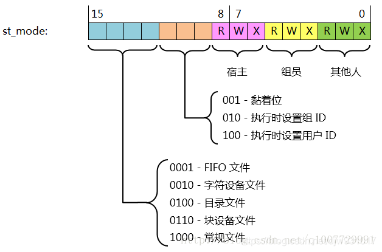

# Linux 文件系统

## 文件信息

获取文件信息相关函数

```c
#include <sys/types.h>
#include <sys/stat.h>
#include <unistd.h>

int stat(const char *path, struct stat *buf);
int fstat(int fd, struct stat *buf);
int lstat(const char *path, struct stat *buf);
```
三个函数都是获取文件信息，填到 buf 结构体中，这意味着你只需要定义一个 buf 结构体，再把指向该结构体的指针传进去。

注意：
* 第一个传递的是文件路径
* 第二个传递的是与文件相关联的 fd 
* 第三个与第一个大体相同，不同之处在于对链接文件的处理

```c
 struct stat {
               dev_t     st_dev;         /* ID of device containing file; 包含当前文件的设备 ID 号*/
               ino_t     st_ino;         /* Inode number; 与 ls -i 中的 inode 号相对应*/
               mode_t    st_mode;        /* File type and mode; 权限信息 */
               nlink_t   st_nlink;       /* Number of hard links; 硬链接数 */
               uid_t     st_uid;         /* User ID of owner; uid */
               gid_t     st_gid;         /* Group ID of owner; gid */
               dev_t     st_rdev;        /* Device ID (if special file); 设备 ID 号，如果该文件是设备的话 */
               off_t     st_size;        /* Total size, in bytes; */
               blksize_t st_blksize;     /* Block size for filesystem I/O; 一个Block 的大小 */
               blkcnt_t  st_blocks;      /* Number of 512B blocks allocated; 当前文件分配了多少个512B大小的块 */
               time_t    st_atim;        /* Time of last access ; 最后一次读的时间 */
               time_t    st_mtim;        /* Time of last modification; 最后一次写的时间 也是 ls 命令显示的时间*/
               time_t    st_ctim;        /* Time of last status change; 最后一个亚数据修改的时间 */
           };
```

st_size、st_blksize 和 st_blocks 无乘积关系。

### 文件空洞

当调用 `lseek()` 改变文件偏移量，使之越过文件结尾，再执行 I/O 操作，将导致原来**文件结尾到新写入数据之间**形成一个空洞，称之为**文件空洞**。

文件空洞不占用磁盘空间，只有往空洞写入内容才会分配磁盘块。这也意味着，一个文件名义上的大小可能远大于其实际在磁盘上占用的空间。有时候文件下载会使用文件空洞。

编程练习：编写一个程序验证文件空洞 [参考](../src/chap2-fs/emptyfile.c)

### st_mode 文件权限信息

st_mode 是一个整型变量，使用低16位表示其文件信息



使用 `S_ISXXX(st_mode)` 宏判断文件类型，如 `S_ISREG` 判断文件是否一个常规文件

编程练习：编写一个程序测试文件类型 [参考](../src/chap2-fs/ftype.c)

### umask

```c
#include <sys/types.h>
#include <sys/stat.h>
mode_t umask(mode_t mask);
```

如前面所述，IO 操作创建的文件权限默认是通过 `0666 & umask` 确定的。

umask 的作用：防止权限过松。

`umask` 也是一条 shell 命令，后面接需要设置的 `umask` 值；如果不带参数，则是打印当前 `umask` 的值

### 文件权限的管理

```c
#include <sys/stat.h>
int chmod(const char *path, mode_t mode);
int fchmod(int fd, mode_t mode);
```

`chmod` 也是一条 shell 命令，用以设置文件权限 [参考](https://www.runoob.com/linux/linux-comm-chmod.html)

### 粘住位 t位

如果一个可执行文件的这一位被设置了，那么在该程序第一次执行结束时，其程序的正文部分（机器指令部分）的一个副本仍被保存在交换区，下次执行该程序时能较快的装入内存。

现今的unix系统大多 虚拟存储系统以及 快速文件系统，所以不再需要这种技术，所以改变粘住位的含义：

如果对一个目录设置了粘住位，只有对该目录具有 写权限的用户在满足下列条件之一的情况下，才能删除或更名该目录下的文件：
* 拥有此文件
* 拥有此目录
* 是超级用户

### 文件系统 FAT UFS

文件系统的功能：存储和管理文件或数据

FAT16/32 实质是静态存储的单链表 具体[参考](http://www.360doc.com/content/19/1029/09/1367418_869696583.shtml)

UFS(Linux早期开源文件系统) 参考 APUE 4.14 节， 由 i 位图 、块位图，inode 和 数据块 组成

目录文件实质是一个特殊文件

### 硬链接和符号链接

```c
#include<unistd.h>
//创建一个硬链接文件
int link(const char *oldpath, const char *newpath);
//删除一个硬链接，可能同时删除对应文件
int unlink(const char *pathname);

#include<sys/types.h>
#include<utime.h>
//修改文件的最后访问时间和修改时间
int utime(const char *filename, const struct utimbuf *times);
```

硬链接（ `ln old_file new_file` ）是 多个文件名关联同一个文件(inode 相同），删除一个文件名，仍可以通过另一个访问文件。

符号链接（`ln -s old_file new_file`） 是一个单独文件（inode 不同），类似于快捷方式，基本不占存储空间，通过原文件名访问文件内容。如果删除原文件名，则文件被删除，符号链接失效。

使用 `remove()`（ISO C) 删除一个文件，`rename()` 更改文件名或文件路径。

**注意**: 硬链接和目录项是同义词，且建立硬链接有限制，不能在分区建立，不能给目录建立，符号链接不受这两点限制。

### 目录操作

```c
#include <sys/stat.h>
#include <sys/types.h>
int mkdir(const char *pathname, mode_t mode);
#include <unistd.h>
//删除一个目录，必须是空目录
int rmdir(const char *pathname);
//修改当前工作路径
int chdir(const char *path);
int fchdir(int fd);
//获取当前工作路径
char *getcwd(char *buf, size_t size);
//
```
>chroot命令用来在指定的根目录下运行指令。chroot，即 change root directory （更改 root 目录）。
>在 linux 系统中，系统默认的目录结构都是以/，即是以根 (root) 开始的。而在使用 chroot 之后，系统的目录结构将以指定的位置作为/位置。

### glob 函数

```c
#include <glob.h>
typedef struct {
    size_t   gl_pathc;    /* Count of paths matched so far  */
    char   **gl_pathv;    /* List of matched pathnames.  */
    size_t   gl_offs;     /* Slots to reserve in gl_pathv.  */
} glob_t;

//通过通配符获取文件名 
int glob(const char *pattern, int flags, int (*errfunc) (const char *epath, int eerrno), glob_t *pglob);
void globfree(glob_t *pglob);
```

可以通过通配符匹配(有选择地）获取目录下的所有文件

编程练习：使用 glob 函数编写一个程序获取目录信息 [参考](../src/chap2-fs/glob.c)

---

也可以通过以下函数获取目录中的文件信息
```c
#include <sys/types.h>
#include <dirent.h>
DIR *opendir(const char *name);
DIR *fdopendir(int fd);
int closedir(DIR *dirp);
struct dirent *readdir(DIR *dirp);
void rewinddir(DIR *dirp);
void seekdir(DIR *dirp, long loc);
long telldir(DIR *dirp);
```

编程练习：使用上面的函数编写一个程序获取目录信息 [参考](../src/chap2-fs/readdir.c)

编程练习：使用 glob （或 opendir 等函数）编写一个程序实现 `du` 的功能 [参考](../src/chap2-fs/mydu.c)

### 系统数据文件和信息

口令文件 /etc/passwd 和组文件 /etc/group 是两个重要的与系统相关的数据文件，也经常被使用。
用户每次登录 Unix 系统和执行 `ls -l` 命令时都要使用到口令文件。

虽然这些文件都是文本文件，可以使用标准 IO 读取，但比较耗费时间。我们需要以非 ASCII 文本格式存放，并提供相关接口。

#### 口令文件

```c
#include <pwd.h>
// passwd 结构体是函数体内部的静态变量，调用下面函数的任一个，都会重写。
struct passwd {
               char   *pw_name;       /* username */
               char   *pw_passwd;     /* user password */
               uid_t   pw_uid;        /* user ID */
               gid_t   pw_gid;        /* group ID */
               char   *pw_gecos;      /* user information */
               char   *pw_dir;        /* home directory */
               char   *pw_shell;      /* shell program */
           };

struct passwd *getpwuid(uid_t uid);
struct passwd *getpwnam(char *name);
```

POSIX.1 定义了两个访问口令文件的函数，可以通过用户登录名或 UID 访问到口令文件中相对应的数据行(不能获取用户口令）。

**注意**：
* 通常都会有一个 root 用户, UID 为 0。
* 加密口令字段仅有一个占位符 x, 故无法访问通过上述函数访问到用户口令。

#### 组文件


## 参考内容

### 在 shell 中 `-` 开头的非选项参数

显然，以 `-` 和 `--` 开头的非选项参数会被当做选项参数，此时需要加一个 `--` 表示选项参数已经结束，剩下的都是非选项参数
```shell script
# 如果想要查看 -a 文件的信息，下面这种做法是达不到要求的
ls -a 
# 你需要加上 --, 将后面的内容解析为非选项参数
ls -- -a
```

### ls命令参数

* -a  --all 显示隐藏文件(.开头的文件)
* -i  --inode 显示文件的 index number
* -n  --numeric-uid-gid 与 -l 类似，但是显示的是 uid 和 gid
* -l  使用长格式

### stat 命令 

显示文件的详细信息

### 硬盘的结构

硬盘由很多盘片(platter)组成，每个盘片的每个面都有一个读写磁头。如果有N个盘片，就有2N个面，对应2N个磁头(Heads)，从0、1、2开始编号。
每个盘片被划分成若干个同心圆磁道(逻辑上的，是不可见的。)
每个盘片的划分规则通常是一样的。这样每个盘片的半径均为固定值R的同心圆在逻辑上形成了一个以电机主轴为轴的柱面(Cylinders)，从外至里编号为0、1、2......每个盘片上的每个磁道又被划分为几十个扇区(Sector)，
通常的容量是512byte，并按照一定规则编号为1、2、3......形成Cylinders×Heads×Sector个扇区。这三个参数即是硬盘的物理参数。

### du 命令

显示指定的目录或文件所占用的磁盘空间

```shell script
# 以 K 为单位，显示当前目录所占磁盘空间
du 
# 显示当前文件所占用磁盘空间
du file
```
