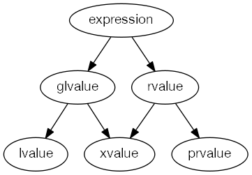

# C++ 11 特性

## 左值和右值

* 表达式不是左值就是右值。
* 左值(lvalue) 是一个函数或者对象实例。
* 失效值(xvalue) 是生命期即将结束的对象。
* 广义左值(glvalue) 包括左值和失效值。
* 右值(rvalue) 包括失效值、临时对象以及不关联对象的值。
* 纯右值(prvalue) 是非失效值的右值。



### 右值引用

C++11 使用 `T&&` 表示右值引用，而 `T&` 表示左值引用。

因为右值引用有名字，所以是左值。

>An rvalue reference, after it has been bound to an rvalue, is an lvalue reference.

```cpp
string&& a = "some string";
string&& b = a; // ERROR: it does not compile because a is not an rvalue
```

```cpp
int x = 1;
// 左值引用
int&  a  = ++x;
// 右值引用
int&& b = x++;
```

右值引用可以延长生命周期。

#### 万能引用

`&&` 并不总是右值引用，也可能是 **万能引用**，其既能接受左值又能接受右值。**万能引用只发生在类型推导时**。

普通函数中左值引用（非常量）只接受左值，右值引用只接受右值，`const 左值引用` 可以接受任何值，`const 右值引用` 能接受任何右值，推导后的模版也同理。
```cpp
template<typename T>
void f(T&& param);
f(10); // void f<int  >(int&& param);
int x = 10;
f( x); // void f<int &>(int&  param);
int &y = x;
f( y); // void f<int &>(int&  param);
int &&z = 10;
f( z); // void f<int &>(int&  param);
```

后两种情况里，`y` 和 `z` 都是左值，和第二种情况类似。

#### 引用折叠

C++ 不允许引用的引用，会触发引用折叠。引用折叠最终都代表一个引用，要么是左值引用，要么是右值引用。

引用折叠发生在四种情况下：

* 模板的实例化中

* `auto` 类型生成时

* `typedef`和别名声明的创建和使用时

* `decltype`

规则就是：

**如果任一引用为左值引用，则结果为左值引用。否则（即两个都是右值引用），结果为右值引用。**

参考：
* [现代C++之万能引用、完美转发、引用折叠](https://zhuanlan.zhihu.com/p/99524127)

* [Rvalue Reference is Treated as an Lvalue?](https://stackoverflow.com/questions/28483250/rvalue-reference-is-treated-as-an-lvalue)

### 转移语义
