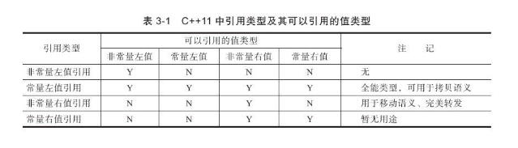
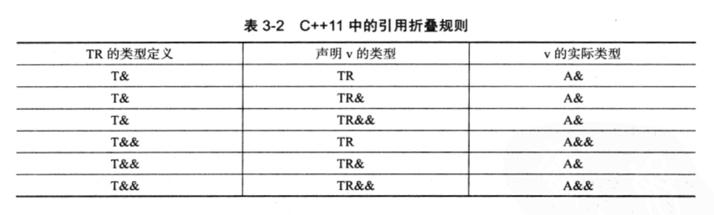

# 新特性

## 1. 构造函数

### 1.1. 继承构造函数

类具有派生性，派生类可以自动获得基类的成员变量和接口(虚函数和纯虚函数)，但是基类的成员函数不能被派生类使用。如果派生类要使用基类的成员函数，可以通过 `using` 声明来完成。

派生类中如果有函数与基类同名，则会[屏蔽基类函数](https://gfjiangly.github.io/C++/派生类与基类的同名函数调用情况.html)。

```cpp
struct Base{
    void f(double i) {cout <<"Base i = " << i << endl; }
};
/// 派生类 `Derived` 实际拥有两个 f 函数。
struct Derived : Base {
    using Base::f;
    void f(int i) {cout <<"Derived i = " << i << endl;}
};
```

C++ 11 中，子类可以通过使用 `using 声明` 来声明继承基类的构造函数。

```cpp
struct A {
    A(int i){}
    A(double d, int i) {}
    A(float f, int i, char* c){}
};

struct B:A {
    using A::A;
}
```

这里通过 `using A::A`, 把基类中的构造函数继承到派生类 `B`.

### 1.2 委托构造函数

C++ 11 允许将一个构造函数设定为 “基准版本”，其他构造函数可以委派该构造函数来初始化。

```cpp
class Info{
public:
    Info() {InitRest();}
    Info(int i) {this->Info(); type = i;}
    Info(char e) {this->Info(); name = e;}
};
```

## 2. 右值引用

### 2.1. 拷贝构造

拷贝构造函数是一种特殊的构造函数，它在创建对象时，是使用同一类中之前创建的对象来初始化新创建的对象。拷贝构造函数通常用于：

* 通过使用另一个同类型的对象来初始化新创建的对象。

* 复制对象把它作为参数传递给函数。

* 复制对象，并从函数返回这个对象。

如果在类中没有定义拷贝构造函数，编译器会自行定义一个。如果类带有指针变量，并有动态内存分配，则它必须有一个拷贝构造函数。

### 2.2. 左值、右值与右值引用

C++ 11 中，右值由将亡值(xvalue) 和纯右值(pvalue). 纯右值是 C++ 98 中右值的概念，如非引用返回的函数返回的临时变量值、运算表达式及不跟对象相关联的字面量，如 2,'c' 等都是纯右值。类型转换函数的返回值、lambda 表达式也是右值。

C++ 11 中，右值引用就是对一个右值进行引用的类型。右值引用和左值引用都属于引用类型，都是左值。左值引用是具名变量名的别值，而右值引用是不具名变量的别名。

`T&& b = ReturnRvalue();` 比 `T b = ReturnRvalue();` 会少一次对象的析构和构造(没有 RVO的情况下).



`<utility>` 中 `std::move()` 强制转化为右值引用。继而可以通过右值引用使用该值。

被 move 的左值生命周期并没有结束，不会立即析构，但不应再使用该值。

### 2.3. 完美转发

完美转发指在函数模板内，完全按照参数的类型，将参数传递给函数模板中调用的另一个函数。

```cpp
template<typename T>
void IamForwoding(T&& t) {
    IrunCodeActually(forward(t));
}
```

#### 2.3.1 Universal Reference

模板参数中 `T&&` 是一个通用引用。如果传递的是一个左值，那么 T 会推断为左值引用，Param Type 也是左值引用。如果传递的是右值，那么 `T` 是正常的类型，而 Param Type 为 `T&&`.

#### 2.3.2 引用折叠



```cpp
template <typename T>
void baz(T t) {
  T& k = t;
}
int ii = 4;
baz<int&>(ii);
```

这个实例中，T 被显式化为 `int&`, k 的类型为 `int &` 因为发生了引用折叠。

参考:

* [知乎回答：std::move(expr)和std::forward(expr) 疑问](https://www.zhihu.com/question/34544004/answer/59104471)

* [Perfect forwarding and universal references in C++](https://eli.thegreenplace.net/2014/perfect-forwarding-and-universal-references-in-c/)

## 3. 显式转换操作符

`explict` 禁止隐式转换。

```cpp
class ConvertTo{};
class Convertable{
public:
    explicit operator ConvertTo() const {return ConvertTo();}
};
void test()
{
    Convertable c;
    ConvertTo ct(c);
    ConvertTo ct2 = c; // implicit type conversion, fail
    ConvertTo ct3 = static_cast<ConvertTo>(c); // explicit type conversion, success
}
```

## 4. 列表初始化

TODO

## 5. POD 类型

POD 是 Plain Old Data 的缩写。

## SFINEA

## decltype

运行时类型识别(RTTI) 的机制是为每个类型产生一个 `type_info` 类型的数据。程序员可以在程序中使用 `typeid` 随时查询一个变量的类型，返回变量相应的 `type_info` 数据。而 `type_info` 的 `name` 成员函数可以返回类型的名字。C++ 11 增加了 `hash_code` 成员函数，返回该类型唯一的哈希值。
