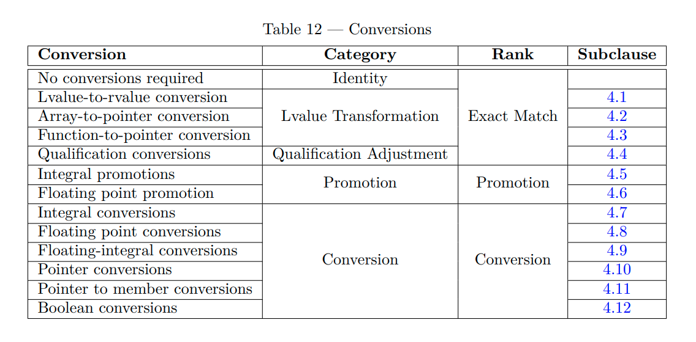

# 函数决议

每种标准转换序列的类型都被赋予三个等级之一：

1) 准确匹配：不要求转换、左值到右值转换、限定性转换、函数指针转换、 (C++17 起)类类型到相同类的用户定义转换

2) 提升：整型提升、浮点提升

3) 转换：整型转换、浮点转换、浮点整型转换、指针转换、成员指针转换、布尔转换、派生类到其基类的用户定义转换

标准转换序列的等级是其所含的标准转换（至多可有三次转换）中的最差等级。



未完待续

## 重载引用参数

```cpp
int f( int &);
int f( int && );
int f( int const & );

int a = 1;
const b = 1;

// https://zh.cppreference.com/w/cpp/language/overload_resolution
// 根据 隐式转换序列的排行 -> 3)标准转换序列S1优于标准转换序列S2，条件为 ->e

// 1 为右值，rvalue -> int&& better than rvalue -> const int&
f(1); 

// a 为左值，lvalue a -> int& better than lvalue a -> const int&
f(a);

// b 为常左值，const lvalue a -> const int&
f(b);
```

如果还有 `int f(int);` 函数，则上面三个调用都会因为二义性而不能正确调用。

参考：

* [重载决议](https://zh.cppreference.com/w/cpp/language/overload_resolution)
* [知乎: 为什么以下C++重载函数会出现二义性调用？](https://www.zhihu.com/question/355751978)
* [Overload resolution between object, rvalue reference, const reference](https://stackoverflow.com/questions/17961719/overload-resolution-between-object-rvalue-reference-const-reference)

## 用户定义转换

```cpp
void foo(const string& name);
void foo(bool on);
// 直接匹配>类型提升转换(float->double这种)>隐式转换>类类型转换。
// 选择第二个
foo("C++"); 
```

参考:

* [知乎: C++ 隐式类型转换重载决议的具体优先级是怎样的？](https://www.zhihu.com/question/27932618)
