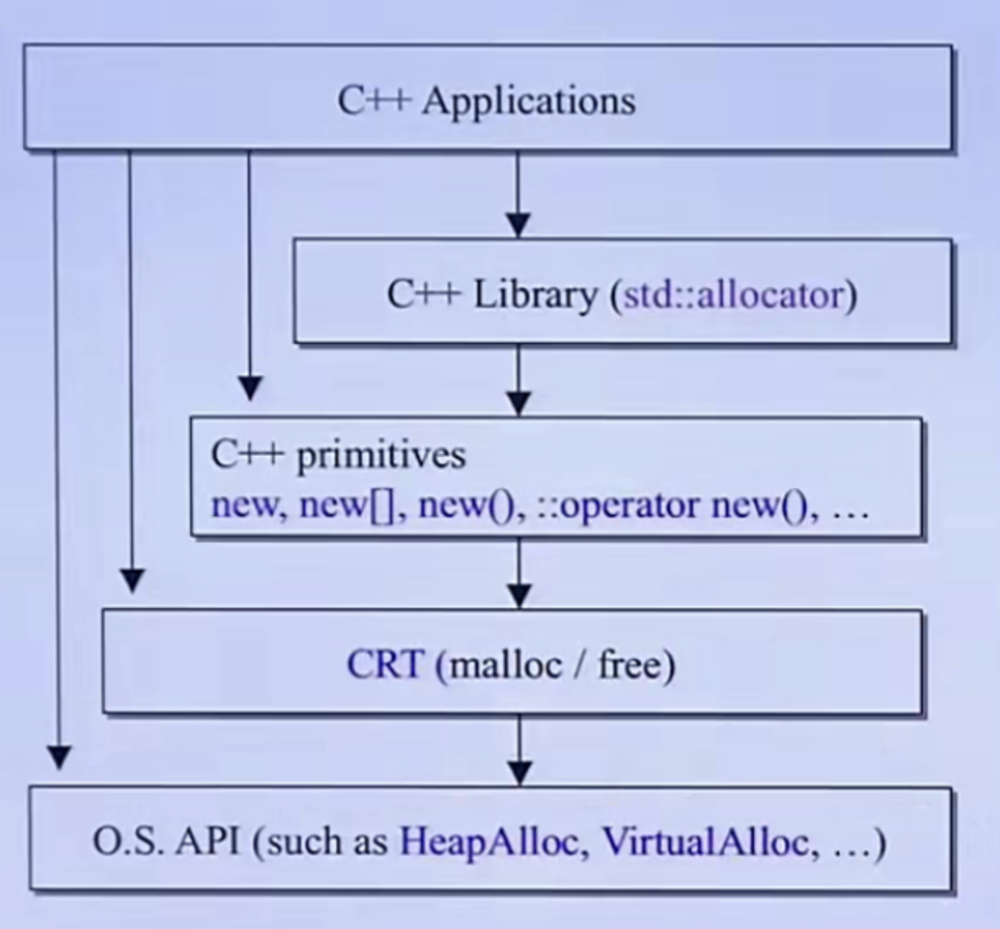

# 内存管理

候捷 《内存管理》 笔记

## 1. 资源

1. [Doug Lea](http://gee.cs.oswego.edu/) 博客
2. [STL 源码分析](https://book.douban.com/subject/1110934/) 第二章
3. [Small Memory Software](https://book.douban.com/subject/1473761/) 
4. [Modern C++ Design](https://book.douban.com/subject/1755195/) 第四章

## 2. 纵览

内存分配的不同层级



### CRT

```cpp
// 分配 512 bytes
void *p = malloc(512);
// 释放
free(p);
```

### C++ primitives

```cpp
void *p = ::operator new(512);
::operator delete(p);

Complex<int> *p2 = new Complex<int>;
delete p2;
```

### C++ Library

```cpp
#ifdef __GNUC__
void *p = alloc::allocate(512);
alloc::deallocate(p);
#endif
```