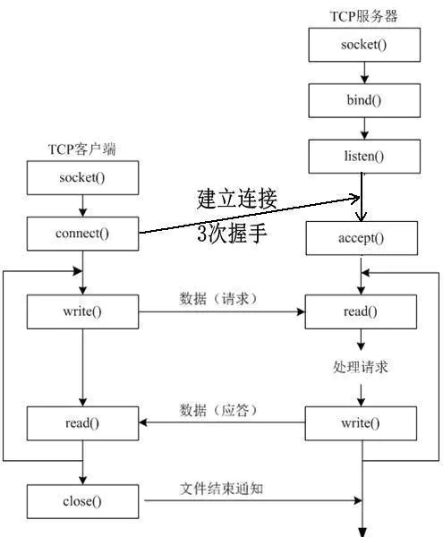
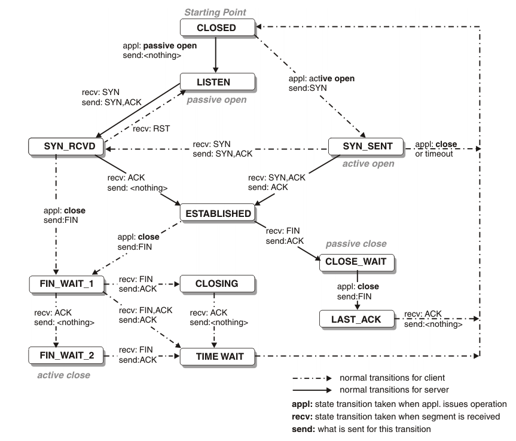
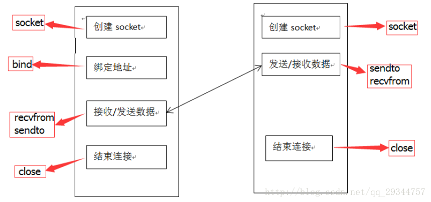

# 计算机网络

## 1. tcp 与 udp 的区别

TCP 为应用层提供 **可靠的**，**面向连接** 和 **基于流** 的服务。使用超时重传、数据确认等方式确保数据包的传输。

UDP 为应用层提供 **不可靠**，**无连接** 和 **基于数据报** 的服务。

## 2. connect 非阻塞

建立 socket 后默认 `connect()` 函数为阻塞连接状态。在大多数实现中，connect 的超时时间在75s至几分钟之间，想要缩短超时时间，可以：

* 方法一、建立 `socket` 句柄时设置为非阻塞

* 方法二、采用信号处理函数设置阻塞超时控制，信号处理函数会打断 `connect` 的阻塞

### 2. 三次握手

1. 第一次握手从客户端执行 `connect()` 开始，发送 `syn` 给客户端，这次报文不携带数据。
2. 第二次握手服务端发送 `syn` 和 `ack` 给客户端，同时需要定义窗口，也不携带数据。
3. 第三次握手由客户端发送 `ack` 给服务器端，可以携带数据。

服务端收到第一次握手后，将这个连接放入到 backlog 队列。收到第三次握手后将这个请求移到 accept 队列。服务端调用 `accept` 是从 accept 队列里面取一个连接。

`listen()` 函数的主要作用就是 **将套接字(sockfd)变成被动的连接监听套接字**（被动等待客户端的连接）。

`listen()` 函数不会阻塞，它主要做的事情为，将该套接字和套接字对应的连接队列长度告诉 Linux 内核，然后，`listen()` 函数就结束。参数 `backlog` 设置内核中连接队列的长度。*TCP 三次握手也不是由这个函数完成，`listen()` 的作用仅仅告诉内核一些信息。*

当有一个客户端主动连接（`connect()`），Linux 内核就自动完成 TCP 三次握手，将建立好的链接自动存储到队列中，如此重复。

只要 TCP 服务器调用了 `listen()`，客户端就可以通过 `connect()` 和服务器建立连接，而这个连接的过程是由内核完成。

### 3. TIME_WAIT时长？为什么？如何取消？

为 2 MSL(报文最大生存时间)，原因：

* 确保被动关闭TCP连接的一端能收到第四次挥手的ACK

* 确保旧的数据包影响到下一次的TCP连接

### 为什么要进行第三次握手

为了防止服务器端开启一些无用的连接增加服务器开销以及防止已失效的连接请求报文段突然又传送到了服务端，因而产生错误。

[详解TCP连接的“三次握手”与“四次挥手”(上)](https://www.cnblogs.com/AhuntSun-blog/p/12028636.html)

[详解TCP连接的“三次握手”与“四次挥手”(下)](https://www.cnblogs.com/AhuntSun-blog/p/12037852.html)

[三次握手及失败处理](https://www.jianshu.com/p/e4cd3de320f7)

[三次挥手及失败处理](https://network.51cto.com/art/202001/609165.htm)

### 4. 报文的最大生存期与那些因素有关？

Windows : MSL = 2 min
linux(Ubuntu, CentOs) : MSL = 60s
Unix : MSL = 30s

TTL（time-to-live）生存时间字段
RTT（round-trip-time）往返时间

[网络术语MSL/TTL/RTT](https://blog.csdn.net/u013074465/article/details/45097183)

### 6. 半连接队列？全连接队列？

基本过程是，Server 调用 listen 监听端口，客户端使用 connect 发起连接，然后 Server 使用 accept 获取已经到达 ESTABLISHED 状态的连接，然后进行读写。

从数据包来看：

* Client: 发送 SYN，连接状态进入 SYN_SENT
* Server: 收到 SYN, 创建连接状态为 SYN_RCVD/SYN_RECV 的 Socket，响应 SYN/ACK
* Client: 收到 SYN/ACK，连接状态从 SYN_SENT 变为 ESTABLISHED，响应 ACK
* Server: 收到 ACK，连接状态变为 ESTABLISHED

此时，双方的 Socket 都已经进入了 ESTABLISHED 状态，接下来就可以开始交换数据了。

从上面的过程中我们可以看出，Server 需要两个队列，分别存储 SYN_RCVD 状态的连接和 ESTABLISHED 状态的连接，这就是半连接队列和全连接队列。

[TCP的全连接和半连接队列](https://juejin.im/post/5e01a5886fb9a016510db122)

[TCP半连接队列和全连接队列](https://blog.csdn.net/yangguosb/article/details/90644683)

[TCP 半连接队列和全连接队列满了会发生什么？又该如何应对？](https://www.cnblogs.com/xiaolincoding/p/12995358.html)

### 8. 网络编程里的reactor模型介绍下

### 10. 有很多close_wait怎么解决？

两次挥手后，服务器端就处于 `close_wait` 状态。大量 `close_wait` 的原因：

1. 没有发生第三次挥手，比如没有调用 `close`
2. 服务端接口耗时较长，客户端主动断开了连接

[TCP CLOSE_WAIT 过多解决方案](https://blog.csdn.net/wwd0501/article/details/78674170)

[线上大量CLOSE_WAIT的原因深入分析](https://juejin.im/post/5c0cf1ed6fb9a04a08217fcc)

[CLOSE_WAIT连接过多的现象分析与处理](https://www.zybuluo.com/zhongdao/note/1450198)

### 11. bind 和 connect 对于 udp 的作用

udp 是一个基于无连接的通讯协议，通讯基本模型如下:

#### udp 客户端使用 connect() 函数

udp 客户端建立了 socket 后可以直接调用 `sendto()` 函数向服务器发送数据，但是需要在 `sendto()` 函数的参数中指定目的地址/端口。

也可以调用 `connect()` 函数先指明目的地址/端口，然后就可以使用 `send()` 函数向目的地址发送数据了，因为此时套接字已经包含目的地址/端口，也就是 `send()` 函数已经知道包含目的地址/端口。

#### udp客户端程序使用 `bind()`函数

udp 服务器调用了 `bind()` 函数为服务器套接字绑定本地地址/端口，这样使得客户端的能知道它发数据的目的地址/端口。

服务器如果单单接收客户端的数据，或者先接收客户端的数据(此时通过 `recvfrom()` 函数获取到了客户端的地址信息/端口)再发送数据，客户端的套接字可以不绑定自身的地址/端口，因为udp在创建套接字后直接使用`sendto()`，隐含操作是，在发送数据之前操作系统会为该套接字随机分配一个合适的 udp 端口，将该套接字和本地地址信息绑定。

但是，如果服务器程序就绪后一上来就要发送数据给客户端，那么服务器就需要知道客户端的地址信息和端口，那么就不能让客户端的地址信息和端口号由客户端所在操作系统分配，而是要在客户端程序指定了。怎么指定，那就是用 `bind()` 函数。

#### udp 服务器程序使用 `connect()` 函数

`connect()` 函数可以用来指明套接字的目的地址/端口号，那么若 udp 服务器可以使用 `connect`，将导致服务器只接受这特定一个主机的请求。

### 12. NAT 实现原理

它是一种把内部**私有网络地址**（IP地址）翻译成**合法网络 IP 地址**的技术。NAT 在一定程度上，能够有效的解决公网地址不足的问题。

NAT的基本工作原理是，当私有网主机和公共网主机通信的IP包经过NAT网关时，将IP包中的源IP或目的IP在私有IP和NAT的公共IP之间进行转换。

### 13. 向失效的 socket 发送数据

在 linux 下写 socket 的程序的时候，如果尝试 send 到一个 **disconnected socket** 上，就会让底层抛出一个 **SIGPIPE** 信号。

这个信号的缺省处理方法是 **退出进程**。可以设定 `send()` 第四个参数，不抛信号。

### 15. DDOS攻击原理

两种表现形式

* **流量攻击**，主要是针对网络带宽的攻击，即大量攻击包导致网络带宽被阻塞，*合法网络包被虚假的攻击包淹没而无法到达主机*；

* **资源耗尽攻击**，主要是针对服务器主机的政击，即通过大量攻击包导致主机的内存被耗尽或CPU内核及应用程序占完而造成无法提供网络服务。

### 16. http/https协议，cookie/session、输入url发生了什么

HTTPS 就是 HTTP 加上 SSL 加密处理（一般是SSL安全通信线路）+ 认证 + 完整性保护

Cookie是服务器发给客户端的特殊信息，将cookie信息存放在响应头中，然后存放在客户端中。客户端再次请求时，会把Cookie回发。服务器收到后，解析请求头的Cookie，生成对应内容。

而 Session 是在服务器端的机制，会在服务器保存会话信息。

Session的两种实现方式：

* url 带入 Session id

* 通过 Cookie 来实现，将 Session id 存在 Cookie中

### 17. https，非对称加密，通信中怎么弄？为什么通信前用非对称加密，通信中要用对称？为什么不一直用非对称？

HTTPS的整体过程分为 **证书验证** 和 **数据传输** 阶段，具体的交互过程如下：

① 证书验证阶段：

1）浏览器发起 HTTPS 请求；
2）服务端返回 HTTPS 证书；
3）客户端验证证书是否合法(检查服务端证书，确认是否由自己信任的证书签发机构签发)，如果不合法则提示告警。

② 数据传输阶段：

1）当证书验证合法后，在本地生成随机数；
2）通过公钥加密随机数，并把加密后的随机数传输到服务端；
3）服务端通过私钥对随机数进行解密；
4）服务端通过客户端传入的随机数构造对称加密算法，对返回结果内容进行加密后传输。

> 非对称加密的加解密效率是非常低的，而 http 的应用场景中通常端与端之间存在大量的交互，非对称加密的效率是无法接受的。

### 18. xss

**跨站点脚本**（Cross-site scripting，XSS）是一种允许攻击者在另一个用户的浏览器中执行恶意脚本的脚本注入式攻击

### 24. UDP 粘包

根据 UDP 通信的有界性，在 buf 足够大的情况下，接收到的一定是一个完整的数据包，UDP 数据在下层的分片和组片问题由 IP 层来处理，提交到 UDP 传输层一定是一个完整的UDP包。

UDP有明确的结束标志，不会有粘包的，UDP本身有对数据完整性的校验，不完整的包会被丢弃，所以也不会不完整。

### 27. http1.0/1.1 和 http2.0的区别?post和get的区别?

> GET请求没有body，只有url，请求数据放在url的querystring中；POST请求的数据在body中

### 30. UDP 报文能否由 recvfrom() 分段多次接受

不行，每次接受到的都是一个完整的报文，缓冲区放不下的数据会被丢弃。

[告知你不为人知的 UDP：疑难杂症和使用](https://cloud.tencent.com/developer/article/1004554)

### 32. 网络各层校验用的什么？ ARP协议？

### 33. 问linux网络驱动的实现步骤

[Linux 网卡驱动程序](https://www.cnblogs.com/053179hu/p/14018654.html)

### 34. 网络故障如何查看网络状态

`netstat` 命令

### 35. 实现一个网络库有哪些要点？

### 36. 硬件地址和ip地址的区别

### 33. 网络协议栈的理解

[理解 Linux 网络栈（1）：Linux 网络协议栈简单总结](https://www.cnblogs.com/sammyliu/p/5225623.html)

[如何学习 Linux 内核网络协议栈](https://segmentfault.com/a/1190000021227338)

[Linux 网络栈剖析](https://www.ibm.com/developerworks/cn/linux/l-linux-networking-stack/)

[重头梳理网络协议栈](https://www.jianshu.com/p/75c7f1a0a4e7)

[了解linux网络协议栈（四）——协议栈实现](https://blog.csdn.net/lee244868149/article/details/71248999)

[Linux网络栈](https://www.cnblogs.com/agilestyle/p/11394930.html)、[协议栈](https://www.zhihu.com/topic/20070536/hot)

### 34. 服务器启动到接受连接的整过过程锁调用的函数

### 35. 出现丢包的情况，服务端发现重复ack，在socket层面的表现是？可以通过什么函数获取到对应的信息？

### 36. 有没有了解其他开源网络库？了解协程网络库吗？

### 37. 网络抓包用什么工具？

wireshark，tcpdump

### 38. arp协议是那一层的？arp协议是干什么的？

arp 是属于网络层，用于将 ip 得知解析成 mac 地址

### 39. icmp 协议分别位于哪层

网络层（ip 层）

### 40. traceroute原理

tranceroute使用IPv4的TTL字段或IPv6的跳线字段以及两种ICMP消息。它一开始向目的地发送一个TTL（或跳限）为1的UDP数据报。这个数据报导致第一跳路由器返回一个ICMP "time exceeded in transmit"（传输中超时）错误。接着它每递增TTL一次发送一个UDP数据报，从而逐步确定下一跳路由器。当某个UDP数据报达到最终目的地时，目标是由这个这个主机返回一个ICMP "port unreachable"（端口不可达）错误。这个目标通过向一个随机选取的（但愿）未被目的主机使用的端口发送UDP数据报得以实现。

### 41. 集群和分布式有什么区别

### 42. HTML怎么优化

### 44. 黏包问题

[TCP粘包问题分析和解决（全）](https://blog.csdn.net/tiandijun/article/details/41961785)

[怎么解决TCP网络传输「粘包」问题？](https://www.zhihu.com/question/20210025)

[Socket 中粘包问题浅析及其解决方案](http://www.hchstudio.cn/article/2018/d5b3/)

[为什么 TCP 协议有粘包问题](https://draveness.me/whys-the-design-tcp-message-frame/)

[TCP粘包/拆包问题](https://www.cnblogs.com/wade-luffy/p/6165671.html)

[Socket编程（4）TCP粘包问题及解决方案](https://www.cnblogs.com/QG-whz/p/5537447.html)

### 45. UDP可靠传输实现

### 47. UDP广播IP段？

IP 多播通信必须依赖于 IP 多播地址，在 IPv4 中它是一个 D 类 IP 地址，范围从 224.0.0.0 到 239.255.255.255，并被划分为局部链接多播地址、预留多播地址和管理权限多播地址三类。

### 49. 如果有很多从客户端发来的请求，结果大量的失败，分析原因

我说了网络，I/O，后来他又问从操作系统层面考虑，我说是不是socket占用了大量的端口号，然后又问端口号的最大个数

### 50. 数据从应用层  到  传输层  到  IP层 到  链路层，每一层涉及的具体的操作有哪些？

### 51. TCP UDP IP首部多大

[TCP、UDP数据包大小的限制](https://blog.csdn.net/caoshangpa/article/details/51530685)
[IP、TCP、UDP首部详解](https://blog.csdn.net/zhangliangzi/article/details/52554439)

### 52. 服务器方，如果两个进程同时占用80端口，客户端的HTTP报文怎么处理？会报错吗？

### 53. 如何判断机器是大端存储还是小端存储，如何将大端转换成小端？

* 大端（big endian）：在内存中，数据的高字节保存在内存的低地址中，而数据的低字节，保存在内存的高地址中。 （数据高字节->内存低地址）

* 小端（little endian）：在内存中，数据的高字节保存在内存的高地址中，而数据的低字节保存在内存的低地址中。 （数据低字节->内存低地址）

**判断方法**：读取一个 int 数据地址的内容。

**转换方法**：手动转换。

### 54. 路由协议 RIP，netstat 显示哪些东西
