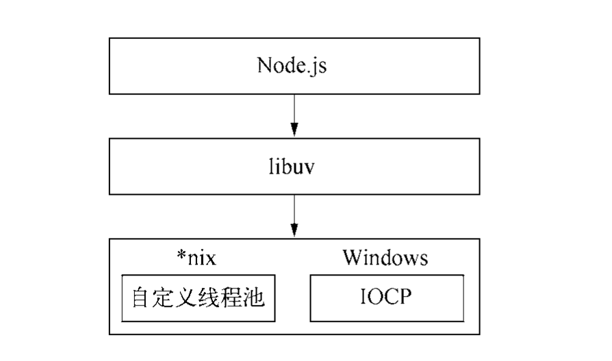

# Node.js

Node.js 是一个后端 JavaScript 的支持 **异步** 和 **非阻塞I/O** 的单线程运行平台。

对于 CPU 密集型应用，长时间的计算将会导致 CPU 时间片不能释放，使后续 I/O 无法发起。应适当调整和分解为多个小任务，使运算适当释放。

## 模块

Node 借鉴 CommonJS 的 Modules 规范实现了一套易用的模块系统。

### 模块介绍

#### 模块引用

在 CommonJS 中，`require()` 接受 **模块标识** ，引入模块的 API 到当前上下文。

```javascript
var math = require('math');
```

#### 模块定义

在 Node.js 中，一个文件就是一个模块。在模块中，存在一个 `module` 对象，表示当前模块，而 `module.exports` 挂载着当前模块可导出的变量和方法。

#### 模块标识

模块标识是传递给 `require()` 的参数，为被导入文件的路径，文件的后缀可以省略。

### 模块实现

Node 引入模块需要经历三个步骤：

1. 路径分析
2. 文件定位
3. 编译执行

Node 的核心模块部分被编译成了二进制执行文件，部分模块在 Node 启动时加载进入了内存。核心模块被引入时不需要 文件定位和路径分析，且路径分析时优先级最高，加载速度最快。

Node 会缓存引入的模块（编译和执行后的对象），在二次引用时优先加载，以减少二次引入的开销。

#### 模块标识符分析

标识符分为以下几类：

* 核心模块，如 `http`,`fs`,`path` 等

* 相对路径文件模块

* 绝对路径文件模块

* 非路径形成的自定义文件模块

自定义模块根据模块路径以一定的顺序查找 `node_modules` 目录。

#### 模块编译

文件模块是一个对象，定义如下

```javascript
function Module(id, parent) { 
  this.id = id;
  this.exports = {}; this.parent = parent;
  if (parent && parent.children) {
    parent.children.push(this);
  }
  this.filename = null; this.loaded = false; 
  this.children = [];
}
```

对于不同的文件类型，载入并编译的方法不同，

* js 文件，通过 `fs` 模块同步读取文件后编译执行
* node 文件，通过 `process.dlopen()` 加载和执行
* json 文件，通过 `fs` 同步读取后，用 `JSON.parse()` 解析
* 其他，当做 js 文件处理

编译成功的模块以其文件路径为索引缓存在 `Module._cache` 对象。

> 在导入模块时，为了减少文件定位的时间，非 js 文件应保留文件后缀。

##### JavaScript 模块编译

在编译 JavaScript 文件时，Node 会对文件内容进行头尾包装。在头部添加`(function (exports, require, module, __filename, __dirname) {\n`，尾部添加 `\n})`。

包装后的代码通过 vm 原生模块的 `runInThisContext()` 执行，返回一个 `function` 对象。将当前模块对象的 `exports`、`require()`、`module`(模块自身对象)， 以及文件路径和文件目录作为参数传递给这个`function()` 执行。

## 异步IO


