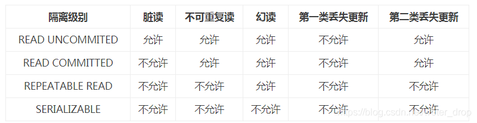

# 数据库

## 基础

### 1. 无锁队列

[论文](http://citeseerx.ist.psu.edu/viewdoc/download?doi=10.1.1.53.8674&rep=rep1&type=pdf)

[无锁队列的实现](https://coolshell.cn/articles/8239.html)

### 2. 关系型数据库的含义

关系型数据库是指采用了关系模型来组织数据的数据库。简单来说，关系模式就是二维表格模型。

### 3. 数据库用 B+ 树的原因

* B+ 树只有叶节点存放数据，其余节点用来索引，而B-树是每个索引节点都会有Data域，磁盘 IO 次数少。

* B+ 将所有的叶子节点用指针串起来，这样遍历叶子节点就能获得全部数据，有利于区间访问。

* AVL 数和红黑树基本都是存储在内存中才会使用的数据结构，树的深度过大而造成磁盘IO读写过于频繁。

### 4. 主键索引与非主键索引

主键索引的叶子结点存的是整条记录，主键索引也被称为聚簇索引。

非主键索引的叶子结点存的是 **主键的值**，非主键索引也被称为二级索引/普通索引/辅助索引。基于非主键索引的查询需要多扫描一棵索引树。

### 5. 什么是覆盖索引？

如果索引包含所有满足查询需要的数据的索引是 **覆盖索引**(Covering Index)，也就是平时所说的不需要回表操作。

覆盖索引就是从索引中直接获取查询结果。

### 6. 索引的缺点

1. 创建索引和维护索引要耗费时间，这种时间随着数据量的增加而增加
2. 索引需要占物理空间，除了数据表占数据空间之外，每一个索引还要占一定的物理空间

### 7. 事务隔离级别？介绍一下主要区别和应用场景？

* Read uncommitted，不解决 **脏读**
* Read committed，不解决 **不可重复读**
* Repeatable read，不解决 **幻读**
* Serializable，效率低

隔离级别越高，越能保证数据的完整性和一致性，但是对并发性能的影响也越大。

MySQL 默认第三级。

### 8. Sql 注入

将恶意的 Sql 查询或添加语句插入到应用的输入参数中，再在后台 Sql 服务器上解析执行进行的攻击

### 9. SQLite 和 MySQL 的区别

SQLite 是一个类似 Access 的轻量级数据库系统，但是更小、更快、容量更大，并发更高。

### 10. 数据库死锁

## 优化

### 1. sql 查询慢优化

慢可能的原因：

1. 没有索引或没有用上索引

2. 用错索引

待续

### 2. 数据库 cpu 跟不上请求频率

* 减少 IO 量

* 使用合适的索引减少扫描的行数

* 加 cache

* 减少逻辑运算量

待续

### 3. 事务

事务的四大特性（ACID）。即原子性（Atomic）、一致性（Consistent）、隔离性（Insulation）和持久性（Duraction）。

## MySQL

### 1. MySQL 的存储引擎

MyISAM存储引擎、innoDB存储引擎、MEMORY存储引擎、ARCHIVE存储引擎。

InnoDB：支持事务处理，支持外键，支持崩溃修复能力和并发控制。如果需要对事务的完整性要求比较高（比如银行），要求实现并发控制（比如售票），那选择 InnoDB 有很大的优势。如果需要频繁的更新、删除操作的数据库，也可以选择 InnoDB，因为支持事务的提交（commit）和回滚（rollback）。

MyISAM：**插入数据快**，空间和内存使用比较低。如果表主要是用于插入新记录和读出记录，那么选择MyISAM能实现处理高效率。如果应用的完整性、并发性要求比较低，也可以使用。**如果数据表主要用来插入和查询记录，则MyISAM引擎能提供较高的处理效率。**

MEMORY：所有的数据都在内存中，数据的处理速度快，但是安全性不高。如果需要很快的读写速度，对数据的安全性要求较低，可以选择MEMOEY。它对表的大小有要求，不能建立太大的表。所以，这类数据库只使用在相对较小的数据库表。如果只是临时存放数据，数据量不大，并且不需要较高的数据安全性，可以选择将数据保存在内存中的Memory引擎，MySQL中使用该引擎作为临时表，存放查询的中间结果

### 2. innodb 和 myisam 区别

* MyISAM 类型不支持事务处理等高级处理，而 InnoDB 类型支持事务与外键和行级锁。

* MyISAM 类型的表强调的是性能，其执行数度比InnoDB类型更快。

InnoDB 是聚集索引，MyISAM 是非聚集索引，数据文件是分离的，索引保存的是数据文件的指针。主键索引和辅助索引是独立的。

### 3. 部署mysql

### 4. 主备复制

为了解决 Mysql 的单点故障提高 MySQL 的整体服务性能，一般都会采用 **主从复制**。

主从复制中分为主服务器（master）和 从服务器（slave），**主服务器负责写**，而 **从服务器负责读**，MySQL 的主从复制的过程是一个异步的过程。

### 5. mysql的索引结构

我们可以在创建上述索引的时候，为其指定索引类型，分两类
hash类型的索引：查询单条快，范围查询慢
btree类型的索引：b+树，层数越多，数据量指数级增长（我们就用它，因为innodb默认支持它）

不同的存储引擎支持的索引类型也不一样

* InnoDB 支持事务，支持行级别锁定，支持 B-tree、Full-text 等索引，不支持 Hash 索引；
* MyISAM 不支持事务，支持表级别锁定，支持 B-tree、Full-text 等索引，不支持 Hash 索引；
* Memory 不支持事务，支持表级别锁定，支持 B-tree、Hash 等索引，不支持 Full-text 索引；
* NDB 支持事务，支持行级别锁定，支持 Hash 索引，不支持 B-tree、Full-text 等索引；
* Archive 不支持事务，支持表级别锁定，不支持 B-tree、Hash、Full-text 等索引；

### 15. mysql主从同步是异步的吗

### 6. MySQL 网页翻页语句

待续

## NOSQL

## 1. k-v数据库如果get有百分之80的数据都不命中有什么好的处理方法？

## 6. nosql了解过吗？关于数据库听说过哪些？

## 11. redis有没有做持久化，redis宕掉会怎么样，怼我说你只是用redis做了一个没有质量保证的消息队列而已

## 14. redis的高可用，主从、哨兵、集群，主从的选举过程

## 22.redis map zset
