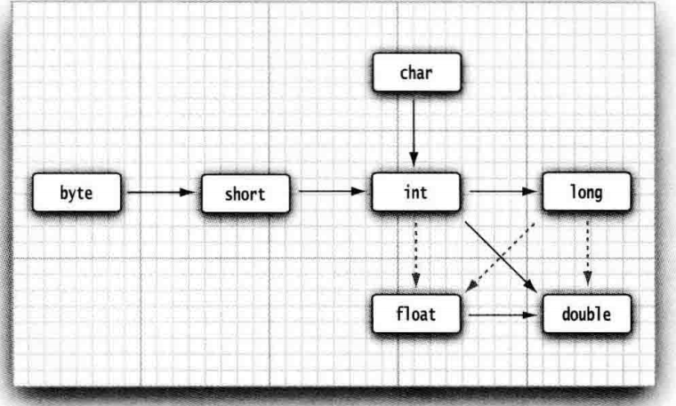
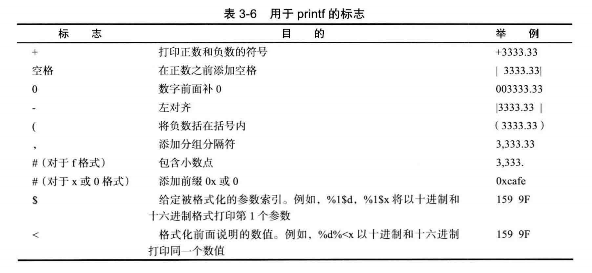
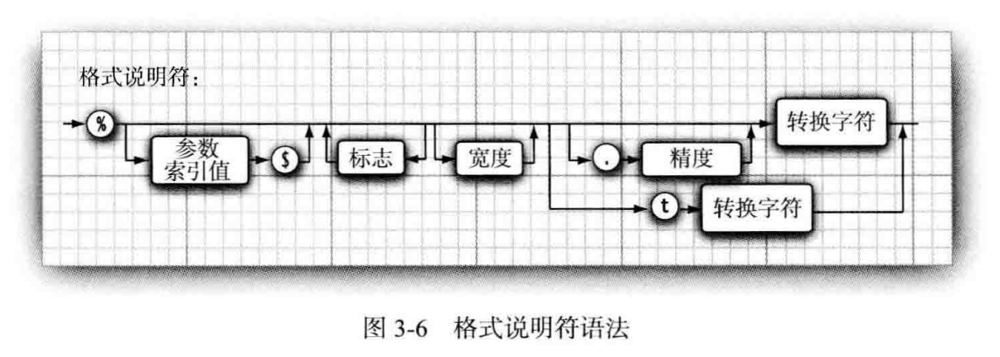
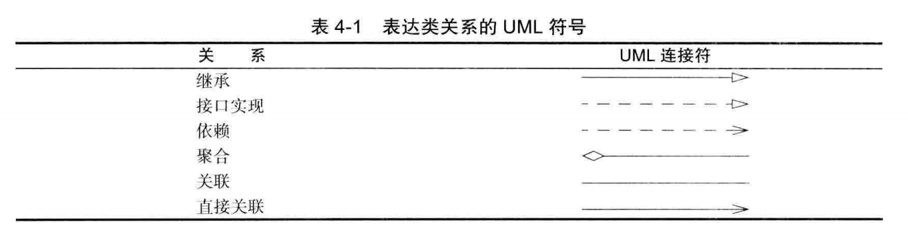

# Java核心技术 笔记

## Java的基本程序设计结构

### 基本概念

* Java区分大小写

* 类名推荐使用驼峰命名法(CamelCase)

* 源代码的文件名必须与公共类的名字相同，并用.java 作为扩展名

* 使用 `java <fileNameWithoutExt>` 命令(无.java 后缀）运行**已编译**的Java程序

* 运行已编译的程序时，Java 虚拟机将从指定类中的 main 方法开始执行

* 鉴于上一条，指定类的源文件中必须包含一个 `main`方法,且`main` 方法必须声明为 `public`

* Java的注释方式与C++一样,

* 以 `/**` 开始， 以 `*/` 结束的注释可以生成文档

### 基本类型

* Java 是强类型语言,必须为每一个变量声明一种类型

* Java8种基本类型:4种整型、2种浮点类型、1种Unicode字符单元的char类型和表示真值的boolean 类型

* Java整型有符号，按照字节大小依次为`byte`(1)、`short`(2)、`int`(4)、`long`(8), 且与平台无关

* 长整型数值有一个后缀L或l,十六进制有前缀 Ox 或 0X,八进制有前缀0

* Java浮点型有8个字节的`double`和4个字节的`float`

* float类型数有后缀F或f(3.14F),没有后缀F的浮点数值默认为 double 类型

* char 类型的字面量值要用单引号括起来，如 `'A'`。

* `'A'`与`"A"`不同，后者是一个字符串。

* `char` 类型的值可以表示为十六进制值，其范围从 `\u0000` 到 `\Uffff`

* 建议不要在程序中主动使用 `char` 类型

* boolean (布尔）类型有两个值：false 和 true,不能与整型进行转换

### 变量

* 变量推荐使用**lowerCamelCase**风格

* 常量命名**全部大写**，单词间用下划线隔开，力求语义表达完整清楚

* Java 每个变量都有一个类型（type)

* 与C++不同，Java不区分变量的声明与定义

* 声明变量时， 变量的类型位于变量名之前

* 变声明后必须初始化

* 方法中的局部变量必须手动初始化

* 类体中的成员变量会自动初始化为各种0值

* Java利用关键字`final`指示常量

### 运算符

* Java使用算术运算符 +、-、 *、/ 表示加、减、 乘、 除运算

* 参与 / 运算的两个操作数都是整数时，表示整数除法；否则，表示浮点除法

* 整数的求余操作用％表示

* `Math`类包含了各种各样的数学函数,如`sqrt`、`pow`

* 强制类型转换的语法格式是在圆括号中给出想要转换的目标类型，后面紧跟待转换的变量名

* `Math_round`方法对浮点数进行舍入,得到最接近的整数,返回类型为`long`

* 与C++类似，Java可以使用 `<op>=`等运算符，其中`<op>`是加减乘除等基本运算符

* 与C++类似， Java可以使用`++`,`--`以表示自增或自减，不推荐使用

* Java的关系运算和C++一样

* 与C++类似， Java可以使用三元操作符`condition？exp1:exp2`

* Java的位运算和C++一样

* Java运算符也有优先级，此处不表，尽量使用括号避免优先级的问题

* Java可以自定义枚举类型,枚举类型的变量只能使用给定的某个枚举值或`null`

* 枚举的语法 `enum ColorEnum {RED,BLUE,GREEN }`

* 事实上，枚举是一种受限制的类(待补充)



实心箭头表示无信息丢失的转换,虚箭头表示**可能**有精度损失的转换

## 字符串

* Java 字符串就是 Unicode 字符序列。

* Java 没有的字符串类型，标准库中提供了一个预定义类`String`

* 用**双引号**括起来的字符串都是 `String`类的一个实例

* `String`类对象称为不可变字符串，不能修改字符串中的字符

* 可以认为字符串存放在公共的存储池，字符串变量指向存储池中相应的位置

### 字符串操作

#### 获取子串

`String` 类的 `substring` 方法可以从一个较大的字符串提取出一个子串

```java
String string = "Hello";
String substring = string.substring(0, 3);
```

创建了一个`"Hel"`的子字符串，`substring(start,end)`方法的参数是子串在原字符串中的位置，左闭右开

#### 拼接

* Java 语言允许使用 `+` 号连接（拼接）两个字符串

* 当将一个字符串与一个非字符串的值进行拼接时，后者被转换成字符串

* 任何一个 Java 对象都可以转换成字符串

* 如果需要把多个字符串放在一起， 用一个定界符分隔，使用静态 `String.join`方法

#### 检测字符串是否相等

使用 `equals` 方法检测两个字符串（内容）是否相等

```java
s.equals(t)
```

检测两个字符串是否相等而不区分大小写， 可以使用 `equalsIgnoreCase`方法

不要使用`==` 运算符检测两个字符串是否相等，这个运算符只能够确定两个字串地址是否相同

只有字符串常量是共享的，可以用`==`检测相同；而`+` 或 `substring` 等操作产生的结果并不是共享的,不能用`==`测试内容相同

#### 空串与`Null`串

* 空串 `""` 是长度为 0 的字符串，但也是一个 Java 对象，有自己的串长（0 ) 和内容（空）

* `null`是一个特殊的值，表示目前没有任何对象与该变量关联

要检查一个字符串既不是 null 也不为空串，这种情况下就需要使用以下条件：

```java
//顺序不能颠倒，否则可能会在一个null上调用方法
if (str != null && str.length() != 0)
```

#### 码点与代码单元

`char` 数据类型是一个采用 UTF-16 编码表示 Unicode 码点的**代码单元**，大多数的常用 Unicode 字符使用一个代码单元就可以表示，而辅助字符需要一对代码单元表示。
>代码点：是指一个编码表中的某个字符对应的代码值，也就是Unicode编码表中每个字符对应的数值
在UTF-16中的基本多语言级别中，每一个字符用16位表示，通常被称为代码单元

* `length`方法将返回采用 UTF-16 编码表示的给定字符串所需要的代码单元数量。

* 要想得到实际的长度，即码点数量，可以调用`codePointCount(startIndex, endIndex)`

```java
 String string = "\uD835\uDD46";
 System.out.println(string.length());
 System.out.println(string.codePointCount(0, string.length()));
 //结果输出2和1
```

大多数情况下，代码单元数可以表示字符串的实际字符数

#### String API

Java 中的 `String`类包含了 50 多个方法,绝大多数都很有用

可以直接阅读[文档](https://docs.oracle.com/javase/7/docs/api/java/lang/String.html),使用时阅读，此处略去不表

#### `StringBuilder`类

`StringBuilder`类是一个可变序列的字符串，线程不安全，但效率高于`StringBuffer`
可以通过`toString`方法得到一个`String`对象

### 输入输出

#### 读取输入

要想通过控制台进行输入，首先需要构造一个 `Scanner` 对象，并与“标准输人流” `System.in`关联

```java
Scanner in = new Scanner(System.in);
```

再使用 `Scanner` 类的各种方法实现输入操作

* `nextLine` 方法将输入一行

* `next` 方法读取一个单词，以空白符分隔

* `nextInt` 方法读取一个整数

* `nextDouble` 方法读取一个浮点数

`Scanner` 类定义在`java.util`包,使用的类不在`java.lang`中时，需要`import`

#### 格式化输出

调用 `System.out.println`打印输出到“ 标准输出流”（即控制台窗口）

使用 `System.0ut.print`可以进行格式化输出，格式化风格与C语言类似

可以使用静态的 `String.format`方法创建一个格式化的字符串， 而不打印输出





#### 文件输入与输出

要想对文件进行读取， 就需要一个用 `File` 对象构造一个 `Scanner` 对象

```java
Scanner in = new Scanner(Paths.get("myfile.txt") , "UTF-8") ;
```

如果文件名中包含反斜杠符号，就要记住在每个反斜杠之前再加一个额外的反斜杠(Window平台)

---

要想**写入文件**， 就需要构造一个 `PrintWriter` 对象。在构造器中，只需要提供文件名

```java
PrintWriter out = new PrintWriter('myfile.txt", "UTF-8");
```

如果文件不存在，创建该文件。
可以像输出到`System.out`—样使用`print`、 `println` 以及 `printf`命令。

### 控制流程

块确定了变量的作用域，块可以嵌套,不能在嵌套的两个块中声明同名的变量

```java
int n;
{
    int n; //Error can't redefine n in inner block
}
```

`if`、`else`、`for`、`while`、`break`和`continue`等语法和C++一样

### 大数值

`java.math`包中的两个类:`BigInteger` 和 `BigDecimal`,可以处理包含任意长度数字序列的数值

`BigInteger` 类实现了任意精度的整数运算， `BigDecimal` 实现了任意精度的浮点数运算

使用静态的 `valueOf` 方法可以将普通的数值转换为大数值

大数值类不能使用算术运算符处理大数值，须使用特殊方法

### 数组

* 数组是一种数据结构， 用来存储同一类型值的集合。

* 通过一个整型下标可以访问数组中的值

* 声明数组变量时， 需要数组类型（数据元素类型紧跟[])和数组变量的名字

* 使用`new`运算符创建数组

```java
//声明一个整型数组，但未初始化
int[] a;
//创建数组
a = new int[n]; //与C语言不同，n可以是变量
```

要想获得数组中的元素个数，可以使用 `length`属性

数组不能改变它的大小(长度)

增强的`for`循环可以应用于数组:
`for (variable : collection) statement`

---

Java中， 提供了一种创建数组对象并同时赋予初始值的简化书写形式:
`int[] a = {1, 2, 3}`

使用这种语句时，不需要调用`new`,甚至还可以初始化一个匿名的数组：`new int[] {1, 2, 3}`

---

* Java 中， 允许将一个数组变量拷贝给另一个数组变量， 两个变量将引用同一个数组

* 如果将一个数组的所有值拷贝到一个新的数组中,使用`Arrays` 类的 `copyOf`方法

---

 Java应用程序都有一个带`String arg[]`参数的 `main` 方法,参数表明 `main` 方法将接收一个字符串数组， 也就是命令行参数

---

对数值型数组进行排序， 可以使用 `Arrays` 类中的 `sort` 优化的快速排序算法

---

多维数组将使用多个下标访问数组元素,使用方法和一维数组类似

```java
//声明一个二维数组
double[][] a;
//初始化
a = {{1,2},{3,4}}
```

---

Java可以构建多维数组

```java
int[][] a = new int[3][];
for (int i = 0; i < 3; i++)
    a[i] = new int[i+1];
```

## 对象和类

### 面向对象编程概述

* 面向对象的程序是由对象组成的

#### 类

* 类（class) 是构造对象的模板

* 类构造 （construct) 对象的过程称为创建类的实例 （instance )

* 对象中的数据称为实例域（instance field)

* 每个特定的类实例（对象）都有一组特定的实例域值，这些值的集合就是这个对象的当前状态

#### 对象

对象的三个主要特性:

* 对象的行为（behavior)—可以对对象施加哪些操作

* 对象的状态 （state)—当施加那些方法时，对象如何响应

* 对象标识（identity )—如何辨别具有相同行为与状态的不同对象

#### 类之间的关系

在类之间， 最常见的关系有:

* 依赖 （“uses-a”）

* 聚合（“has-a”）

* 继承（“is-a”）



### 预定义类

* Java 使用构造器（constructor) 构造新实例

* 构造器的名字应该与类名相同, 构造对象需要在构造器前面加上`new`操作符

* 对象变量是对对象的应用，不是对象本身，需要`new`一个新的对象或者传递一个已存在的对象来初始化

* 可以显式地将对象变量设置为 `null`, 表明这个对象变量目前没有引用任何对象

#### `LocalDate` 类

pass

#### 更改器方法与访问器方法

* 只访问对象而不修改对象的方法称为访问器方法(accessor method)

* 调用后对象的状态会改变的方法称作更改器方法(mutator method)

### 用户自定义类

* 要想创建一个完整的程序， 应该将若干类组合在一起， 其中只有一个类有 `main` 方法

* 在一个源文件中， 只能有一个公有类，但可以有任意数目的非公有类

* Java编译源程序的时候，每一个类都会生成一个类文件

* 将包含`main`方法的公有类的类名提供给字节码解释器以启动程序

#### 多源文件的使用

对于多个java文件构成的程序，有两种编译方法

* 同时编译所有相关的java程序

* 仅编译含`main`方法的java程序

#### 隐式参数和显式参数

* 显式参数：显式参数是在方法中括号中声明的参数

* 隐式参数：隐式参数表示在方法中使用，但是没有写在方法参数中也没有在方法体内声明的变量

---

只返回实例域值访问器称为域访问器

需要获得或设置实例域,应该提供:

* 一个私有的数据域

* 一个公有的域访问器方法

* 一个公有的域更改器方法

#### 基于类的访问权限

同一个类的不同实例对象竟然可以相互访问各自的private成员

#### 私有方法

方法可以私有，只需要关键字`private`修饰,不会被外部的其他类操作调用

#### final实例域

可以将实例域定义为`final`，构建对象时必须初始化，在后面的操作中不能再修改

`final`主要修饰基本（primitive)类型域，或不可变（immutable)类的域

### 静态域与静态方法

静态域与静态方法用`static`修饰

#### 静态域

类中只有一个这样的域，被所有实例共享

#### 静态常量

同时被`final`和`static`修饰的域

#### 静态方法

* 静态方法是一种不能操作对象的方法,可以认为没有`this`参数

* 静态方法可以访问自身类中的静态域

* 可以使用类名和对象调用静态方法，但不推荐后者

* 静态方法可以用于工厂方法(设计模式的一种)

#### `main`方法

 `main` 方法不对任何对象进行操作。事实上，在启动程序时还没有任何一个对象。静态的`main`方法将执行并创建程序所需要的对象

### 方法参数

将参数传递给方法（或函数）的一些专业术语

* 按值调用 （call by value) 表示方法接收的是调用者提供的值

* 按引用调用 （call by reference)表示方法接收的是调用者提供的变量地址

Java 程序设计语言总是采用按值调用，也就是说， 方法得到的是所有参数值的一个拷
贝，特别是，方法不能修改传递给它的任何参数变量的内容

当传递给方法一个对象变量，方法不能改变该变量的对象指向，但是可以改变被指向对象的状态

### 对象构造

构造器可以重载(overloading)

>如果多个方法有相同的名字、 不同的参数，便产生了重载

#### 默认域初始化

构造器中没有显式地给域赋予初值，那么就会被自动地赋为默认值： 数值为`0`、布尔值为 `false`、 对象引用为 `null`

#### 无参数的构造器

很多类都包含一个无参数的构造函数，对象由无参数构造函数创建时，其域被设置为默认值

如果类没有构造器， 系统会提供一个无参数构造器

如果类提供构造器，则系统不再提供无参构造器

#### 显式域初始化

* 在类定义中， 直接将一个值赋给任何域,称之为显式域初始化

* 显示域初始化在构造函数之前

* 初始值不一定得是常量，也可以是方法

#### 参数名

出于良好的编程习惯，构造函数的形参一般采用两种方式命名

1. 在每个参数前加前缀a, `name = aName`

2. 使用`this`隐式变量，`this.name = name`

#### 调用另一个构造函数

构造器可以调用被重载的其他构造器,语法为 `this(...)`

采用这种方式使用 `this` 关键字非常有用， 这样对公共的构造器代码部分只编写一次即可

#### 初始化块

初始化数据域有三种方式:

* 在构造器中设置值

* 在声明中赋值

* 初始化块（initialization block)

调用构造器的具体处理步骤：

* 所有数据域被初始化为默认值

* 按照在类声明中出现的次序， 依次执行所有域初始化语句和初始化块

* 如果构造器第一行调用了第二个构造器， 则执行第二个构造器主体

* 执行这个构造器的主体

可以使用静态的初始化块初始化比较复杂的静态域

在类第一次加载的时候， 将会进行静态域的初始化

#### 对象析构与`finalize`方法

* Java有自动的垃圾回收器，不需要人工回收内存， 所以 Java 不支持析构器

* 可以为任何一个类添加 `finalize` 方法，将在垃圾回收器清除对象之前调用

* 不要依赖于使用 `finalize` 方法回收任何短缺的资源， 这是因为很难知道这个方法什么时候才能够调用

### 包

Java 使用包（ package )将类组织起来

标准的 Java 类库分布在多个包中， 包括`java.lang`、`java.util` 和`java.net`等

使用包的主要原因是确保类名的唯一性

Sun公司建议将公司的域名以逆序的形式作为包名，对于不同的项目使用不同的子包

#### 类的导入

一个类可以使用所属包中的所有类， 以及其他包中的公有类

两种方式访问另一个包中的公有类:

* 每个类名之前添加完整的包名

* 使用`import`语句，在使用类时，就不必写出包的全名

使用 `import` 语句导人一个特定的类或者整个包

import 语句应该位于源文件的顶部,但在`package`下面

示例：可以使用下面这条语句导人 `java.util` 包中所有的类

```java
import java.util.*;
```

还可以导人一个包中的特定类：

```java
LocalDate today = new LocalDate.now();
```

只能使用星号（*) 导入一个包

```java
import java.*.*; //error
```

#### 静态导入

`import`语句不仅可以导入类，还能导入静态方法和静态域

#### 将类放入包中

想将一个类放人包中，必须将包的名字放在源文件的开头

没有package语句， 源文件中的类就被放置在没有名字的默认包

将包中的文件放到与完整的包名匹配的子目录中,例如，`com.horstmann.corejava`包中的所有源文件应该被放置在子目录 `com/horstmann/corejava`，编译器将类文件也放在相同的目录结构中

#### 包作用域

* 标记为 public 的部分可以被任意的类使用
* 标记为 private 的部分只能被定义它们的类使用
* 如果没有指定 public 或 private, 这个部分（类、方法或变量）可以被同一个包中的所有方法访问

### 类路径

类存储在文件系统的子目录中，类的路径必须与包名匹配

类路径包括：

* 基目录 `/home/user/classdir` 或 `c:\classes`
* 当前目录 (.)
* JAR 文件 `/home/user/archives/archive.jar`或 `c:\archives\archive.jar`

### 文档注释

JDK 包含一个很有用的工具，叫做`javadoc`, 它可以由源文件生成一个`HTML`文档

#### 注释的插入

`javadoc` 实用程序（`utility`) 从下面几个特性中抽取信息:

* 包
* 公有类与接口
* 公有的和受保护的构造器及方法
* 公有的和受保护的域

应该为上面几部分编写注释，注释应该放置在所描述特性的前面
注释以 `/**`开始， 并以 `*/` 结束,每个 `/** . . . */` 文档注释在标记之后紧跟着自由格式文本

自由格式文本的第一句应该是一个概要性的句子。javadoc 实用程序自动地将这些句子抽取出来形成概要页。在自由格式文本中，可以使用 HTML 修饰符

#### 类注释

类注释必须放在 `import` 语句之后，类定义之前

#### 方法注释

每一个方法注释必须放在所描述的方法之前。除了通用标记之外,还可以使用下面的标记

1. @pram 变量描述 这个标记将对当前方法的`“param”` （参数）部分添加一个条目。这个描述可以占据多行， 并可以使用HTML标记。一个方法的所有`@param`标记必须放在一起

2. @return 描述 这个标记将对当前方法添加“ return” （返回）部分。这个描述可以跨越多行， 并可以使用 HTML 标记

3. ©throws 类描述 这个标记将添加一个注释， 用于表示这个方法有可能抛出异常

#### 域注释

只需要对公有域（通常指的是静态常量）建立文档

#### 通用注释

下面的标记可以用在类文档的注释中

1. @author 姓名 这个标记将产生一个 "author" (作者）条目。可以使用多个 @aUthor 标记，每个@author 标记对应一个作者

2. ©version 这个标记将产生一个“ version”（版本）条目

#### 包与概述注释

要想产生包注释，就需要在每一个包目录中添加一个单独的文件，有如下两个选择:

1. 提供一个以 `package.html` 命名的 HTML 文件。在标记 `<body>—</body>` 之间的所有文本都会被抽取出来

2. 提供一个以 `package-info.java`命名的 Java 文件。这个文件必须包含一个初始的以 /** 和 */ 界定的 Javadoc 注释， 跟随在一个package语句之后

#### 注释的抽取

todo
