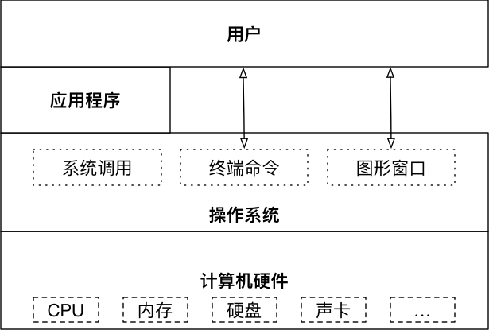
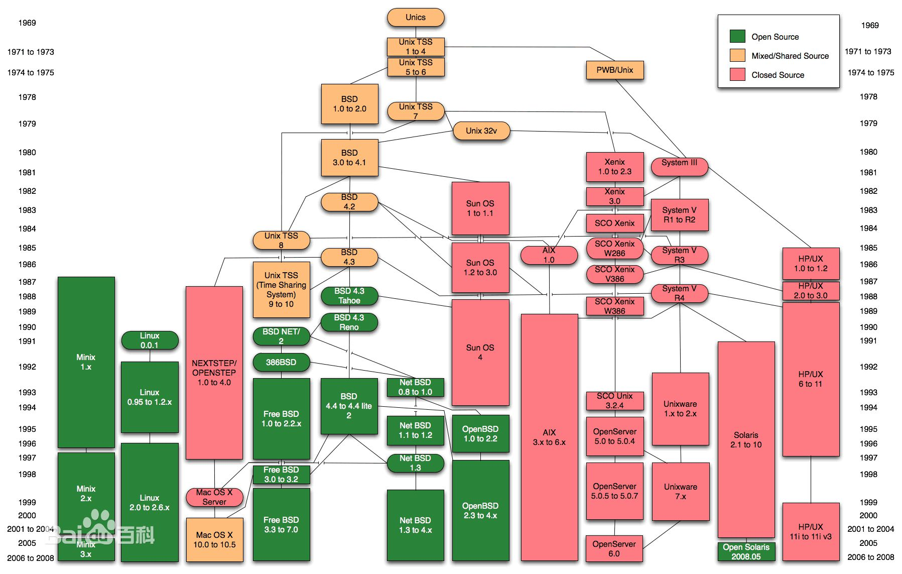

# Linux

## 操作系统(科普)

### 操作系统(Operation System, OS)



**裸机**指没有安装操作系统的计算机

* 如果想在裸机上运行自己所编写的程序，就必须用机器语言书写程序

### 虚拟机

虚拟机（Virtual Machine）指通过软件模拟的具有完整硬件系统功能的、运行在一个完全隔离环境中的完整计算机系统

* 虚拟系统通过生成现有操作系统的全新虚拟镜像，具有真实操作系统完全一样的功能
* 进入虚拟系统后，所有操作都是在这个全新的独立的虚拟系统里面进行，可以独立安装运行软件，保存数据，拥有自己的独立桌面，不会对真正的系统产生任何影响
* 而且能够在现有系统与虚拟镜像之间灵活切换的一类操作系统

## 操作系统的发展史（科普章节）

### Unix

* 1965 年左后由 贝尔实验室 加入了 麻省理工学院 以及 通用电气 合作的计划 —— 该计划要建立一套 多使用者(multi－user)、多任务(multi－processor)、多层次(multi－level) 的 MULTICS 操作系统，想让大型主机支持 300 台终端

* 1969 年前后这个项目进度缓慢，资金短缺，贝尔实验室退出了研究

* 1969 年从这个项目中退出的 Ken Thompson 当时在实验室无聊时，为了让一台空闲的电脑上能够运行 "星际旅行（Space Travel）" 游行，在 8 月份左右趁着其妻子探亲的时间，用了 1 个月的时间，使用汇编写出了 Unix 操作系统的原型

* 1970 年，美国贝尔实验室的 Ken Thompson，以 BCPL 语言为基础，设计出很简单且很接近硬件的 B 语言（取BCPL的首字母），并且他用 B 语言 写了第一个 UNIX 操作系统

* 1971 年，同样酷爱 "星际旅行（Space Travel）" 的 Dennis M.Ritchie 为了能早点儿玩上游戏，加入了 Thompson 的开发项目，合作开发 UNIX，他的主要工作是改造 B 语言，因为B 语言 的跨平台性较差

* 1972 年，Dennis M.Ritchie 在 B 语言 的基础上最终设计出了一种新的语言，他取了 BCPL 的第二个字母作为这种语言的名字，这就是 C 语言

* 1973 年初，C 语言的主体完成，Thompson 和 Ritchie 迫不及待地开始用它完全重写了现在大名鼎鼎的 Unix 操作系统



### Minix

* 因为 AT&T（通用电气） 的政策改变，在 Version 7 Unix 推出之后，发布新的使用条款，将 UNIX 源代码私有化，在大学中不再能使用 UNIX 源代码

* Andrew S. Tanenbaum（塔能鲍姆） 教授为了能 在课堂上教授学生操作系统运作的细节，决定在不使用任何 AT&T 的源代码前提下，自行开发与 UNIX 兼容的操作系统，以避免版权上的争议

* 以 小型 UNIX（mini-UNIX）之意，将它称为 MINIX

### Linux

* 1991 年 林纳斯（Linus） 就读于赫尔辛基大学期间，对 Unix 产生浓厚兴趣，尝试着在Minix 上做一些开发工作

* 因为 Minix 只是教学使用，因此功能并不强，林纳斯 经常要用他的终端 仿真器（Terminal Emulator） 去访问大学主机上的新闻组和邮件，为了方便读写和下载文件，他自己编写了磁盘驱动程序和文件系统，这些在后来成为了 Linux 第一个内核的雏形，当时，他年仅 21 岁！

* 林纳斯 利用 GNU 的 bash 当做开发环境，gcc 当做编译工具，编写了 Linux 内核，一开始 Linux 并不能兼容 Unix, 即 Unix 上跑的应用程序不能在 Linux 上跑，即应用程序与内核之间的接口不一致一开始 Linux 只适用于 386，后来经过全世界的网友的帮助，最终能够兼容多种硬件

### Linux 内核及发行版

#### Linux 内核版本

内核（kernel）是系统的心脏，是运行程序和管理像磁盘和打印机等硬件设备的核心程序，它提供了一个在裸设备与应用程序间的抽象层,又分为**稳定版**和**开发版**

#### Linux 发行版本

Linux 发行版（也被叫做 GNU/Linux 发行版）通常包含了包括桌面环境、办公套件、媒体播放器、数据库等应用软件
常见的发行版本如下：

* Ubuntu
* Redhat
* Fedora
* openSUSE
* Linux Mint
* Debian
* Manjaro
* Mageia
* CentOS
* Arch

## Linux 文件和目录

* /：根目录，一般根目录下只存放目录，在 linux 下有且只有一个根目录，所有的东西都是从这里开始

* 当在终端里输入 `/home`，其实是在告诉电脑，先从 /（根目录）开始，再进入到 home 目录

* /bin、/usr/bin：可执行二进制文件的目录，如常用的命令 ls、tar、mv、cat 等

* /boot：放置 linux 系统启动时用到的一些文件，如 linux 的内核文件：`/boot/vmlinuz`，系统引导管理器：/boot/grub

* /dev：存放linux系统下的设备文件，访问该目录下某个文件，相当于访问某个设备，常用的是挂载光驱`mount /dev/cdrom /mnt`

* /etc：系统配置文件存放的目录，不建议在此目录下存放可执行文件，重要的配置文件有

```shell
/etc/inittab

/etc/fstab

/etc/init.d

/etc/X11

/etc/sysconfig

/etc/xinetd.d
```

* /home：系统默认的用户家目录，新增用户账号时，用户的家目录都存放在此目录下
~ 表示当前用户的家目录
~edu 表示用户 edu 的家目录

* /lib、/usr/lib、/usr/local/lib：系统使用的函数库的目录，程序在执行过程中，需要调用一些额外的参数时需要函数库的协助

* /lost+fount：系统异常产生错误时，会将一些遗失的片段放置于此目录下

* /mnt: /media：光盘默认挂载点，通常光盘挂载于 /mnt/cdrom 下，也不一定，可以选择任意位置进行挂载

* /opt：给主机额外安装软件所摆放的目录

* /proc：此目录的数据都在内存中，如系统核心，外部设备，网络状态，由于数据都存放于内存中，所以不占用磁盘空间，比较重要的文件有：/proc/cpuinfo、/proc/interrupts、/proc/dma、/proc/ioports、/proc/net/* 等

* /root：系统管理员root的家目录

* /sbin、/usr/sbin、/usr/local/sbin：放置系统管理员使用的可执行命令，如 fdisk、shutdown、mount 等。与 /bin 不同的是，这几个目录是给系统管理员 root 使用的命令，一般用户只能"查看"而不能设置和使用

* /tmp：一般用户或正在执行的程序临时存放文件的目录，任何人都可以访问，重要数据不可放置在此目录下

* /srv：服务启动之后需要访问的数据目录，如 www 服务需要访问的网页数据存放在 /srv/www 内

* /usr：应用程序存放目录

```shell
/usr/bin：存放应用程序

/usr/share：存放共享数据

/usr/lib：存放不能直接运行的，却是许多程序运行所必需的一些函数库文件

/usr/local：存放软件升级包

/usr/share/doc：系统说明文件存放目录

/usr/share/man：程序说明文件存放目录
```

* /var：放置系统执行过程中经常变化的文件

```shell
/var/log：随时更改的日志文件

/var/spool/mail：邮件存放的目录

/var/run：程序或服务启动后，其 PID 存放在该目录下
```

### Linux 常用命令

<table>
      <thead>
        <tr>
          <th>序号</th>
          <th>命令</th>
          <th>对应英文</th>
          <th>作用</th>
        </tr>
      </thead>
      <tbody>
        <tr>
          <td>01</td>
          <td>ls</td>
          <td>list</td>
          <td>查看当前文件夹下的内容</td>
        </tr>
        <tr>
          <td>02</td>
          <td>pwd</td>
          <td>print wrok directory</td>
          <td>查看当前所在文件夹</td>
        </tr>
        <tr>
          <td>03</td>
          <td>cd [目录名]</td>
          <td>change directory</td>
          <td>切换文件夹</td>
        </tr>
        <tr>
          <td>04</td>
          <td>touch [文件名]</td>
          <td>touch</td>
          <td>如果文件不存在，新建文件</td>
        </tr>
        <tr>
          <td>05</td>
          <td>mkdir [目录名]</td>
          <td>make directory</td>
          <td>创建目录</td>
        </tr>
        <tr>
          <td>06</td>
          <td>rm [文件名]</td>
          <td>remove</td>
          <td>删除指定的文件名</td>
        </tr>
        <tr>
          <td>07</td>
          <td>clear</td>
          <td>clear</td>
          <td>清屏</td>
        </tr>
      </tbody>
    </table>

#### more

* 可以用于分屏显示文件内容，每次只显示一页内容

* 适合于 查看内容较多的文本文件

使用 more 的操作键:

<table>
<thead>
<tr>
<th>操作键</th>
<th>功能</th>
</tr>
</thead>

<tbody>
<tr>
<td>空格键</td>
<td>显示手册页的下一屏</td>
</tr>
<tr>
<td>Enter 键</td>
<td>一次滚动手册页的一行</td>
</tr>
<tr>
<td>b</td>
<td>回滚一屏</td>
</tr>
<tr>
<td>f</td>
<td>前滚一屏</td>
</tr>
<tr>
<td>q</td>
<td>退出</td>
</tr>
<tr>
<td>/word</td>
<td>搜索 <strong>word</strong> 字符串</td>
</tr>
</tbody>
</table>

#### grep

grep允许对文本文件进行 模式查找，所谓模式查找，又被称为正则表达式

<table>
<thead>
<tr>
<th>选项</th>
<th>含义</th>
</tr>
</thead>

<tbody>
<tr>
<td>-n</td>
<td>显示匹配行及行号</td>
</tr>
<tr>
<td>-v</td>
<td>显示不包含匹配文本的所有行（相当于求反）</td>
</tr>
<tr>
<td>-i</td>
<td>忽略大小写</td>
</tr>
</tbody>
</table>

常用的两种模式查找

<table>
<thead>
<tr>
<th>参数</th>
<th>含义</th>
</tr>
</thead>

<tbody>
<tr>
<td>^a</td>
<td>行首，搜寻以 <strong>a</strong> 开头的行</td>
</tr>
<tr>
<td>ke$</td>
<td>行尾，搜寻以 <strong>ke</strong> 结束的行</td>
</tr>
</tbody>
</table>

### Linux 系统信息相关命令

#### 时间和日期

<table>
<thead>
<tr>
<th>序号</th>
<th>命令</th>
<th>作用</th>
</tr>
</thead>

<tbody>
<tr>
<td>01</td>
<td>date</td>
<td>查看系统时间</td>
</tr>
<tr>
<td>02</td>
<td>cal</td>
<td><code>calendar</code> 查看日历，<code>-y</code> 选项可以查看一年的日历</td>
</tr>
</tbody>
</table>

#### 磁盘信息

<table>
<thead>
<tr>
<th>序号</th>
<th>命令</th>
<th>作用</th>
</tr>
</thead>

<tbody>
<tr>
<td>01</td>
<td>df -h</td>
<td><code>disk free</code> 显示磁盘剩余空间</td>
</tr>
<tr>
<td>02</td>
<td>du -h [目录名]</td>
<td><code>disk usage</code> 显示目录下的文件大小</td>
</tr>
</tbody>
</table>

> -h	以人性化的方式显示文件大小

#### 进程信息

<table>
<thead>
<tr>
<th>序号</th>
<th>命令</th>
<th>作用</th>
</tr>
</thead>

<tbody>
<tr>
<td>01</td>
<td>ps aux</td>
<td><code>process status</code> 查看进程的详细状况</td>
</tr>
<tr>
<td>02</td>
<td>top</td>
<td>动态显示运行中的进程并且排序</td>
</tr>
<tr>
<td>03</td>
<td>kill [-9] 进程代号</td>
<td>终止指定代号的进程，<code>-9</code> 表示强行终止</td>
</tr>
</tbody>
</table>

ps 选项说明

<table>
<thead>
<tr>
<th>选项</th>
<th>含义</th>
</tr>
</thead>

<tbody>
<tr>
<td>a</td>
<td>显示终端上的所有进程，包括其他用户的进程</td>
</tr>
<tr>
<td>u</td>
<td>显示进程的详细状态</td>
</tr>
<tr>
<td>x</td>
<td>显示没有控制终端的进程</td>
</tr>
</tbody>
</table>

### Linux 其他命令

#### 查找文件

find 命令功能非常强大，通常用来在 特定的目录下 搜索 符合条件的文件

<table>
<thead>
<tr>
<th>序号</th>
<th>命令</th>
<th>作用</th>
</tr>
</thead>

<tbody>
<tr>
<td>01</td>
<td>find [路径] -name &quot;*.py&quot;</td>
<td>查找指定路径下扩展名是 <code>.py</code> 的文件，包括子目录</td>
</tr>
</tbody>
</table>

* 如果省略路径，表示在当前文件夹下查找
* 通配符可使用

#### 软链接

<table>
<thead>
<tr>
<th>序号</th>
<th>命令</th>
<th>作用</th>
</tr>
</thead>

<tbody>
<tr>
<td>01</td>
<td>ln -s 被链接的源文件 链接文件</td>
<td>建立文件的软链接，用通俗的方式讲<strong>类似于</strong> Windows 下的<strong>快捷方式</strong></td>
</tr>
</tbody>
</table>

* 没有 -s 选项建立的是一个 硬链接文件
* 源文件要使用绝对路径，不能使用相对路径，这样可以方便移动链接文件后，仍然能够正常使用